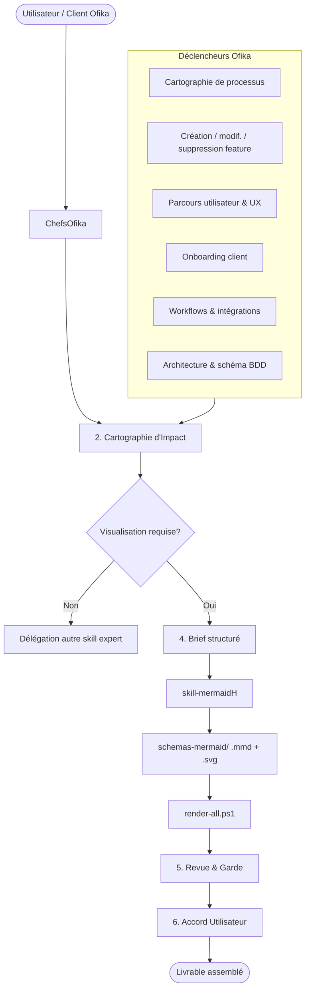
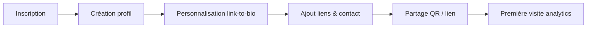

# Intégration ChefsOfika — skill-mermaidH (Projet Ofika)

Ce skill s'exécute sous l'orchestration de **ChefsOfika** pour le projet **Ofika / Favor Company**. Il sert à **cartographier, visualiser, créer, modifier, mettre à jour et supprimer** les représentations de processus, fonctionnalités, parcours utilisateur et onboarding — avant, pendant et après les décisions techniques.

**Chemins relatifs** (depuis la racine du repo) :
- Orchestrateur : `.skills/skills Agents/ChefsOfika/SKILL.md`
- Manifeste global : `.skills/skills Agents/ChefsOfika/MANIFESTE_COMPETENCES.md`
- Ce skill : `.skills/skills Agents/skill-mermaidH/SKILL.md`
- Workflow 5 phases : `.skills/skills Agents/skill-mermaidH/references/workflow.md`
- **Dépôt schémas (obligatoire)** : `schemas-mermaid/README.md`

## Flux de délégation ChefsOfika



### Rôle de ChefsOfika

1. **Cartographie d'Impact (étape 2)** — Identifier si un diagramme clarifie le flux, les acteurs, les impacts ou le parcours avant toute implémentation.
2. **Délégation directe** — ChefsOfika **ne dessine jamais** lui-même : il charge `skill-mermaidH` avec un brief conforme au manifeste.
3. **Supervision** — Valider le type de diagramme, la cohérence avec `PROMPT/STACK.md` et l'alignement avec le code existant.
4. **Assemblage** — Intégrer le diagramme dans `schemas-mermaid/` (sous-dossier thématique), mettre à jour le README du dossier, journaliser via `memoire-favor/` si décision structurante, et demander l'accord explicite de l'utilisateur.

## Dépôt officiel — `schemas-mermaid/`

Tous les livrables Mermaid du projet Ofika **vivent ici** :

```
schemas-mermaid/
├── README.md                 ← index + aperçus
├── render-all.ps1            ← export SVG global
├── link-to-bio/              ← page publique, vCard, UX visiteur
├── onboarding/               ← parcours client
├── architecture/             ← C4, ERD, Supabase
└── processus/                ← workflows métier
```

| Action | Procédure |
|--------|-----------|
| **Créer** | `.mmd` + `.svg` dans le bon sous-dossier + ligne dans le README local |
| **Modifier** | Éditer `.mmd` → `.\schemas-mermaid\render-all.ps1` → commit `.mmd` + `.svg` |
| **Supprimer** | Retirer `.mmd`, `.svg` et l'entrée README quand la feature disparaît |
| **Visualiser** | Ouvrir le `.svg` ou le README racine avec miniatures |

Index complet : [schemas-mermaid/README.md](../../../schemas-mermaid/README.md)

## Quand déléguer à skill-mermaidH

| Contexte Ofika | Action attendue | Types Mermaid recommandés |
|----------------|-----------------|---------------------------|
| **Cartographie de processus** | Modéliser un flux métier, pipeline ou règle de décision | `flowchart`, `stateDiagram-v2` |
| **Création de feature** | Visualiser le flux avant le code (spec partagée) | `flowchart` + `sequenceDiagram` |
| **Modification de feature** | État avant/après, points de rupture, impacts | `flowchart`, `stateDiagram-v2`, `gitGraph` |
| **Suppression de feature** | Cartographier dépendances et effets de bord | `flowchart`, `C4Context`, `erDiagram` |
| **Mise à jour / refonte** | Synchroniser la doc visuelle avec le code | Tous types selon le périmètre |
| **Visualisation de feature** | Documenter une fonctionnalité existante | `sequenceDiagram`, `flowchart`, C4 |
| **Parcours utilisateur (UX)** | Link-to-bio, inscription, partage, ajout contact vCard | `userJourney`, `flowchart` |
| **Onboarding client Ofika** | Étapes d'accueil, configuration profil, première utilisation | `userJourney`, `flowchart`, `timeline` |
| **Workflows & intégrations** | Auth Supabase, emails, API, webhooks | `sequenceDiagram`, `flowchart` |
| **Schéma données** | Tables, relations, RLS | `erDiagram` |

**Règle ChefsOfika** : si la demande touche l'un de ces contextes, **proposer ou imposer** un diagramme lors de la Cartographie d'Impact, avant validation du plan d'exécution.

## Format de brief de délégation

```markdown
[DÉLÉGATION CHEFSOFIKA → skill-mermaidH]
- **Cartographie d'Impact** : [Objectif / Acteurs / Fichiers impactés / Livrables]
- **Skill à charger** : .skills/skills Agents/skill-mermaidH/SKILL.md
- **Contexte Ofika** : [processus | nouvelle feature | modification | suppression | mise à jour | visualisation | parcours utilisateur | onboarding client | workflow | architecture]
- **Type de diagramme suggéré** : [flowchart | sequenceDiagram | userJourney | stateDiagram-v2 | erDiagram | C4Context | …]
- **Emplacement livrable** : `schemas-mermaid/{link-to-bio|onboarding|architecture|processus}/{nom-kebab}.mmd` + `.svg`
- **Export** : exécuter `.\schemas-mermaid\render-all.ps1` après édition
- **Tâche** : [Description + critères de validation]
- **Contraintes** : Respecter PROMPT/STACK.md et PROMPT/SECURITY.md
```

## Exemples Ofika

### Parcours link-to-bio → Ajouter contact (vCard)

```mermaid
userJourney
    title Parcours visiteur — Link to bio Ofika
    section Découverte
      Scan QR ou clic lien: 5: Visiteur
      Affichage page profil: 5: Visiteur
    section Action
      Clic Ajouter contact: 4: Visiteur
      Ouverture app téléphone: 5: Visiteur
      Enregistrement contact: 4: Visiteur
```

### Onboarding client Ofika



## Phases du workflow (alignement protocole ChefsOfika)

| Phase skill-mermaidH | Étape ChefsOfika |
|----------------------|------------------|
| 1 — Comprendre | Étape 1 : Déconstruction + contexte Ofika |
| 2 — Choisir le type | Étape 2 : Cartographie d'Impact |
| 3 — Rédiger | Étape 4 : Délégation (skill-mermaidH exécute) |
| 4 — Valider | Étape 5 : Revue & Garde (preview MCP ou `render.mjs`) |
| 5 — Livrer | Étape 6 : Accord utilisateur + archivage `memoire-favor` si décision structurante |

## Maintenance des diagrammes

- Stocker **uniquement** dans `schemas-mermaid/` (sous-dossier thématique) : couple `.mmd` + `.svg`.
- Mettre à jour le **README** du sous-dossier à chaque ajout ou suppression.
- Régénérer les SVG : `.\schemas-mermaid\render-all.ps1`.
- **Mettre à jour** le diagramme à chaque création, modification ou suppression de feature.
- **Supprimer** les fichiers obsolètes quand une feature est retirée.
- Après livraison significative, journaliser via `memoire-favor`.

## Skills complémentaires (co-délégation)

| Besoin | Skill complémentaire |
|--------|----------------------|
| Implémentation code | Skill générique + `PROMPT/STACK.md` |
| Schéma Supabase / RLS | `supabase`, `supabase-postgres-best-practices` |
| UI / maquettes | `frontend-design` |
| Sécurité du flux | `securite-ofika` |
| Archivage décision | `memoire-favor` |
