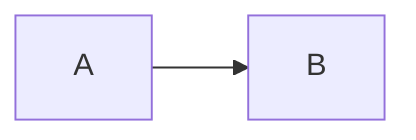

# Workflow unifié — skill-mermaidH

> **Contexte ChefsOfika (Ofika)** : la phase 0 (cartographie + délégation) est gérée par ChefsOfika. Livrables dans `schemas-mermaid/`. Voir [chefsOfika-integration.md](chefsOfika-integration.md).

> **Contexte Chefskrsidoine7** (legacy) : voir [chefskrsidoine7-integration.md](chefskrsidoine7-integration.md).

## Phase 0 — Cartographie (ChefsOfika)

Avant de diagrammer, ChefsOfika évalue :

- **Contexte** : processus, feature, modification, suppression, parcours utilisateur, onboarding, workflow, architecture ?
- **Besoin de viz** : le flux ou l'architecture est-il ambigu sans schéma ?
- **Délégation** : brief vers `skill-mermaidH` + sous-dossier cible dans `schemas-mermaid/`.

Si l'un des déclencheurs s'applique, **proposer un diagramme avant le code**.

## Phase 1 — Comprendre

Clarifier si nécessaire (sans bloquer sur des détails mineurs) :

- **Quoi** documenter ? (flux, schéma BDD, architecture, états)
- **Pour qui** ? (métier → contexte ; dev → séquence/composant ; ops → déploiement)
- **Où** ça vit ? (README, ADR, PR, présentation, terminal)

## Phase 2 — Choisir le type

| Signal dans la demande | Type recommandé |
|------------------------|-----------------|
| « étapes », « si/sinon », parcours utilisateur | flowchart |
| « appelle », « requête », « webhook », temporalité | sequenceDiagram |
| « tables », « clés », « relations » | erDiagram |
| « classes », « agrégat », DDD | classDiagram |
| « système », « microservices », « qui parle à qui » | C4 (Context puis Container) |
| « états », « cycle de vie » | stateDiagram-v2 |
| « planning », « jalons » | gantt |
| « branches », release | gitGraph |

Règle C4 : **Context + Container** suffisent souvent ; Component/Code seulement si la valeur est claire.

## Phase 3 — Rédiger

1. Lire la référence du type (`references/INDEX.md`).
2. Commencer minimal : acteurs/entités/nœuds principaux, puis relations.
3. Nommer clairement (`User`, `OrderService`, pas `A`/`B` sauf brouillon).
4. Commenter avec `%%` les zones ambiguës.
5. Encadrer la livraison Markdown :

````markdown

````

## Phase 4 — Valider

Ordre préféré :

1. Relecture syntaxe (mots-clés, guillemets, flèches).
2. Si MCP mermaid disponible : `mermaid_preview` avec `preview_id` stable.
3. Sinon : [mermaid.live](https://mermaid.live) ou `node scripts/render.mjs --input x.mmd`.

Corrections fréquentes : sequence sans `style` ; caractères spéciaux dans les labels ; diagramme trop large → le scinder.

## Phase 5 — Livrer (Ofika → `schemas-mermaid/`)

| Besoin | Action |
|--------|--------|
| **Projet Ofika (défaut)** | `.mmd` dans `schemas-mermaid/{sous-dossier}/` + `.svg` via `render-all.ps1` |
| Doc versionnée | Mettre à jour le README du sous-dossier + index racine |
| Asset figé | `.\schemas-mermaid\render-all.ps1` ou `render.mjs` unitaire |
| Lot de diagrammes | `batch.mjs` ou `render-all.ps1` |

**Sous-dossiers :** `link-to-bio/` · `onboarding/` · `architecture/` · `processus/`

Itérer avec le même `preview_id` MCP lors des retouches. ChefsOfika valide l'emplacement à l'étape *Revue & Garde*.

## Qualité (checklist rapide)

- [ ] Un message par diagramme
- [ ] Légendes / titres si public mixte
- [ ] Cardinalités / PK-FK cohérentes (ERD)
- [ ] Pas de style sur sequenceDiagram
- [ ] Thème adapté clair/sombre si export SVG
