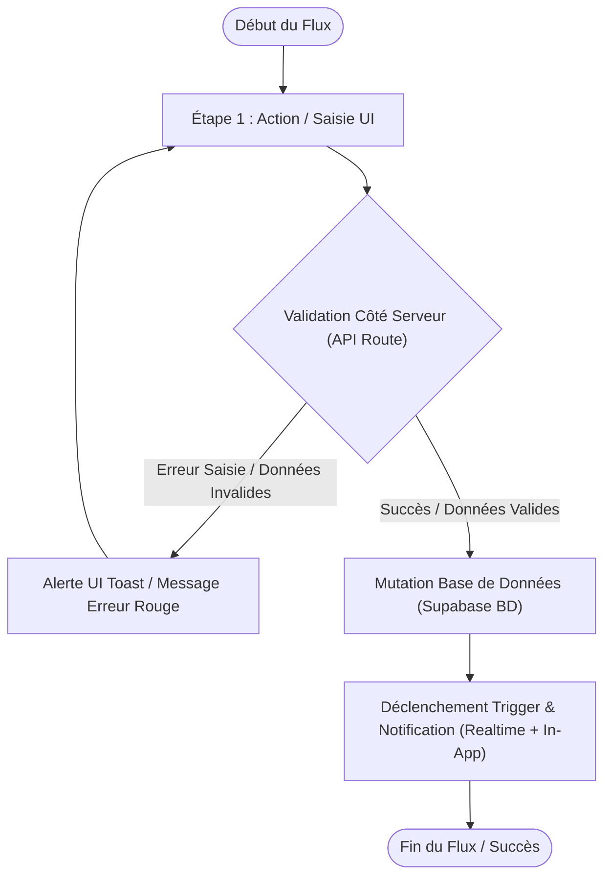

# Procédure de Flux : [Nom du Flux Utilisateur / Onboarding / Paiement]

> [!IMPORTANT]
> **Positionnement Officiel : OFIKA — Solution Leader de Cartes de Visite Intelligentes NFC & QR Code**
> Document d'architecture fonctionnelle et cartographie de flux. Conçu pour une présentation aux investisseurs, à la direction, aux audits légaux, aux développeurs et aux utilisateurs finaux.

---

## 1. Synthèse Exécutive (Executive Overview)

* **Famille de Flux** : `[ex: 01_Auth, 02_Onboarding, 03_Paiement, 04_NFC_Profil, 05_Administration]`
* **Code du Flux** : `FLOW-OFIKA-[CATEGORIE]-[ID]`
* **Acteur Principal** : `[Client / Visiteur Public / Administrateur]`
* **Objectif Fonctionnel** : `[Brève description claire de ce que le flux accomplit]`
* **Préréquis & Conditions d'entrée** : `[ex: Compte client connecté, Panier validé, etc.]`
* **Livrables & État final** : `[ex: Commande créée, Statut BD mis à 'paid', Notif client envoyée]`

---

## 2. Matrice d'Habilitation RBAC (Rôles & Permissions)

| Rôle Utilisateur | Niveau d'Accès | Actions Autorisées dans ce Flux |
| :--- | :--- | :--- |
| **Visiteur Public** | `visiteur` | Consultation des pages publiques, scan de carte NFC / QR Code, téléchargement vCard. |
| **Client Membre** | `client` | Inscription, commande de cartes, choix de paiement (GeniusPay / Wave), édition de profil Link-in-Bio. |
| **Administrateur** | `admin` | Validation des reçus Wave, suivi logistique (Préparation, Expédition, Livraison), configuration passerelles. |
| **Super Admin** | `super_admin` | Audit système, modification du prix de base de la carte, override complet. |

---

## 3. Cartographie du Flux (Diagramme Mermaid)

---

## 4. Déroulé Détaillé des Étapes (Step-by-Step Execution)

### Étape 1 : [Nom de l'étape initialisation]
* **Composant UI** : `[file.tsx](file:///c:/Users/Toto.ADMINISTRATOR/Desktop/Ofika-c-main/app/...)`
* **Trigger Utilisateur** : Clic sur le bouton `[Nom du Bouton]` ou soumission du formulaire.
* **Champs requis / Variables** : `[liste des variables]`
* **Action Serveur / API** : `[route.ts](file:///c:/Users/Toto.ADMINISTRATOR/Desktop/Ofika-c-main/app/api/...)`
* **Impact Base de Données** : Table `[table_name]`, colonnes modifiées `[col1, col2]`.

---

## 5. 📝 Résumé du Flux

[Synthèse globale du parcours rédigée de A à Z en langage naturel sous forme d'un bloc explicatif clair et fluide. Elle récapitule l'action initiale de l'utilisateur, le traitement côté serveur/API, les modifications enregistrées en base de données Supabase, le déclenchement des notifications et l'état final visualisé sur l'application.]
