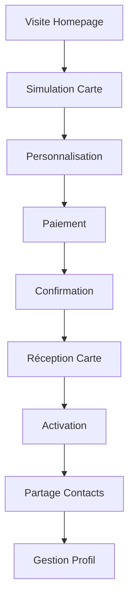
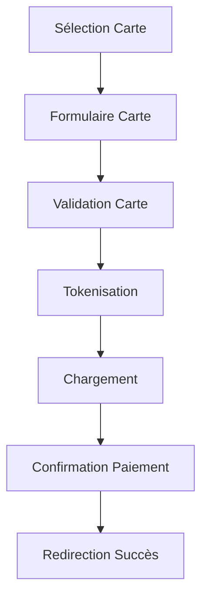
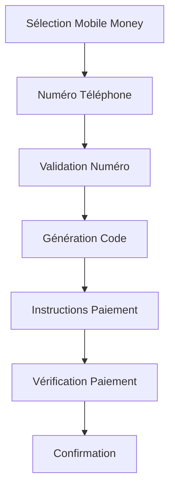

# 👤 Parcours Utilisateur - Ofika

> **Documentation complète du parcours utilisateur pour la plateforme Ofika**  
> *Version 1.0 - Janvier 2025*

---

## 📋 Table des Matières

- [Vue d'ensemble du Parcours](#-vue-densemble-du-parcours)
- [Phase 1 : Découverte & Simulation](#-phase-1--découverte--simulation)
- [Phase 2 : Personnalisation & Commande](#-phase-2--personnalisation--commande)
- [Phase 3 : Paiement](#-phase-3--paiement)
- [Phase 4 : Confirmation & Profil](#-phase-4--confirmation--profil)
- [Phase 5 : Utilisation & Partage](#-phase-5--utilisation--partage)
- [Phase 6 : Gestion & Optimisation](#-phase-6--gestion--optimisation)
- [Personas & Scénarios](#-personas--scénarios)
- [Points de Friction & Solutions](#-points-de-friction--solutions)

---

## �� Vue d'ensemble du Parcours

### Parcours Principal : De la Découverte à l'Utilisation



### Temps Total du Parcours
- **Découverte → Commande** : 5-10 minutes
- **Commande → Réception** : 7-14 jours
- **Réception → Première utilisation** : Immédiat
- **Cycle de vie complet** : 12+ mois

---

## 🏠 Phase 1 : Découverte & Simulation

### 1.1 Arrivée sur la Homepage

#### **Objectif Utilisateur**
Comprendre rapidement ce qu'est Ofika et comment ça fonctionne

#### **Éléments de la Page**
```
┌─────────────────────────────────────────┐
│  🧡 OFIKA - Votre Carte Pro Digitale    │
│                                         │
│  "Partagez vos contacts en un tap"      │
│                                         │
│  [Voir la Démo] [Commander Maintenant]  │
│                                         │
│  ┌─────────────────────────────────────┐ │
│  │        SIMULATION GRATUITE          │ │
│  │                                     │ │
│  │  Nom: [________________]            │ │
│  │  Entreprise: [____________]         │ │
│  │  Poste: [________________]          │ │
│  │  Logo: [📁 Upload]                  │ │
│  │                                     │ │
│  │  ┌─────────────────────────────────┐ │ │
│  │  │     PRÉVISUALISATION CARTE      │ │ │
│  │  │                                 │ │ │
│  │  │  [LOGO]                         │ │ │
│  │  │                                 │ │ │
│  │  │  NOM COMPLET                    │ │ │
│  │  │  Titre du Poste                 │ │ │
│  │  │                                 │ │ │
│  │  │  Nom de l'Entreprise            │ │ │
│  │  └─────────────────────────────────┘ │ │
│  │                                     │ │
│  │  [Commander Ma Carte - $12]         │ │
│  └─────────────────────────────────────┘ │
└─────────────────────────────────────────┘
```

#### **Interactions Clés**
1. **Scroll automatique** vers la section simulation
2. **Focus automatique** sur le premier champ
3. **Prévisualisation en temps réel** de la carte
4. **Validation progressive** des champs requis
5. **Bouton CTA** qui s'active après validation

#### **États du Formulaire**

| État | Champs Requis | Bouton CTA | Action |
|------|---------------|------------|--------|
| **Initial** | 0/3 | Désactivé | Aucune |
| **Partiel** | 1-2/3 | Désactivé | Aucune |
| **Complet** | 3/3 | Actif | "Commander Ma Carte" |
| **Erreur** | 3/3 | Désactivé | Message d'erreur |

#### **Micro-interactions**
- **Champ focus** : Bordure orange, label animé
- **Validation** : Checkmark vert, animation de succès
- **Erreur** : Bordure rouge, message d'aide
- **Prévisualisation** : Animation de flip carte
- **Bouton hover** : Effet de scale + glow

### 1.2 Simulation en Temps Réel

#### **Fonctionnalités de Simulation**
```typescript
interface SimulationData {
  name: string;           // Requis
  company: string;        // Requis  
  jobTitle: string;       // Requis
  logo?: File;           // Optionnel
  email?: string;        // Optionnel (pour follow-up)
}

interface CardPreview {
  front: {
    logo: string | null;
    name: string;
    jobTitle: string;
    company: string;
  };
  back: {
    qrCode: string;
    instruction: string;
  };
}
```

#### **Logique de Validation**
```javascript
const validateSimulation = (data) => {
  const errors = {};
  
  if (!data.name.trim()) {
    errors.name = "Le nom est requis";
  }
  
  if (!data.company.trim()) {
    errors.company = "L'entreprise est requise";
  }
  
  if (!data.jobTitle.trim()) {
    errors.jobTitle = "Le poste est requis";
  }
  
  return {
    isValid: Object.keys(errors).length === 0,
    errors
  };
};
```

#### **Génération de Prévisualisation**
- **Logo par défaut** : Initiales de l'entreprise si pas de logo
- **QR Code dynamique** : Généré avec URL de profil temporaire
- **Dimensions réelles** : 85mm × 55mm (ratio 1.55:1)
- **Rendu haute qualité** : Canvas 2D pour preview net

### 1.3 Points de Sortie & Rétention

#### **Stratégies de Rétention**
1. **Popup de sortie** : "Ne perdez pas votre carte personnalisée !"
2. **Sauvegarde locale** : Données stockées dans localStorage
3. **Email de rappel** : Si email fourni, envoi après 24h
4. **Social proof** : "1,247 cartes créées cette semaine"

#### **Call-to-Actions Secondaires**
- **"Voir des exemples"** : Galerie de cartes existantes
- **"Comment ça marche"** : Vidéo explicative 30s
- **"Témoignages"** : Avis clients avec photos
- **"Prix"** : Comparaison avec cartes traditionnelles

---

## 🎨 Phase 2 : Personnalisation & Commande

### 2.1 Page de Personnalisation

#### **Layout de la Page**
```
┌─────────────────────────────────────────────────────────┐
│  ← Retour    Personnalisez Votre Carte    [Aide] [?]   │
├─────────────────────────────────────────────────────────┤
│                                                         │
│  ┌─────────────────┐  ┌─────────────────────────────┐   │
│  │   PRÉVISUALISATION   │  │     CONTRÔLES DESIGN      │   │
│  │                     │  │                           │   │
│  │  ┌───────────────┐  │  │  Logo:                    │   │
│  │  │  [LOGO]       │  │  │  [Position] [Taille]      │   │
│  │  │               │  │  │                           │   │
│  │  │  NOM COMPLET  │  │  │  Texte:                   │   │
│  │  │  Titre Poste  │  │  │  [Alignement] [Police]    │   │
│  │  │               │  │  │                           │   │
│  │  │  ENTREPRISE   │  │  │  Couleurs:                │   │
│  │  └───────────────┘  │  │  [Thème] [Accent]         │   │
│  │                     │  │                           │   │
│  │  [🔄 Voir Dos]      │  │  Quantité:                 │   │
│  │                     │  │  [1] [2] (Max 2)          │   │
│  └─────────────────┘  │                           │   │
│                       │  [Continuer vers Paiement] │   │
│                       └─────────────────────────────┘   │
└─────────────────────────────────────────────────────────┘
```

#### **Contrôles de Personnalisation**

##### **Logo**
- **Position** : Haut-centre, Haut-gauche, Haut-droite
- **Taille** : Petit (20%), Moyen (30%), Grand (40%)
- **Format** : PNG, JPG, SVG (max 2MB)
- **Aperçu** : Rendu en temps réel

##### **Texte**
- **Alignement** : Centre, Gauche, Justifié
- **Police** : Inter (défaut), Roboto, Open Sans
- **Taille** : Auto-adaptative selon contenu
- **Couleur** : Palette Ofika + personnalisée

##### **Couleurs**
- **Thèmes prédéfinis** :
  - Classique (Noir/Blanc)
  - Ofika (Orange/Rose)
  - Professionnel (Bleu/Gris)
  - Créatif (Couleurs vives)

##### **Quantité**
- **Maximum** : 2 cartes par utilisateur
- **Prix** : $12 pour 1, $20 pour 2
- **Économie** : "Économisez $4 avec 2 cartes"

### 2.2 Prévisualisation Avancée

#### **Rendu 3D de la Carte**
```typescript
interface Card3DPreview {
  front: CardDesign;
  back: CardDesign;
  animation: 'flip' | 'rotate' | 'zoom';
  quality: 'draft' | 'preview' | 'final';
}

interface CardDesign {
  logo: LogoConfig;
  text: TextConfig;
  colors: ColorConfig;
  layout: LayoutConfig;
}
```

#### **Animations de Prévisualisation**
- **Flip carte** : Animation 3D front/back
- **Zoom** : Détails de la carte en gros plan
- **Rotation** : Vue sous différents angles
- **Hover effects** : Effets de survol réalistes

#### **Qualité de Rendu**
- **Draft** : Rendu rapide, qualité basse
- **Preview** : Rendu moyen, qualité acceptable
- **Final** : Rendu haute qualité pour validation

### 2.3 Validation & Finalisation

#### **Vérifications Avancees**
```javascript
const validateCustomization = (design) => {
  const checks = {
    logo: validateLogo(design.logo),
    text: validateText(design.text),
    colors: validateColors(design.colors),
    layout: validateLayout(design.layout)
  };
  
  return {
    isValid: Object.values(checks).every(check => check.valid),
    warnings: Object.values(checks).flatMap(check => check.warnings),
    errors: Object.values(checks).flatMap(check => check.errors)
  };
};
```

#### **Messages de Validation**
- **Erreurs critiques** : "Logo trop petit pour être lisible"
- **Avertissements** : "Texte long, considérez une version courte"
- **Suggestions** : "Essayez l'alignement centré pour un look plus professionnel"

---

##  Phase 3 : Paiement

### 3.1 Sélection de Méthode de Paiement

#### **Page de Sélection**
```
┌─────────────────────────────────────────────────────────┐
│  ← Retour    Choisissez Votre Méthode de Paiement      │
├─────────────────────────────────────────────────────────┤
│                                                         │
│  Commande: 2 cartes Ofika - $20.00                     │
│                                                         │
│  ┌─────────────────────────────────────────────────────┐ │
│  │  💳 CARTE BANCAIRE                                  │ │
│  │  Visa, Mastercard, American Express                 │ │
│  │  [Sélectionner]                                     │ │
│  └─────────────────────────────────────────────────────┘ │
│                                                         │
│  ┌─────────────────────────────────────────────────────┐ │
│  │  🏦 VIREMENT BANCAIRE                               │ │
│  │  Comptes locaux, RIP                                │ │
│  │  [Sélectionner]                                     │ │
│  └─────────────────────────────────────────────────────┘ │
│                                                         │
│  ┌─────────────────────────────────────────────────────┐ │
│  │  📱 MOBILE MONEY                                    │ │
│  │  Orange Money, MTN Money, Wave                      │ │
│  │  [Sélectionner]                                     │ │
│  └─────────────────────────────────────────────────────┘ │
│                                                         │
│  [Continuer]                                            │
└─────────────────────────────────────────────────────────┘
```

#### **Méthodes Disponibles par Pays**

| Pays | Cartes | Virement | Mobile Money | Autres |
|------|--------|----------|--------------|--------|
| **Sénégal** | ✅ | ✅ | Orange Money, Wave | - |
| **Côte d'Ivoire** | ✅ | ✅ | Orange Money, MTN | - |
| **Ghana** | ✅ | ✅ | MTN Money | - |
| **Nigeria** | ✅ | ✅ | MTN Money | - |
| **Kenya** | ✅ | ✅ | M-Pesa | - |

### 3.2 Processus de Paiement

#### **Flow de Paiement Carte**


#### **Flow de Paiement Mobile Money**


#### **Sécurité & Conformité**
- **PCI DSS** : Conformité pour données cartes
- **Tokenisation** : Aucune donnée sensible stockée
- **Chiffrement** : TLS 1.3 pour toutes communications
- **Audit** : Logs complets pour traçabilité

### 3.3 Gestion des Erreurs de Paiement

#### **Types d'Erreurs**
```typescript
interface PaymentError {
  type: 'card_declined' | 'insufficient_funds' | 'network_error' | 'invalid_data';
  message: string;
  retryable: boolean;
  alternativeMethods?: PaymentMethod[];
}
```

#### **Messages d'Erreur Utilisateur**
- **Carte refusée** : "Votre carte a été refusée. Essayez une autre carte ou une autre méthode de paiement."
- **Fonds insuffisants** : "Fonds insuffisants. Vérifiez votre solde ou utilisez une autre méthode."
- **Erreur réseau** : "Problème de connexion. Veuillez réessayer dans quelques instants."
- **Données invalides** : "Vérifiez vos informations de paiement et réessayez."

#### **Stratégies de Récupération**
1. **Retry automatique** : 2 tentatives automatiques
2. **Méthodes alternatives** : Suggestion d'autres options
3. **Support** : Chat en direct ou ticket
4. **Sauvegarde** : Données de commande conservées 24h

---

## ✅ Phase 4 : Confirmation & Profil

### 4.1 Page de Confirmation

#### **Layout de Confirmation**
```
┌─────────────────────────────────────────────────────────┐
│  ✅ Commande Confirmée !                               │
├─────────────────────────────────────────────────────────┤
│                                                         │
│  Merci pour votre commande, [Nom] !                    │
│                                                         │
│  ┌─────────────────────────────────────────────────────┐ │
│  │  📋 DÉTAILS DE LA COMMANDE                          │ │
│  │                                                     │ │
│  │  Commande #OF-2025-001234                          │ │
│  │  Date: 15 Janvier 2025                             │ │
│  │  Montant: $20.00                                   │ │
│  │  Statut: En préparation                            │ │
│  │                                                     │ │
│  │  Livraison estimée: 7-14 jours                     │ │
│  └─────────────────────────────────────────────────────┘ │
│                                                         │
│  ┌─────────────────────────────────────────────────────┐ │
│  │  🎯 VOTRE PROFIL EST CRÉÉ !                         │ │
│  │                                                     │ │
│  │  URL: https://ofika.app/[username]                  │ │
│  │  QR Code: [QR Code]                                │ │
│  │                                                     │ │
│  │  [Voir Mon Profil] [Partager]                      │ │
│  └─────────────────────────────────────────────────────┘ │
│                                                         │
│  📧 Un email de confirmation a été envoyé              │
│                                                         │
│  [Retour à l'Accueil] [Suivre Ma Commande]            │
└─────────────────────────────────────────────────────────┘
```

#### **Informations de Suivi**
- **Numéro de commande** : Format OF-YYYY-NNNNNN
- **Statut en temps réel** : En préparation → Expédié → Livré
- **Tracking** : Lien vers transporteur si applicable
- **Support** : Contact direct pour questions

### 4.2 Création Automatique du Profil

#### **Génération du Profil**
```typescript
interface ProfileData {
  username: string;        // Généré automatiquement
  displayName: string;     // Nom de la simulation
  company: string;         // Entreprise de la simulation
  jobTitle: string;        // Poste de la simulation
  logo: string;           // Logo uploadé ou initiales
  bio: string;            // Description générée automatiquement
  socialLinks: SocialLink[]; // Liens sociaux (max 2)
  contactInfo: ContactInfo;  // Informations de contact
  theme: ThemeConfig;      // Configuration visuelle
}

interface SocialLink {
  platform: 'linkedin' | 'twitter' | 'instagram' | 'website';
  url: string;
  displayName: string;
}
```

#### **URL de Profil**
- **Format** : `https://ofika.app/[username]`
- **Username** : Généré à partir du nom (ex: "john-doe-123")
- **Disponibilité** : Vérification automatique d'unicité
- **Personnalisation** : Possibilité de changer plus tard

### 4.3 Email de Confirmation

#### **Template Email**
```html
<!DOCTYPE html>
<html>
<head>
  <title>Votre commande Ofika est confirmée</title>
</head>
<body>
  <div style="max-width: 600px; margin: 0 auto; font-family: Arial, sans-serif;">
    
    <!-- Header -->
    <div style="background: linear-gradient(135deg, #d2691e, #b91c7c); color: white; padding: 20px; text-align: center;">
      <h1> Votre commande est confirmée !</h1>
    </div>
    
    <!-- Content -->
    <div style="padding: 20px;">
      <p>Bonjour [Nom],</p>
      
      <p>Merci pour votre commande ! Votre carte Ofika personnalisée est en cours de préparation.</p>
      
      <!-- Order Details -->
      <div style="background: #f5f5f5; padding: 15px; margin: 20px 0; border-radius: 8px;">
        <h3> Détails de votre commande</h3>
        <p><strong>Commande :</strong> #OF-2025-001234</p>
        <p><strong>Montant :</strong> $20.00</p>
        <p><strong>Livraison :</strong> 7-14 jours ouvrés</p>
      </div>
      
      <!-- Profile Info -->
      <div style="background: #e8f4fd; padding: 15px; margin: 20px 0; border-radius: 8px;">
        <h3>🎯 Votre profil est prêt !</h3>
        <p><strong>URL :</strong> <a href="https://ofika.app/[username]">https://ofika.app/[username]</a></p>
        <p>Vous pouvez commencer à partager votre profil dès maintenant !</p>
      </div>
      
      <!-- Next Steps -->
      <div style="margin: 20px 0;">
        <h3>📱 Prochaines étapes</h3>
        <ol>
          <li>Votre carte sera expédiée dans 7-14 jours</li>
          <li>Vous recevrez un email de suivi avec le tracking</li>
          <li>Une fois reçue, scannez le QR code pour activer</li>
          <li>Commencez à partager vos contacts !</li>
        </ol>
      </div>
      
      <!-- CTA Buttons -->
      <div style="text-align: center; margin: 30px 0;">
        <a href="https://ofika.app/[username]" style="background: linear-gradient(135deg, #d2691e, #b91c7c); color: white; padding: 12px 24px; text-decoration: none; border-radius: 6px; margin: 0 10px;">Voir Mon Profil</a>
        <a href="https://ofika.app/track/OF-2025-001234" style="background: #f0f0f0; color: #333; padding: 12px 24px; text-decoration: none; border-radius: 6px; margin: 0 10px;">Suivre Ma Commande</a>
      </div>
      
    </div>
    
    <!-- Footer -->
    <div style="background: #f8f9fa; padding: 20px; text-align: center; color: #666; font-size: 14px;">
      <p>Des questions ? Répondez à cet email ou contactez-nous sur <a href="mailto:support@ofika.app">support@ofika.app</a></p>
      <p>Ofika - Votre carte professionnelle digitale</p>
    </div>
    
  </div>
</body>
</html>
```

---

## 📱 Phase 5 : Utilisation & Partage

### 5.1 Réception et Activation de la Carte

#### **Processus d'Activation**
1. **Réception** : Carte livrée avec instructions
2. **Scan QR** : Premier scan pour activation
3. **Vérification** : Confirmation de propriétaire
4. **Activation** : Carte liée au profil utilisateur

#### **Instructions d'Activation**
```
┌─────────────────────────────────────────────────────────┐
│  🎉 Votre carte Ofika est arrivée !                    │
├─────────────────────────────────────────────────────────┤
│                                                         │
│  ┌─────────────────────────────────────────────────────┐ │
│  │  📱 ACTIVATION EN 3 ÉTAPES                          │ │
│  │                                                     │ │
│  │  1. Scannez le QR code au dos de votre carte       │ │
│  │  2. Confirmez que c'est bien votre carte           │ │
│  │  3. Votre carte est maintenant active !            │ │
│  │                                                  
