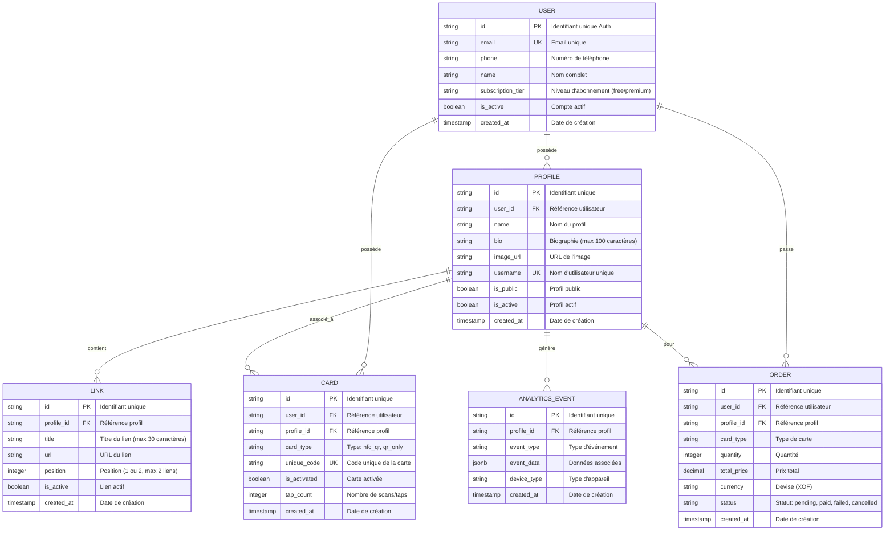

# 🏗️ Architecture, Base de Données & Spécifications APIs - Ofika

> **Documentation unifiée de l'infrastructure technique, de la modélisation de données et des spécifications API d'Ofika**  
> *Version 1.0 - Janvier 2025*

---

## 📋 Table des Matières

1. [Architecture Technique & Système](#1-architecture-technique--système)
2. [Modèle Conceptuel de Données (MCD)](#2-modèle-conceptuel-de-données-mcd)
3. [Structure Physique de la Base de Données (SQL Schema)](#3-structure-physique-de-la-base-de-données-sql-schema)
4. [Spécifications des APIs & Endpoints](#4-spécifications-des-apis--endpoints)
5. [Politiques RLS & Sécurité](#5-politiques-rls--sécurité)

---

## 1. Architecture Technique & Système

### Architecture Générale
Ofika utilise une architecture Next.js moderne, optimisée pour le marché africain avec une approche mobile-first, une faible consommation de bande passante et des connexions résilientes.

#### **Composants Principaux**
1. **Frontend / Application Web** : Interface Next.js 15 (App Router, React 18, Tailwind CSS, shadcn/ui).
2. **Backend & Serverless API** : Routes API intégrées dans Next.js via App Router, connectées à la base de données.
3. **Base de Données** : PostgreSQL hébergé sur Supabase pour la persistance, avec gestion de l'authentification et du stockage de fichiers.

### Stack Technologique

#### **Frontend**
* **Next.js 15** (App Router) & **React 18**
* **TypeScript** pour la sécurité de typage.
* **Tailwind CSS** & **shadcn/ui** pour un design premium et réactif.
* **Framer Motion** & **GSAP** pour des micro-animations interactives fluides.

#### **Backend & Données**
* **Supabase** (PostgreSQL, Auth, Storage).
* **Drizzle ORM** pour la modélisation, les jointures et l'écriture sécurisée des requêtes SQL.

---

## 2. Modèle Conceptuel de Données (MCD)

### Diagramme MCD (Mermaid)



---

## 3. Structure Physique de la Base de Données (SQL Schema)

### Schéma PostgreSQL principal

```sql
-- Table des Utilisateurs
CREATE TABLE users (
    id UUID PRIMARY KEY DEFAULT gen_random_uuid(),
    email VARCHAR(255) UNIQUE NOT NULL,
    first_name VARCHAR(100) NOT NULL,
    last_name VARCHAR(100) NOT NULL,
    phone VARCHAR(20),
    country VARCHAR(2) NOT NULL,
    role VARCHAR(20) DEFAULT 'user', -- 'user', 'admin'
    is_active BOOLEAN DEFAULT TRUE,
    created_at TIMESTAMP WITH TIME ZONE DEFAULT NOW(),
    updated_at TIMESTAMP WITH TIME ZONE DEFAULT NOW()
);

-- Table des Profils Link-in-Bio
CREATE TABLE profiles (
    id UUID PRIMARY KEY DEFAULT gen_random_uuid(),
    user_id UUID NOT NULL REFERENCES users(id) ON DELETE CASCADE,
    username VARCHAR(50) UNIQUE NOT NULL,
    display_name VARCHAR(100) NOT NULL,
    company VARCHAR(100),
    job_title VARCHAR(100),
    bio TEXT,
    logo_url VARCHAR(500),
    photo_url VARCHAR(500),
    theme VARCHAR(20) DEFAULT 'classic',
    is_public BOOLEAN DEFAULT TRUE,
    is_active BOOLEAN DEFAULT TRUE,
    created_at TIMESTAMP WITH TIME ZONE DEFAULT NOW(),
    updated_at TIMESTAMP WITH TIME ZONE DEFAULT NOW()
);

-- Table des Liens Sociaux (Max 2 par profil)
CREATE TABLE social_links (
    id UUID PRIMARY KEY DEFAULT gen_random_uuid(),
    profile_id UUID NOT NULL REFERENCES profiles(id) ON DELETE CASCADE,
    platform VARCHAR(20) NOT NULL,
    url VARCHAR(500) NOT NULL,
    display_name VARCHAR(100),
    order_index INTEGER NOT NULL,
    is_active BOOLEAN DEFAULT TRUE,
    created_at TIMESTAMP WITH TIME ZONE DEFAULT NOW()
);

-- Table des Commandes de Cartes Physiques (Wave Direct)
CREATE TABLE card_orders (
    id UUID PRIMARY KEY DEFAULT gen_random_uuid(),
    user_id UUID NOT NULL REFERENCES users(id) ON DELETE CASCADE,
    order_number VARCHAR(20) UNIQUE NOT NULL,
    status VARCHAR(20) NOT NULL DEFAULT 'pending',
    quantity INTEGER NOT NULL CHECK (quantity > 0 AND quantity <= 2),
    total_amount DECIMAL(10,2) NOT NULL,
    currency VARCHAR(3) NOT NULL DEFAULT 'XOF',
    payment_method VARCHAR(20) NOT NULL, -- 'wave', 'manual_upload'
    payment_status VARCHAR(20) NOT NULL DEFAULT 'pending',
    payment_reference VARCHAR(100),
    shipping_address JSONB NOT NULL,
    receipt_image_url VARCHAR(500), -- Pour la preuve d'upload manuelle
    created_at TIMESTAMP WITH TIME ZONE DEFAULT NOW(),
    updated_at TIMESTAMP WITH TIME ZONE DEFAULT NOW()
);

-- Table des Événements Analytics
CREATE TABLE analytics_events (
    id UUID PRIMARY KEY DEFAULT gen_random_uuid(),
    profile_id UUID NOT NULL REFERENCES profiles(id) ON DELETE CASCADE,
    event_type VARCHAR(50) NOT NULL, -- 'profile_view', 'social_click', 'nfc_tap'
    event_data JSONB,
    device_type VARCHAR(20),
    browser VARCHAR(50),
    created_at TIMESTAMP WITH TIME ZONE DEFAULT NOW()
);
```

---

## 4. Spécifications des APIs & Endpoints

### 🔑 Authentification & Compte
* `POST /api/auth/register` : Crée un compte utilisateur.
* `POST /api/auth/login` : Connecte l'utilisateur.

### 👤 Profils & Liens
* `GET /api/profiles/:username` : Récupère le profil public d'un utilisateur par son nom unique.
* `POST /api/profiles` : Crée ou met à jour le profil de l'utilisateur connecté.
* `POST /api/social-links` : Ajoute ou modifie un lien social (Contrainte : 2 liens actifs maximum).

### 🛒 Commandes & Paiements (Flux Wave)
* `POST /api/payments/wave/create` : Génère le lien de paiement direct Wave ou enregistre les détails de transaction.
* `POST /api/orders/manual-upload` : Enregistre une commande avec téléversement (upload) de la capture d'écran du reçu de paiement.
* `POST /api/admin/orders/:id/verify` : (Réservé Admin) Valide un reçu manuel et confirme la commande pour la production.

### 📊 Statistiques (Analytics)
* `POST /api/analytics/track` : Enregistre anonymement un événement de visite (`profile_view`) ou de clic (`social_click`).

---

## 5. Politiques RLS & Sécurité

### Row Level Security (RLS) sur Supabase
Afin de protéger la confidentialité des données utilisateurs, toutes les tables de la base de données ont les politiques RLS configurées.

* **Lecture Publique** : Les tables `profiles` et `social_links` autorisent la lecture publique anonyme pour l'affichage des mini-sites.
* **Écriture restreinte** : Seuls les propriétaires authentifiés (vérification de `user_id = auth.uid()`) peuvent ajouter, modifier ou supprimer leurs liens, informations de profil et commandes de cartes.
* **Accès Admin** : Les utilisateurs déclarés dans la table `admin_users` disposent des droits de lecture/écriture globaux pour la modération et la gestion des commandes physiques.
