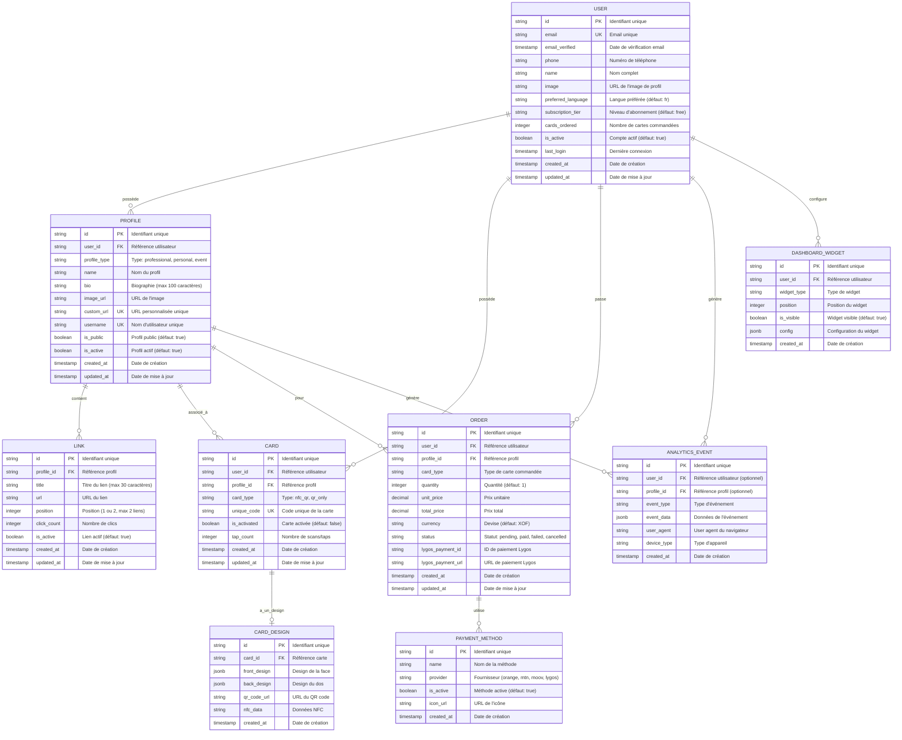
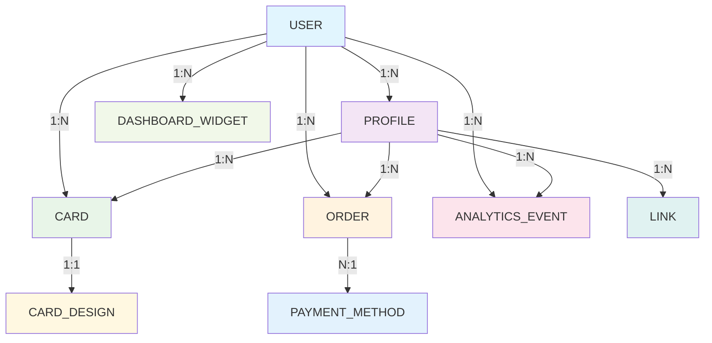
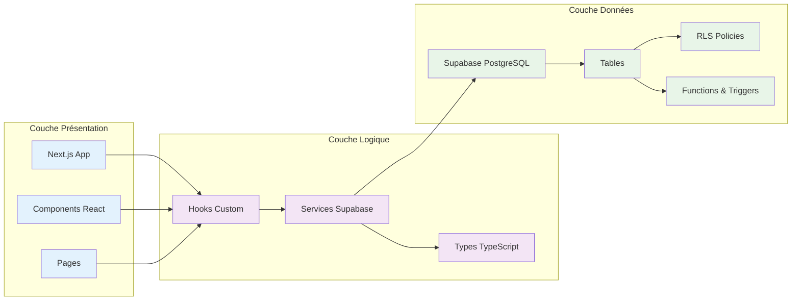

# 📊 MCD - MODÈLE CONCEPTUEL DE DONNÉES

## Vue d'ensemble
Modèle conceptuel de données pour le système de cartes de visite NFC/QR avec Supabase.

## Diagramme MCD Visuel

## Diagramme de Relations Simplifié

## Architecture des Données

## Description des Entités

### 1. USER (Utilisateur)
**Rôle** : Utilisateur principal du système
**Contraintes** : 
- Email unique
- Maximum 3 profils par utilisateur
- Maximum 2 cartes par utilisateur
**Relations** : 1:N avec Profile, Card, Order, AnalyticsEvent, DashboardWidget

### 2. PROFILE (Profil)
**Rôle** : Profils professionnels/personnels/événements
**Contraintes** :
- Maximum 2 liens par profil
- URL personnalisée unique
- Username unique
**Relations** : N:1 avec User, 1:N avec Link, Card, Order, AnalyticsEvent

### 3. LINK (Lien)
**Rôle** : Liens sociaux et web des profils
**Contraintes** :
- Maximum 2 liens par profil
- Titre limité à 30 caractères
**Relations** : N:1 avec Profile

### 4. CARD (Carte)
**Rôle** : Cartes NFC/QR physiques
**Contraintes** :
- Code unique généré automatiquement
- Maximum 2 cartes par utilisateur
**Relations** : N:1 avec User et Profile, 1:1 avec CardDesign

### 5. CARD_DESIGN (Design de Carte)
**Rôle** : Design personnalisé des cartes
**Contraintes** : Un design par carte
**Relations** : 1:1 avec Card

### 6. ORDER (Commande)
**Rôle** : Commandes de cartes physiques
**Contraintes** : Prix en XOF par défaut
**Relations** : N:1 avec User et Profile

### 7. PAYMENT_METHOD (Méthode de Paiement)
**Rôle** : Méthodes de paiement disponibles
**Contraintes** : Méthodes spécifiques à l'Afrique (Orange Money, MTN, etc.)
**Relations** : 1:N avec Order

### 8. ANALYTICS_EVENT (Événement Analytics)
**Rôle** : Suivi des interactions et statistiques
**Contraintes** : Données JSON flexibles
**Relations** : N:1 avec User et Profile (optionnels)

### 9. DASHBOARD_WIDGET (Widget Dashboard)
**Rôle** : Widgets personnalisables du dashboard
**Contraintes** : Configuration JSON flexible
**Relations** : N:1 avec User

## Règles de Gestion

### Contraintes Métier
1. **Un utilisateur** peut avoir **maximum 3 profils**
2. **Un profil** peut avoir **maximum 2 liens**
3. **Un utilisateur** peut avoir **maximum 2 cartes**
4. **Les profils publics** sont visibles par tous
5. **Les cartes** sont liées à un utilisateur ET un profil
6. **Les commandes** sont liées à un utilisateur ET un profil

### Génération Automatique
1. **Codes uniques** pour les cartes (format: OFK-XXXXXXXX)
2. **URLs personnalisées** basées sur le nom du profil
3. **Timestamps** de création et mise à jour automatiques

### Sécurité
1. **RLS activé** sur toutes les tables
2. **Politiques** basées sur l'authentification utilisateur
3. **Profils publics** accessibles sans authentification

## Types de Données

### Types Primitifs
- `string` : Texte
- `integer` : Nombre entier
- `decimal` : Nombre décimal
- `boolean` : Vrai/Faux
- `timestamp` : Date et heure
- `jsonb` : Données JSON binaires

### Types Spéciaux
- `PK` : Clé primaire
- `FK` : Clé étrangère
- `UK` : Clé unique

## Index et Performance

### Index Principaux
- `users_email_key` : Index unique sur email
- `profiles_custom_url_key` : Index unique sur custom_url
- `profiles_username_key` : Index unique sur username
- `cards_unique_code_key` : Index unique sur unique_code

### Index de Performance
- `idx_profiles_user_active` : (user_id, is_active)
- `idx_profiles_custom_url` : custom_url WHERE is_active = true
- `idx_links_profile_active` : (profile_id, is_active)
- `idx_cards_user` : user_id
- `idx_analytics_profile_date` : (profile_id, created_at)

## Politiques RLS (Row Level Security)

### Tables avec RLS
- `users` : Données utilisateur privées
- `profiles` : Profils publics/privés
- `links` : Liens des profils
- `cards` : Cartes utilisateur
- `card_designs` : Designs des cartes
- `orders` : Commandes utilisateur
- `analytics_events` : Événements analytics
- `dashboard_widgets` : Widgets dashboard

### Règles d'Accès
1. **Utilisateurs** : Accès uniquement à leurs propres données
2. **Profils publics** : Accessibles par tous les utilisateurs
3. **Profils privés** : Accessibles uniquement par le propriétaire
4. **Cartes** : Accessibles uniquement par le propriétaire
5. **Analytics** : Insertion libre, lecture restreinte au propriétaire

---

**Date de création** : $(date)
**Version** : 1.0
**Statut** : Actif
**Base de données** : Supabase PostgreSQL
