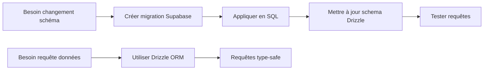

# 📖 DOCUMENTATION BASE DE DONNÉES OFIKA (FRANÇAIS)

**Bienvenue** ! Cette documentation explique en français toute l'architecture de votre base de données.

---

## 🚀 COMMENCEZ ICI

### Vous êtes nouveau ? Lisez dans cet ordre :

1. **GUIDE_UTILISATION_FR.md** ← COMMENCEZ ICI !
   - Explication simple de tout
   - Exemples de code
   - Ce qu'il faut faire et ne pas faire

2. **DATABASE_RESUME_FR.md**
   - Vue d'ensemble technique
   - Problèmes trouvés
   - Plan d'action

3. **DATABASE_CORRECTIONS_RAPIDES_FR.sql**
   - Fichier SQL à exécuter
   - Corrige les problèmes détectés

---

## 📚 TOUS LES DOCUMENTS

### 🇫🇷 Documents en FRANÇAIS

| Fichier | Description | Pour qui ? |
|---------|-------------|------------|
| **README_FR.md** | Ce fichier (index) | Tout le monde |
| **GUIDE_UTILISATION_FR.md** | Guide pratique complet | ⭐ Développeurs (LIRE EN PREMIER) |
| **DATABASE_RESUME_FR.md** | Résumé technique | Architectes/Lead Dev |
| **DATABASE_CORRECTIONS_RAPIDES_FR.sql** | Script de correction | DBA/DevOps |

### 🇬🇧 Documents en ANGLAIS (versions originales)

| Fichier | Description |
|---------|-------------|
| DATABASE_SUMMARY.md | Executive summary |
| DATABASE_TABLES_DETAIL.md | Complete table specs |
| DATABASE_FINAL_REPORT.md | Full analysis report |
| DATABASE_QUICK_FIXES.sql | SQL fixes script |
| DATABASE_DIAGRAM.md | Visual diagrams |

---

## 🎯 QUESTIONS RAPIDES

### "Je veux juste comprendre ma base de données"
→ Lisez **GUIDE_UTILISATION_FR.md**

### "Je veux voir les problèmes techniques"
→ Lisez **DATABASE_RESUME_FR.md**

### "Je veux corriger les problèmes"
→ Exécutez **DATABASE_CORRECTIONS_RAPIDES_FR.sql**

### "Je veux des exemples de code Drizzle"
→ Section "Exemples pratiques" dans **GUIDE_UTILISATION_FR.md**

---

## 🚨 AVERTISSEMENT IMPORTANT

### ⚠️ NE FAITES PAS `npm run db:push` !

**Pourquoi ?**
- Votre schéma SQL utilise `UUID`
- Votre schéma Drizzle utilise `TEXT`
- La synchronisation va **casser votre base de données**

**Que faire à la place ?**
```typescript
// ✅ BON : Utilisez Drizzle pour les requêtes
const profils = await db.select().from(profiles);

// ✅ BON : Utilisez Supabase pour les migrations
-- supabase/migrations/xxx.sql
ALTER TABLE profiles ADD COLUMN ...;

// ❌ MAUVAIS : Ne synchronisez jamais
npm run db:push  // VA DÉTRUIRE VOS DONNÉES !
```

---

## 📊 RÉSUMÉ DE VOTRE BASE

```
✅ 15 tables
✅ 185 colonnes
✅ 23 relations (clés étrangères)
✅ 47 index
✅ 32 politiques de sécurité (RLS)
✅ 12 fonctions
✅ 11 triggers

Note de qualité : 7,5/10
Statut : Prête pour production (avec réserves)
```

---

## 🗂️ VOS 15 TABLES

### Tables principales
1. **users** - Comptes utilisateurs
2. **profiles** - Profils (plusieurs par utilisateur)
3. **links** - Liens des profils
4. **cards** - Cartes NFC/QR
5. **card_designs** - Design des cartes

### E-commerce
6. **orders** - Commandes
7. **payment_methods** - Moyens de paiement

### Analytiques
8. **analytics_events** - Événements trackés
9. **dashboard_widgets** - Config dashboard

### QR Codes
10. **qr_redirects** - Redirections QR
11. **qr_scans** - Scans détaillés

### Templates
12. **template_schemas** - 8 templates préfaits
13. **profile_template_data** - Valeurs templates

### NFC
14. **nfc_profiles** - Profils NFC
15. **nfc_cards** - Cartes physiques

---

## 🔧 CORRECTIONS À APPLIQUER

### Priorité 1 : CRITIQUE
- ❌ Ne pas utiliser `drizzle-kit push`
- ✅ Appliquer corrections SQL

### Priorité 2 : HAUTE
- Supprimer colonne redondante `links.position`
- Ajouter 3 index manquants
- Ajouter validations JSONB

### Priorité 3 : MOYENNE
- Documenter toutes les tables
- Standardiser types VARCHAR
- Optimiser requêtes lentes

---

## 💡 WORKFLOW RECOMMANDÉ



### En français :

1. **Pour changer la structure** (ajouter colonne, table, etc.)
   - Créez fichier dans `supabase/migrations/`
   - Écrivez SQL : `ALTER TABLE ...`
   - Exécutez dans Supabase Dashboard
   - Mettez à jour `drizzle/schema.ts` manuellement

2. **Pour lire/écrire des données**
   - Utilisez Drizzle partout
   - Requêtes type-safe
   - Autocomplete dans VS Code
   - Pas de risque d'erreur SQL

---

## 📖 EXEMPLES RAPIDES

### Lire des données
```typescript
import { db } from '@/lib/db';
import { profiles } from '@/drizzle/schema';
import { eq } from 'drizzle-orm';

// Simple
const tous = await db.select().from(profiles);

// Avec filtre
const monProfil = await db.select()
  .from(profiles)
  .where(eq(profiles.id, profilId));

// Avec relations
const profilComplet = await db.query.profiles.findFirst({
  where: eq(profiles.id, profilId),
  with: { links: true, cards: true }
});
```

### Écrire des données
```typescript
// Insérer
const [nouveau] = await db.insert(profiles)
  .values({ userId, name: 'Mon Profil' })
  .returning();

// Mettre à jour
await db.update(profiles)
  .set({ bio: 'Nouvelle bio' })
  .where(eq(profiles.id, profilId));

// Supprimer
await db.delete(profiles)
  .where(eq(profiles.id, profilId));
```

---

## 🆘 BESOIN D'AIDE ?

### Problèmes courants

**"Je ne comprends pas l'architecture"**
→ Lisez la section "LES 15 TABLES EXPLIQUÉES" dans **GUIDE_UTILISATION_FR.md**

**"Comment je fais une requête avec Drizzle ?"**
→ Section "EXEMPLES PRATIQUES" dans **GUIDE_UTILISATION_FR.md**

**"J'ai une erreur avec drizzle-kit push"**
→ Normal ! Ne l'utilisez pas. Voir section "AVERTISSEMENT" ci-dessus

**"Comment j'ajoute une colonne ?"**
→ Créez migration Supabase, pas avec Drizzle

**"Quelles tables sont liées entre elles ?"**
→ Voir diagramme dans **DATABASE_RESUME_FR.md**

---

## 📞 CONTACT ET SUPPORT

### Ressources utiles

- **Documentation Drizzle** : https://orm.drizzle.team/docs/overview
- **Documentation Supabase** : https://supabase.com/docs
- **PostgreSQL Doc** : https://www.postgresql.org/docs/

### Vos fichiers de doc

```
docs/
├── README_FR.md                        ← Vous êtes ici
├── GUIDE_UTILISATION_FR.md             ← Guide complet
├── DATABASE_RESUME_FR.md               ← Résumé technique
├── DATABASE_CORRECTIONS_RAPIDES_FR.sql ← Script SQL
│
├── DATABASE_SUMMARY.md                 (English)
├── DATABASE_TABLES_DETAIL.md          (English)
├── DATABASE_FINAL_REPORT.md           (English)
├── DATABASE_QUICK_FIXES.sql           (English)
└── DATABASE_DIAGRAM.md                (English)
```

---

## ✅ CHECKLIST DE DÉMARRAGE

Cochez au fur et à mesure :

- [ ] J'ai lu **GUIDE_UTILISATION_FR.md**
- [ ] J'ai compris pourquoi ne pas faire `npm run db:push`
- [ ] J'ai exécuté **DATABASE_CORRECTIONS_RAPIDES_FR.sql**
- [ ] J'ai testé une requête Drizzle simple
- [ ] Je sais comment ajouter une colonne (migration Supabase)
- [ ] J'ai lu la liste des 15 tables
- [ ] Je comprends le workflow recommandé

---

## 🎉 RÉSUMÉ EN 3 POINTS

1. **Votre base est bonne** (7,5/10) mais a besoin de petites corrections
2. **Utilisez Drizzle pour les requêtes**, Supabase pour le schéma
3. **Ne faites JAMAIS `npm run db:push`** !

---

**Documentation créée par** : Cascade AI - Expert Architecture BDD  
**Date** : 05/01/2025  
**Pour** : Projet OFIKA  
**Langue** : Français 🇫🇷  
**Version** : 1.0

---

## 🚀 PROCHAINE ÉTAPE

### Ouvrez maintenant : **GUIDE_UTILISATION_FR.md**

C'est le guide complet avec tous les exemples dont vous avez besoin ! 📚
