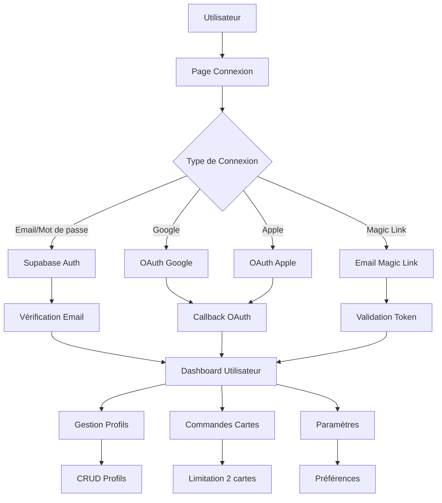

# MODULE 1 : AUTHENTIFICATION & GESTION UTILISATEURS

## 🎯 OBJECTIFS DU MODULE

**Durée :** Semaine 1 (7 jours)
**Équipe :** 1 développeur (vous)
**Priorité :** Critique (fondation du projet)

### Fonctionnalités Core
- ✅ Inscription par email/mot de passe
- ✅ Connexion Google et Apple (OAuth)
- ✅ Magic Link via Supabase
- ✅ Vérification email automatique
- ✅ Gestion des sessions sécurisées
- ✅ Profils multiples (Pro/Personnel/Événement)
- ✅ Limitation : 2 cartes max par utilisateur
- ✅ Dashboard utilisateur basique

---

## 🧠 Raisonnement et Analyse

**Approche technique retenue :**
- Architecture **monolithique** optimisée pour un développeur solo
- Stack **Next.js + Supabase** pour la rapidité de développement
- Focus sur la **simplicité d'implémentation** et la **maintenabilité**
- Authentification **multi-provider** pour maximiser les conversions
- **Magic Link** pour réduire la friction d'inscription

**Décisions clés :**
1. **Supabase Auth** : Solution complète avec OAuth intégré
2. **Next.js 15** : Framework moderne avec App Router
3. **shadcn/ui** : Composants prêts à l'emploi
4. **Zod** : Validation type-safe côté client/serveur

---

## 📋 Spécifications Techniques Détaillées

### Stack Technique
```json
{
  "frontend": {
    "framework": "Next.js 15",
    "ui": "shadcn/ui + Tailwind CSS",
    "forms": "React Hook Form + Zod",
    "state": "React 18 hooks",
    "auth": "Supabase Auth"
  },
  "backend": {
    "auth": "Supabase Auth",
    "database": "PostgreSQL (Supabase)",
    "storage": "Supabase Storage",
    "functions": "Supabase Edge Functions"
  },
  "integrations": {
    "oauth": "Google, Apple",
    "email": "Supabase Auth templates",
    "sms": "Supabase OTP"
  }
}
```

### Architecture Base de Données

```sql
-- Table Users
CREATE TABLE users (
  id UUID PRIMARY KEY DEFAULT gen_random_uuid(),
  email VARCHAR(255) UNIQUE NOT NULL,
  phone VARCHAR(20),
  created_at TIMESTAMP WITH TIME ZONE DEFAULT NOW(),
  subscription_tier VARCHAR(20) DEFAULT 'free',
  cards_ordered INTEGER DEFAULT 0 CHECK (cards_ordered <= 2),
  is_active BOOLEAN DEFAULT true,
  last_login TIMESTAMP WITH TIME ZONE,
  preferred_language VARCHAR(5) DEFAULT 'fr'
);

-- Table Profiles
CREATE TABLE profiles (
  id UUID PRIMARY KEY DEFAULT gen_random_uuid(),
  user_id UUID REFERENCES users(id) ON DELETE CASCADE,
  profile_type VARCHAR(20) CHECK (profile_type IN ('professional', 'personal', 'event')),
  name VARCHAR(100) NOT NULL,
  bio VARCHAR(100),
  image_url TEXT,
  custom_url VARCHAR(100) UNIQUE,
  is_active BOOLEAN DEFAULT true,
  created_at TIMESTAMP WITH TIME ZONE DEFAULT NOW(),
  updated_at TIMESTAMP WITH TIME ZONE DEFAULT NOW()
);

-- RLS Policies
ALTER TABLE users ENABLE ROW LEVEL SECURITY;
ALTER TABLE profiles ENABLE ROW LEVEL SECURITY;

CREATE POLICY "Users can view own data" ON users
  FOR ALL USING (auth.uid() = id);

CREATE POLICY "Users can manage own profiles" ON profiles
  FOR ALL USING (auth.uid() = user_id);
```

---

## 🔄 Diagramme MERMAID



---

## 🛠️ Stack Technologique

### Frontend
- **Next.js 15** : Framework React avec App Router
- **shadcn/ui** : Composants UI prêts à l'emploi
- **Tailwind CSS** : Styling utility-first
- **React Hook Form** : Gestion des formulaires
- **Zod** : Validation de schémas
- **Supabase Client** : SDK JavaScript

### Backend
- **Supabase** : Backend-as-a-Service
- **PostgreSQL** : Base de données relationnelle
- **Supabase Auth** : Authentification complète
- **Row Level Security** : Sécurité au niveau des lignes

### Intégrations
- **Google OAuth** : Connexion Google
- **Apple OAuth** : Connexion Apple
- **Magic Link** : Connexion sans mot de passe

---

## 🛠️ Sécurité OWASP

### A01:2021 - Broken Access Control
- ✅ RLS policies sur toutes les tables
- ✅ Validation ownership des ressources
- ✅ Rate limiting par utilisateur (Supabase)
- ✅ Vérification permissions à chaque requête

### A02:2021 - Cryptographic Failures
- ✅ HTTPS obligatoire (Vercel)
- ✅ Hachage bcrypt pour mots de passe (Supabase)
- ✅ Chiffrement données sensibles (Supabase)
- ✅ JWT tokens sécurisés

### A03:2021 - Injection
- ✅ Prepared statements PostgreSQL (Supabase)
- ✅ Validation Zod côté client/serveur
- ✅ Sanitization inputs automatique
- ✅ Paramètres typés TypeScript

### A07:2021 - Identification Failures
- ✅ Rate limiting authentification (Supabase)
- ✅ Gestion sessions sécurisée (JWT)
- ✅ MFA optionnel (Supabase)
- ✅ Timeout sessions automatique

---

## ⏱️ Échéance Estimée

**Semaine 1 (7 jours) :**
- **Jour 1-2** : Setup projet + Supabase + Pages auth
- **Jour 3-4** : OAuth Google/Apple + Magic Link
- **Jour 5-6** : Dashboard + Gestion profils
- **Jour 7** : Tests + Optimisation + Déploiement

---

## ✅ Critères de Validation

### Fonctionnel
- [ ] Inscription email/mot de passe fonctionnelle
- [ ] Connexion Google et Apple opérationnelle
- [ ] Magic Link fonctionnel
- [ ] Dashboard utilisateur accessible
- [ ] CRUD profils complet
- [ ] Limitation 2 cartes respectée

### Technique
- [ ] RLS policies configurées
- [ ] Validation Zod implémentée
- [ ] Tests unitaires passent
- [ ] Performance < 2s
- [ ] Sécurité OWASP validée

### Utilisateur
- [ ] Interface responsive
- [ ] Messages d'erreur clairs
- [ ] Onboarding fluide
- [ ] Support multilingue (FR/EN)

---

## 🎨 Interface Utilisateur

### Pages Principales
1. **Page Connexion** (`/auth/login`)
   - Email/mot de passe
   - Boutons OAuth (Google, Apple)
   - Magic Link
   - "Mot de passe oublié"

2. **Page Inscription** (`/auth/register`)
   - Email + mot de passe
   - Vérification email
   - Onboarding basique

3. **Dashboard** (`/dashboard`)
   - Stats rapides
   - Profils existants
   - Actions rapides
   - Navigation principale

### Composants shadcn/ui Utilisés
- `Button` - Actions principales
- `Input` - Champs de saisie
- `Card` - Conteneurs dashboard
- `Badge` - Statuts profils
- `Avatar` - Photos utilisateur
- `Form` - Formulaires validation

---

## 🚀 Déploiement

### Variables d'Environnement
```env
NEXT_PUBLIC_SUPABASE_URL=your_supabase_url
NEXT_PUBLIC_SUPABASE_ANON_KEY=your_supabase_anon_key
SUPABASE_SERVICE_ROLE_KEY=your_service_role_key
GOOGLE_CLIENT_ID=your_google_client_id
GOOGLE_CLIENT_SECRET=your_google_client_secret
APPLE_CLIENT_ID=your_apple_client_id
APPLE_CLIENT_SECRET=your_apple_client_secret
```

### Checklist Déploiement
- [ ] Tests automatisés passent
- [ ] Variables environnement configurées
- [ ] Base de données migrée
- [ ] SSL certificats valides
- [ ] Monitoring configuré
- [ ] Backup automatique activé

---

## 🔄 Prochaines Étapes

**Module suivant :** MODULE_2_PROFILS_LIENS.md
**Dépendances :** Authentification complète
**Timeline :** Semaine 2

**Validation requise avant de continuer :**
- [ ] Authentification fonctionnelle
- [ ] Dashboard utilisateur opérationnel
- [ ] Gestion profils basique
- [ ] Sécurité OWASP validée
- [ ] Tests passent à 100%
