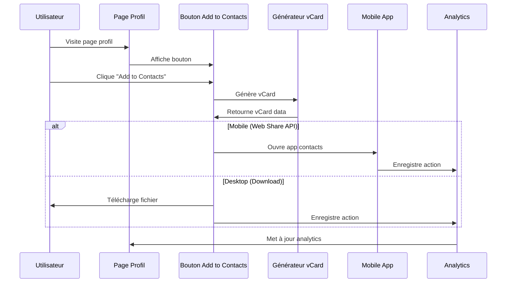

# MODULE 4 : ADD TO CONTACTS

## 🎯 OBJECTIFS DU MODULE

**Durée :** Semaine 2 (3 jours) - Parallèle avec Modules 2-3
**Équipe :** 1 développeur (vous)
**Priorité :** Critique (valeur ajoutée clé)

### Fonctionnalités Core
- ✅ Bouton "Add to Contacts" sur page profil
- ✅ Génération vCard dynamique
- ✅ Intégration mobile (iOS/Android)
- ✅ Fallback pour navigateurs non compatibles
- ✅ Analytics des ajouts de contacts
- ✅ Support multilingue (FR/EN)

---

## 🧠 Raisonnement et Analyse

**Approche technique retenue :**
- **vCard standard** pour compatibilité maximale
- **Web Share API** pour intégration native mobile
- **Fallback download** pour navigateurs non compatibles
- **Analytics détaillés** pour mesurer l'impact

**Décisions clés :**
1. **vCard 3.0** : Standard universellement supporté
2. **Web Share API** : Intégration native mobile
3. **Fallback intelligent** : Téléchargement direct
4. **Analytics** : Tracking des conversions

---

## 📋 Spécifications Techniques Détaillées

### Stack Technique
```json
{
  "frontend": {
    "vcard_generation": "vcard-generator custom",
    "mobile_integration": "Web Share API",
    "fallback": "Blob download",
    "analytics": "Supabase Analytics"
  },
  "backend": {
    "database": "PostgreSQL (Supabase)",
    "analytics": "Supabase Analytics",
    "functions": "Supabase Edge Functions"
  },
  "standards": {
    "vcard": "vCard 3.0",
    "encoding": "UTF-8",
    "mime_type": "text/vcard"
  }
}
```

### Architecture Base de Données

```sql
-- Table Contact Analytics
CREATE TABLE contact_analytics (
  id UUID PRIMARY KEY DEFAULT gen_random_uuid(),
  profile_id UUID REFERENCES profiles(id) ON DELETE CASCADE,
  user_agent TEXT,
  device_type VARCHAR(20),
  action_type VARCHAR(20) CHECK (action_type IN ('vcard_generated', 'vcard_downloaded', 'vcard_shared')),
  created_at TIMESTAMP WITH TIME ZONE DEFAULT NOW()
);

-- RLS Policies
ALTER TABLE contact_analytics ENABLE ROW LEVEL SECURITY;

CREATE POLICY "Public can insert contact analytics" ON contact_analytics
  FOR INSERT WITH CHECK (true);

CREATE POLICY "Users can view own profile analytics" ON contact_analytics
  FOR SELECT USING (
    EXISTS (
      SELECT 1 FROM profiles 
      WHERE profiles.id = contact_analytics.profile_id 
      AND profiles.user_id = auth.uid()
    )
  );
```

---

## 🔄 Diagramme MERMAID



---

## 🛠️ Stack Technologique

### Frontend
- **vCard Generator** : Génération vCard côté client
- **Web Share API** : Intégration native mobile
- **Blob API** : Téléchargement de fichiers
- **Analytics** : Tracking des interactions

### Backend
- **Supabase** : Stockage analytics
- **PostgreSQL** : Base de données
- **Edge Functions** : Traitement côté serveur

### Standards
- **vCard 3.0** : Format standard
- **UTF-8** : Encodage universel
- **MIME type** : text/vcard

---

## 🔒 Sécurité OWASP

### A01:2021 - Broken Access Control
- ✅ Validation ownership profils
- ✅ Rate limiting génération vCard
- ✅ Sanitization données contact

### A03:2021 - Injection
- ✅ Validation données vCard
- ✅ Sanitization inputs
- ✅ Échappement caractères spéciaux

### A05:2021 - Security Misconfiguration
- ✅ Headers CORS configurés
- ✅ Content Security Policy
- ✅ Validation MIME types

---

## ⏱️ Échéance Estimée

**3 jours :**
- **Jour 1** : Générateur vCard + Interface
- **Jour 2** : Intégration mobile + Fallback
- **Jour 3** : Analytics + Tests + Optimisation

---

## ✅ Critères de Validation

### Fonctionnel
- [ ] Bouton "Add to Contacts" visible
- [ ] vCard généré correctement
- [ ] Intégration mobile fonctionnelle
- [ ] Fallback desktop opérationnel
- [ ] Analytics enregistrés

### Technique
- [ ] vCard 3.0 valide
- [ ] Web Share API testé
- [ ] Performance < 1s
- [ ] Compatibilité navigateurs
- [ ] Tests passent

---

## 🎨 Interface Utilisateur

### Bouton Add to Contacts
```typescript
interface AddToContactsProps {
  profile: {
    name: string;
    email?: string;
    phone?: string;
    company?: string;
    title?: string;
    website?: string;
    socialLinks: SocialLink[];
  };
  analytics: boolean;
}

const AddToContactsButton: React.FC<AddToContactsProps> = ({ profile, analytics }) => {
  const [isGenerating, setIsGenerating] = useState(false);
  
  const handleAddToContacts = async () => {
    setIsGenerating(true);
    
    try {
      const vCard = generateVCard(profile);
      
      if (navigator.share && /Android|iPhone|iPad|iPod|BlackBerry|IEMobile|Opera Mini/i.test(navigator.userAgent)) {
        // Mobile - Web Share API
        await navigator.share({
          title: `Contact: ${profile.name}`,
          text: `Add ${profile.name} to your contacts`,
          files: [new File([vCard], `${profile.name}.vcf`, { type: 'text/vcard' })]
        });
      } else {
        // Desktop - Download
        downloadVCard(vCard, `${profile.name}.vcf`);
      }
      
      if (analytics) {
        trackContactAction('vcard_generated', profile.id);
      }
    } catch (error) {
      console.error('Error adding to contacts:', error);
    } finally {
      setIsGenerating(false);
    }
  };

  return (
    <Button
      onClick={handleAddToContacts}
      disabled={isGenerating}
      className="w-full bg-gradient-to-r from-ofika-orange to-ofika-pink text-white"
    >
      {isGenerating ? (
        <>
          <Loader2 className="mr-2 h-4 w-4 animate-spin" />
          Génération...
        </>
      ) : (
        <>
          <UserPlus className="mr-2 h-4 w-4" />
          Ajouter aux contacts
        </>
      )}
    </Button>
  );
};
```

### Générateur vCard
```typescript
const generateVCard = (profile: Profile): string => {
  const vcard = [
    'BEGIN:VCARD',
    'VERSION:3.0',
    `FN:${profile.name}`,
    `N:${profile.name.split(' ').reverse().join(';')};;;`,
  ];

  if (profile.email) {
    vcard.push(`EMAIL:${profile.email}`);
  }

  if (profile.phone) {
    vcard.push(`TEL:${profile.phone}`);
  }

  if (profile.company) {
    vcard.push(`ORG:${profile.company}`);
  }

  if (profile.title) {
    vcard.push(`TITLE:${profile.title}`);
  }

  if (profile.website) {
    vcard.push(`URL:${profile.website}`);
  }

  // Ajouter liens sociaux
  profile.socialLinks.forEach(link => {
    if (link.type === 'whatsapp') {
      vcard.push(`X-WHATSAPP:${link.url}`);
    } else if (link.type === 'linkedin') {
      vcard.push(`X-LINKEDIN:${link.url}`);
    } else if (link.type === 'twitter') {
      vcard.push(`X-TWITTER:${link.url}`);
    }
  });

  vcard.push('END:VCARD');
  
  return vcard.join('\r\n');
};
```

---

## �� Analytics et Métriques

### Métriques Trackées
- **vCard générés** : Nombre total
- **vCard téléchargés** : Taux de conversion
- **vCard partagés** : Engagement mobile
- **Device types** : Mobile vs Desktop
- **Profils populaires** : Top performers

### Dashboard Analytics
```typescript
interface ContactAnalytics {
  totalGenerated: number;
  totalDownloaded: number;
  totalShared: number;
  conversionRate: number;
  deviceBreakdown: {
    mobile: number;
    desktop: number;
  };
  topProfiles: Array<{
    profileId: string;
    profileName: string;
    contactCount: number;
  }>;
}
```

---

## 🚀 Déploiement

### Variables d'Environnement
```env
NEXT_PUBLIC_APP_URL=https://ofika.app
SUPABASE_ANALYTICS_ENABLED=true
VCARD_VERSION=3.0
```

### Checklist Déploiement
- [ ] vCard génération testée
- [ ] Web Share API testé sur mobile
- [ ] Fallback desktop fonctionnel
- [ ] Analytics configurés
- [ ] Tests passent

---

## �� Prochaines Étapes

**Module suivant :** MODULE_5_PAYMENT_INTEGRATION.md
**Dépendances :** Add to Contacts fonctionnel
**Timeline :** Semaine 3

**Validation requise avant de continuer :**
- [ ] Bouton Add to Contacts opérationnel
- [ ] vCard génération fonctionnelle
- [ ] Intégration mobile testée
- [ ] Analytics enregistrés
- [ ] Tests passent à 100%
