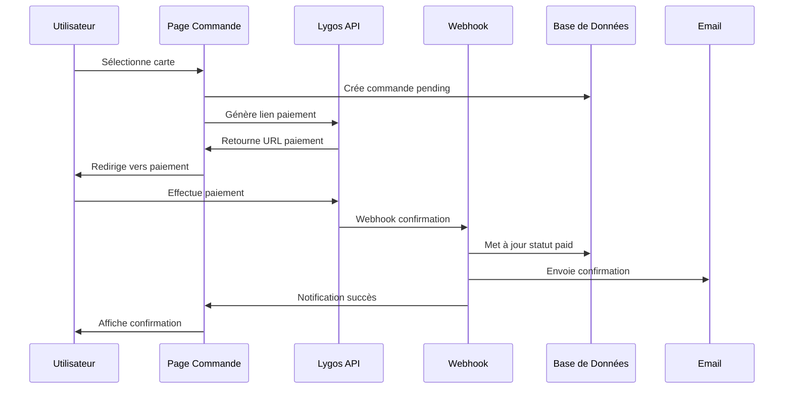

# MODULE 5 : INTÉGRATION PAIEMENTS

## 🎯 OBJECTIFS DU MODULE

**Durée :** Semaine 3 (5 jours)
**Équipe :** 1 développeur (vous)
**Priorité :** Critique (monétisation)

### Fonctionnalités Core
- ✅ Intégration Lygos (Orange Money, MTN, Moov, Wave)
- ✅ Génération liens de paiement
- ✅ Gestion commandes cartes physiques
- ✅ Confirmation paiement automatique
- ✅ Limitation : 2 cartes max par utilisateur
- ✅ Support multilingue (FR/EN)

---

## 🧠 Raisonnement et Analyse

**Approche technique retenue :**
- **Lygos API** pour paiements africains
- **Webhooks** pour confirmation automatique
- **Base de données** pour tracking commandes
- **Fallback** pour paiements échoués

**Décisions clés :**
1. **Lygos uniquement** : Spécialisé marché africain
2. **Webhooks** : Confirmation temps réel
3. **Base de données** : Historique complet
4. **Retry logic** : Gestion des échecs

---

## 📋 Spécifications Techniques Détaillées

### Stack Technique
```json
{
  "frontend": {
    "payment_ui": "shadcn/ui components",
    "forms": "React Hook Form + Zod",
    "state": "React 18 hooks"
  },
  "backend": {
    "api": "Lygos API",
    "webhooks": "Supabase Edge Functions",
    "database": "PostgreSQL (Supabase)"
  },
  "integrations": {
    "lygos": "Payment Gateway",
    "webhooks": "Confirmation automatique"
  }
}
```

### Architecture Base de Données

```sql
-- Table Orders
CREATE TABLE orders (
  id UUID PRIMARY KEY DEFAULT gen_random_uuid(),
  user_id UUID REFERENCES users(id) ON DELETE CASCADE,
  profile_id UUID REFERENCES profiles(id) ON DELETE CASCADE,
  card_type VARCHAR(20) CHECK (card_type IN ('nfc_qr', 'qr_only')),
  quantity INTEGER DEFAULT 1 CHECK (quantity > 0),
  unit_price DECIMAL(10,2) NOT NULL,
  total_price DECIMAL(10,2) NOT NULL,
  currency VARCHAR(3) DEFAULT 'XOF',
  status VARCHAR(20) DEFAULT 'pending' CHECK (status IN ('pending', 'paid', 'failed', 'cancelled')),
  lygos_payment_id VARCHAR(100),
  lygos_payment_url TEXT,
  created_at TIMESTAMP WITH TIME ZONE DEFAULT NOW(),
  updated_at TIMESTAMP WITH TIME ZONE DEFAULT NOW()
);

-- Table Payment Methods
CREATE TABLE payment_methods (
  id UUID PRIMARY KEY DEFAULT gen_random_uuid(),
  name VARCHAR(50) NOT NULL,
  provider VARCHAR(20) NOT NULL,
  is_active BOOLEAN DEFAULT true,
  icon_url TEXT,
  created_at TIMESTAMP WITH TIME ZONE DEFAULT NOW()
);

-- Insertion méthodes de paiement
INSERT INTO payment_methods (name, provider, icon_url) VALUES
('Orange Money', 'lygos', '/icons/orange-money.svg'),
('MTN Money', 'lygos', '/icons/mtn-money.svg'),
('Moov Money', 'lygos', '/icons/moov-money.svg'),
('Wave', 'lygos', '/icons/wave.svg');

-- RLS Policies
ALTER TABLE orders ENABLE ROW LEVEL SECURITY;
ALTER TABLE payment_methods ENABLE ROW LEVEL SECURITY;

CREATE POLICY "Users can view own orders" ON orders
  FOR ALL USING (auth.uid() = user_id);

CREATE POLICY "Payment methods are public" ON payment_methods
  FOR SELECT USING (is_active = true);
```

---

## 🔄 Diagramme MERMAID



---

## 🛠️ Stack Technologique

### Frontend
- **shadcn/ui** : Composants UI
- **React Hook Form** : Gestion formulaires
- **Zod** : Validation
- **React 18** : Hooks et state

### Backend
- **Lygos API** : Paiements africains
- **Supabase Edge Functions** : Webhooks
- **PostgreSQL** : Base de données
- **Email** : Notifications

### Intégrations
- **Orange Money** : Via Lygos
- **MTN Money** : Via Lygos
- **Moov Money** : Via Lygos
- **Wave** : Via Lygos

---

## �� Sécurité OWASP

### A01:2021 - Broken Access Control
- ✅ RLS policies sur commandes
- ✅ Validation ownership
- ✅ Rate limiting commandes

### A02:2021 - Cryptographic Failures
- ✅ HTTPS obligatoire
- ✅ Chiffrement données sensibles
- ✅ Validation signatures webhooks

### A03:2021 - Injection
- ✅ Validation Zod
- ✅ Prepared statements
- ✅ Sanitization inputs

### A05:2021 - Security Misconfiguration
- ✅ Headers CORS
- ✅ Content Security Policy
- ✅ Validation webhooks

---

## ⏱️ Échéance Estimée

**5 jours :**
- **Jour 1** : Intégration Lygos + Interface
- **Jour 2** : Gestion commandes + Base de données
- **Jour 3** : Webhooks + Confirmation
- **Jour 4** : Tests + Validation
- **Jour 5** : Optimisation + Déploiement

---

## ✅ Critères de Validation

### Fonctionnel
- [ ] Sélection carte fonctionnelle
- [ ] Génération lien paiement
- [ ] Redirection Lygos
- [ ] Confirmation automatique
- [ ] Email confirmation

### Technique
- [ ] Lygos API intégrée
- [ ] Webhooks fonctionnels
- [ ] Base de données mise à jour
- [ ] Tests passent
- [ ] Sécurité validée

---

## �� Interface Utilisateur

### Page Commande Carte
```typescript
interface CardOrderPage {
  cardType: 'nfc_qr' | 'qr_only';
  profile: Profile;
  pricing: {
    nfc_qr: number;
    qr_only: number;
  };
  paymentMethods: PaymentMethod[];
}

const CardOrderPage: React.FC = () => {
  const [selectedCardType, setSelectedCardType] = useState<'nfc_qr' | 'qr_only'>('nfc_qr');
  const [selectedPaymentMethod, setSelectedPaymentMethod] = useState<string>('');
  const [isProcessing, setIsProcessing] = useState(false);

  const handleOrder = async () => {
    setIsProcessing(true);
    
    try {
      const order = await createOrder({
        cardType: selectedCardType,
        profileId: profile.id,
        paymentMethod: selectedPaymentMethod
      });
      
      const paymentUrl = await generatePaymentUrl(order.id);
      window.location.href = paymentUrl;
    } catch (error) {
      console.error('Order failed:', error);
    } finally {
      setIsProcessing(false);
    }
  };

  return (
    <div className="max-w-2xl mx-auto p-6">
      <Card>
        <CardHeader>
          <CardTitle>Commander votre carte</CardTitle>
          <CardDescription>
            Choisissez le type de carte et la méthode de paiement
          </CardDescription>
        </CardHeader>
        
        <CardContent className="space-y-6">
          {/* Sélection type de carte */}
          <div className="space-y-4">
            <Label>Type de carte</Label>
            <div className="grid grid-cols-2 gap-4">
              <Card 
                className={`cursor-pointer transition-colors ${
                  selectedCardType === 'nfc_qr' ? 'ring-2 ring-ofika-orange' : ''
                }`}
                onClick={() => setSelectedCardType('nfc_qr')}
              >
                <CardContent className="p-4">
                  <div className="text-center">
                    <Smartphone className="h-8 w-8 mx-auto mb-2" />
                    <h3 className="font-semibold">NFC + QR</h3>
                    <p className="text-sm text-muted-foreground">15,000 XOF</p>
                  </div>
                </CardContent>
              </Card>
              
              <Card 
                className={`cursor-pointer transition-colors ${
                  selectedCardType === 'qr_only' ? 'ring-2 ring-ofika-orange' : ''
                }`}
                onClick={() => setSelectedCardType('qr_only')}
              >
                <CardContent className="p-4">
                  <div className="text-center">
                    <QrCode className="h-8 w-8 mx-auto mb-2" />
                    <h3 className="font-semibold">QR seulement</h3>
                    <p className="text-sm text-muted-foreground">10,000 XOF</p>
                  </div>
                </CardContent>
              </Card>
            </div>
          </div>

          {/* Méthodes de paiement */}
          <div className="space-y-4">
            <Label>Méthode de paiement</Label>
            <div className="grid grid-cols-2 gap-4">
              {paymentMethods.map((method) => (
                <Card 
                  key={method.id}
                  className={`cursor-pointer transition-colors ${
                    selectedPaymentMethod === method.id ? 'ring-2 ring-ofika-orange' : ''
                  }`}
                  onClick={() => setSelectedPaymentMethod(method.id)}
                >
                  <CardContent className="p-4">
                    <div className="flex items-center space-x-3">
                      
                      <span className="font-medium">{method.name}</span>
                    </div>
                  </CardContent>
                </Card>
              ))}
            </div>
          </div>

          {/* Bouton commander */}
          <Button 
            onClick={handleOrder}
            disabled={!selectedPaymentMethod || isProcessing}
            className="w-full bg-gradient-to-r from-ofika-orange to-ofika-pink"
          >
            {isProcessing ? (
              <>
                <Loader2 className="mr-2 h-4 w-4 animate-spin" />
                Traitement...
              </>
            ) : (
              'Commander maintenant'
            )}
          </Button>
        </CardContent>
      </Card>
    </div>
  );
};
```

---

## 🔧 Fonctionnalités Détaillées

### Intégration Lygos
```typescript
interface LygosConfig {
  apiKey: string;
  baseUrl: string;
  webhookUrl: string;
  currency: string;
}

const lygosConfig: LygosConfig = {
  apiKey: process.env.LYGOS_API_KEY!,
  baseUrl: process.env.LYGOS_BASE_URL!,
  webhookUrl: `${process.env.NEXT_PUBLIC_APP_URL}/api/webhooks/lygos`,
  currency: 'XOF'
};

const generatePaymentUrl = async (orderId: string): Promise<string> => {
  const order = await getOrderById(orderId);
  
  const paymentData = {
    amount: order.total_price,
    currency: order.currency,
    description: `Commande carte Ofika - ${order.card_type}`,
    return_url: `${process.env.NEXT_PUBLIC_APP_URL}/dashboard/orders/${orderId}`,
    webhook_url: lygosConfig.webhookUrl,
    metadata: {
      order_id: orderId,
      user_id: order.user_id
    }
  };

  const response = await fetch(`${lygosConfig.baseUrl}/payments`, {
    method: 'POST',
    headers: {
      'Authorization': `Bearer ${lygosConfig.apiKey}`,
      'Content-Type': 'application/json'
    },
    body: JSON.stringify(paymentData)
  });

  const result = await response.json();
  
  // Mettre à jour la commande avec l'ID de paiement
  await updateOrder(orderId, {
    lygos_payment_id: result.payment_id,
    lygos_payment_url: result.payment_url
  });

  return result.payment_url;
};
```

### Webhook Confirmation
```typescript
// app/api/webhooks/lygos/route.ts
export async function POST(request: Request) {
  try {
    const signature = request.headers.get('x-lygos-signature');
    const payload = await request.json();
    
    // Vérifier la signature
    if (!verifyLygosSignature(payload, signature)) {
      return new Response('Invalid signature', { status: 401 });
    }
    
    const { payment_id, status, order_id } = payload;
    
    if (status === 'success') {
      // Mettre à jour la commande
      await updateOrder(order_id, {
        status: 'paid',
        updated_at: new Date().toISOString()
      });
      
      // Envoyer email de confirmation
      await sendOrderConfirmationEmail(order_id);
      
      // Déclencher production carte
      await triggerCardProduction(order_id);
    } else if (status === 'failed') {
      await updateOrder(order_id, {
        status: 'failed',
        updated_at: new Date().toISOString()
      });
    }
    
    return new Response('OK', { status: 200 });
  } catch (error) {
    console.error('Webhook error:', error);
    return new Response('Error', { status: 500 });
  }
}
```

---

## �� Analytics et Métriques

### Métriques Trackées
- **Commandes créées** : Nombre total
- **Taux de conversion** : Paiements réussis
- **Méthodes populaires** : Préférences utilisateurs
- **Revenus** : Chiffre d'affaires
- **Abandons** : Panier abandonné

### Dashboard Analytics
```typescript
interface PaymentAnalytics {
  totalOrders: number;
  totalRevenue: number;
  conversionRate: number;
  paymentMethodBreakdown: Array<{
    method: string;
    count: number;
    percentage: number;
  }>;
  monthlyRevenue: Array<{
    month: string;
    revenue: number;
    orders: number;
  }>;
}
```

---

## 🚀 Déploiement

### Variables d'Environnement
```env
LYGOS_API_KEY=your_lygos_api_key
LYGOS_BASE_URL=https://api.lygos.com
LYGOS_WEBHOOK_SECRET=your_webhook_secret
NEXT_PUBLIC_APP_URL=https://ofika.app
```

### Checklist Déploiement
- [ ] Lygos API configurée
- [ ] Webhooks testés
- [ ] Base de données migrée
- [ ] Tests passent
- [ ] Monitoring activé

---

## �� Prochaines Étapes

**Module suivant :** MODULE_6_ANALYTICS_DASHBOARD.md
**Dépendances :** Paiements fonctionnels
**Timeline :** Semaine 3

**Validation requise avant de continuer :**
- [ ] Lygos API intégrée
- [ ] Commandes fonctionnelles
- [ ] Webhooks opérationnels
- [ ] Confirmation automatique
- [ ] Tests passent à 100%