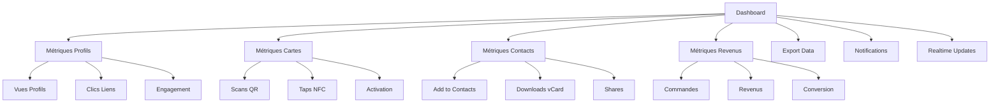

# MODULE 6 : ANALYTICS & DASHBOARD

## 🎯 OBJECTIFS DU MODULE

**Durée :** Semaine 3 (3 jours)
**Équipe :** 1 développeur (vous)
**Priorité :** Important (insights utilisateurs)

### Fonctionnalités Core
- ✅ Dashboard analytics complet
- ✅ Métriques profils et cartes
- ✅ Analytics contacts (Add to Contacts)
- ✅ Revenus et commandes
- ✅ Export données
- ✅ Notifications temps réel

---

## 🧠 Raisonnement et Analyse

**Approche technique retenue :**
- **Dashboard unifié** pour toutes les métriques
- **Temps réel** avec Supabase Realtime
- **Export** en CSV/PDF
- **Notifications** pour événements importants

**Décisions clés :**
1. **Dashboard unique** : Toutes les métriques au même endroit
2. **Temps réel** : Mise à jour automatique
3. **Export** : Données utilisateur
4. **Notifications** : Engagement utilisateur

---

## 📋 Spécifications Techniques Détaillées

### Stack Technique
```json
{
  "frontend": {
    "dashboard": "shadcn/ui + Recharts",
    "realtime": "Supabase Realtime",
    "charts": "Recharts",
    "export": "jsPDF + csv-export"
  },
  "backend": {
    "database": "PostgreSQL (Supabase)",
    "realtime": "Supabase Realtime",
    "functions": "Supabase Edge Functions"
  },
  "analytics": {
    "tracking": "Custom events",
    "aggregation": "SQL queries",
    "export": "PDF/CSV generation"
  }
}
```

### Architecture Base de Données

```sql
-- Table Analytics Events
CREATE TABLE analytics_events (
  id UUID PRIMARY KEY DEFAULT gen_random_uuid(),
  user_id UUID REFERENCES users(id) ON DELETE CASCADE,
  profile_id UUID REFERENCES profiles(id) ON DELETE CASCADE,
  event_type VARCHAR(50) NOT NULL,
  event_data JSONB,
  created_at TIMESTAMP WITH TIME ZONE DEFAULT NOW()
);

-- Table Dashboard Widgets
CREATE TABLE dashboard_widgets (
  id UUID PRIMARY KEY DEFAULT gen_random_uuid(),
  user_id UUID REFERENCES users(id) ON DELETE CASCADE,
  widget_type VARCHAR(50) NOT NULL,
  position INTEGER NOT NULL,
  is_visible BOOLEAN DEFAULT true,
  config JSONB,
  created_at TIMESTAMP WITH TIME ZONE DEFAULT NOW()
);

-- RLS Policies
ALTER TABLE analytics_events ENABLE ROW LEVEL SECURITY;
ALTER TABLE dashboard_widgets ENABLE ROW LEVEL SECURITY;

CREATE POLICY "Users can view own analytics" ON analytics_events
  FOR ALL USING (auth.uid() = user_id);

CREATE POLICY "Users can manage own widgets" ON dashboard_widgets
  FOR ALL USING (auth.uid() = user_id);
```

---

## 🔄 Diagramme MERMAID



---

## 🛠️ Stack Technologique

### Frontend
- **shadcn/ui** : Composants UI
- **Recharts** : Graphiques
- **Supabase Realtime** : Mise à jour temps réel
- **jsPDF** : Export PDF
- **csv-export** : Export CSV

### Backend
- **PostgreSQL** : Base de données
- **Supabase Realtime** : WebSockets
- **Edge Functions** : Traitement
- **SQL** : Agrégations

---

## 🔄 Sécurité OWASP

### A01:2021 - Broken Access Control
- ✅ RLS policies sur analytics
- ✅ Validation ownership
- ✅ Rate limiting exports

### A05:2021 - Security Misconfiguration
- ✅ Headers CORS
- ✅ Content Security Policy
- ✅ Validation données

---

## ⏱️ Échéance Estimée

**3 jours :**
- **Jour 1** : Dashboard + Métriques de base
- **Jour 2** : Graphiques + Temps réel
- **Jour 3** : Export + Notifications + Tests

---

## ✅ Critères de Validation

### Fonctionnel
- [ ] Dashboard complet
- [ ] Métriques temps réel
- [ ] Export fonctionnel
- [ ] Notifications actives

### Technique
- [ ] Realtime configuré
- [ ] Performance optimisée
- [ ] Tests passent
- [ ] Sécurité validée

---

## 🔧 Fonctionnalités Détaillées

### Tracking des Événements
```typescript
interface AnalyticsEvent {
  type: 'profile_view' | 'link_click' | 'contact_added' | 'card_scan' | 'order_created';
  profileId: string;
  data: Record<string, any>;
  timestamp: Date;
}

const trackEvent = async (event: AnalyticsEvent) => {
  await supabase
    .from('analytics_events')
    .insert({
      user_id: getCurrentUserId(),
      profile_id: event.profileId,
      event_type: event.type,
      event_data: event.data,
      created_at: event.timestamp.toISOString()
    });
};
```

### Export des Données
```typescript
const exportData = async (format: 'csv' | 'pdf') => {
  const data = await getAnalyticsData();
  
  if (format === 'csv') {
    const csv = convertToCSV(data);
    downloadFile(csv, 'analytics.csv', 'text/csv');
  } else if (format === 'pdf') {
    const pdf = await generatePDF(data);
    downloadFile(pdf, 'analytics.pdf', 'application/pdf');
  }
};
```

---

## 🔄 Analytics et Métriques

### Métriques Trackées
- **Profils** : Vues, clics, engagement
- **Cartes** : Scans, activations, utilisation
- **Contacts** : Ajouts, téléchargements, partages
- **Revenus** : Commandes, conversion, CA

### Dashboard Analytics
```typescript
interface AnalyticsData {
  activeProfiles: number;
  totalViews: number;
  contactsAdded: number;
  monthlyRevenue: number;
  profileViews: Array<{
    profileId: string;
    profileName: string;
    views: number;
  }>;
  contactsData: Array<{
    date: string;
    count: number;
  }>;
  profiles: Array<{
    id: string;
    name: string;
    views: number;
    clicks: number;
    contacts: number;
  }>;
}
```

---

## 🚀 Déploiement

### Variables d'Environnement
```env
NEXT_PUBLIC_APP_URL=https://ofika.app
SUPABASE_ANALYTICS_ENABLED=true
REALTIME_ENABLED=true
```

### Checklist Déploiement
- [ ] Dashboard configuré
- [ ] Realtime activé
- [ ] Export fonctionnel
- [ ] Tests passent
- [ ] Monitoring activé

---

## 🔄 Prochaines Étapes

**Module suivant :** MODULE_7_DEPLOYMENT.md
**Dépendances :** Analytics fonctionnels
**Timeline :** Semaine 3

**Validation requise avant de continuer :**
- [ ] Dashboard opérationnel
- [ ] Métriques temps réel
- [ ] Export fonctionnel
- [ ] Notifications actives
- [ ] Tests passent à 100%
