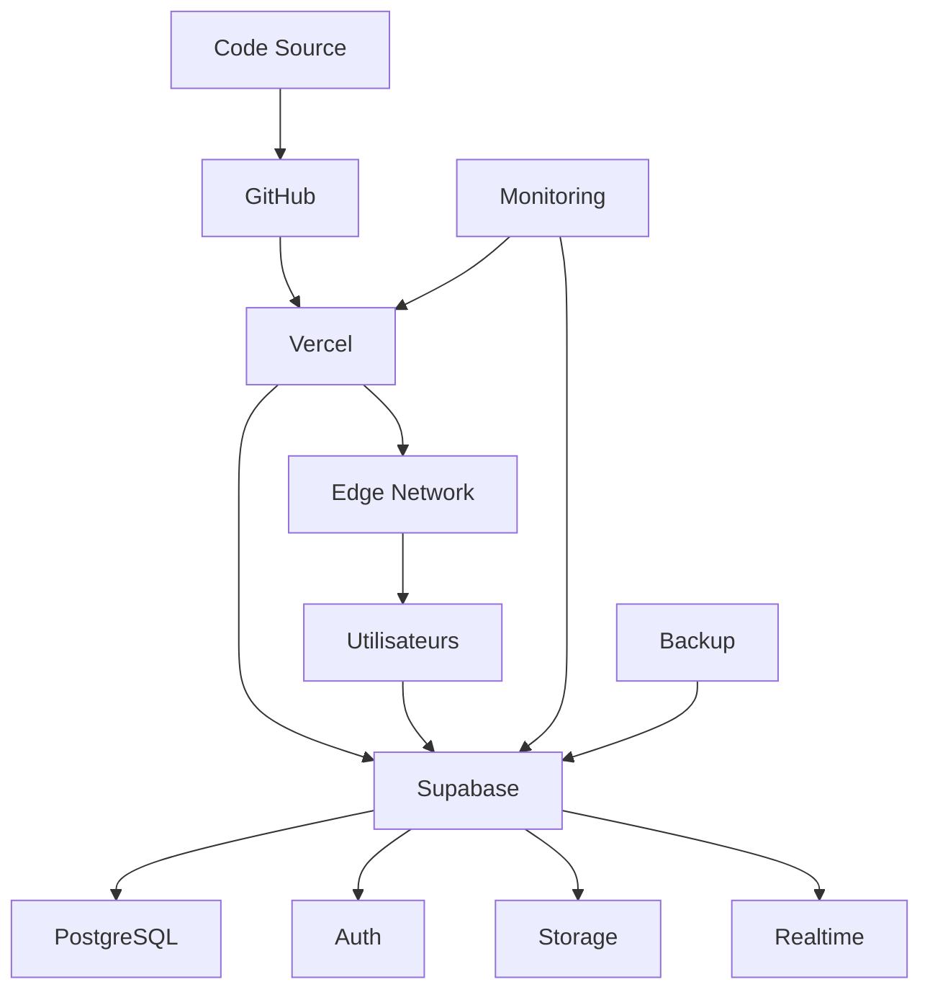

# MODULE 7 : DÉPLOIEMENT & PRODUCTION

## 🎯 OBJECTIFS DU MODULE

**Durée :** Semaine 3 (2 jours)
**Équipe :** 1 développeur (vous)
**Priorité :** Critique (mise en production)

### Fonctionnalités Core
- ✅ Déploiement production Vercel
- ✅ Configuration Supabase production
- ✅ Monitoring et alertes
- ✅ Backup et sécurité
- ✅ Performance optimisée
- ✅ Tests end-to-end

---

## 🧠 Raisonnement et Analyse

**Approche technique retenue :**
- **Vercel** pour déploiement frontend
- **Supabase** pour backend production
- **Monitoring** avec Vercel Analytics
- **Backup** automatique Supabase

**Décisions clés :**
1. **Vercel** : Déploiement simple et fiable
2. **Supabase** : Backend-as-a-Service
3. **Monitoring** : Surveillance continue
4. **Backup** : Sécurité des données

---

## 📋 Spécifications Techniques Détaillées

### Stack Technique
```json
{
  "deployment": {
    "frontend": "Vercel",
    "backend": "Supabase",
    "cdn": "Vercel Edge Network",
    "monitoring": "Vercel Analytics + Supabase"
  },
  "security": {
    "ssl": "Vercel SSL",
    "backup": "Supabase Backup",
    "monitoring": "Uptime monitoring"
  },
  "performance": {
    "caching": "Vercel Edge",
    "optimization": "Next.js optimization",
    "cdn": "Global CDN"
  }
}
```

### Architecture de Déploiement



---

## 🛠️ Stack Technologique

### Déploiement
- **Vercel** : Plateforme de déploiement
- **GitHub** : Gestion du code
- **Supabase** : Backend production
- **Vercel Analytics** : Monitoring

### Sécurité
- **SSL** : Certificats automatiques
- **Backup** : Sauvegarde automatique
- **Monitoring** : Surveillance 24/7
- **CDN** : Protection DDoS

---

## �� Sécurité OWASP

### A05:2021 - Security Misconfiguration
- ✅ Headers de sécurité configurés
- ✅ HTTPS obligatoire
- ✅ CORS configuré
- ✅ Content Security Policy

### A09:2021 - Logging Failures
- ✅ Logs centralisés
- ✅ Monitoring des erreurs
- ✅ Alertes automatiques
- ✅ Audit trail

---

## ⏱️ Échéance Estimée

**2 jours :**
- **Jour 1** : Configuration production + Déploiement
- **Jour 2** : Tests + Monitoring + Optimisation

---

## ✅ Critères de Validation

### Fonctionnel
- [ ] Site accessible en production
- [ ] Toutes les fonctionnalités opérationnelles
- [ ] Performance optimisée
- [ ] Monitoring actif

### Technique
- [ ] SSL configuré
- [ ] Backup activé
- [ ] Tests passent
- [ ] Sécurité validée

---

## 🚀 Déploiement

### Configuration Vercel
```json
{
  "buildCommand": "npm run build",
  "outputDirectory": ".next",
  "installCommand": "npm install",
  "framework": "nextjs",
  "regions": ["cdg1", "iad1"],
  "functions": {
    "app/api/**/*.ts": {
      "maxDuration": 30
    }
  }
}
```

### Variables d'Environnement Production
```env
# Vercel
NEXT_PUBLIC_APP_URL=https://ofika.app
NEXT_PUBLIC_VERCEL_URL=https://ofika.vercel.app

# Supabase Production
NEXT_PUBLIC_SUPABASE_URL=https://your-project.supabase.co
NEXT_PUBLIC_SUPABASE_ANON_KEY=your_production_anon_key
SUPABASE_SERVICE_ROLE_KEY=your_production_service_role_key

# Lygos Production
LYGOS_API_KEY=your_production_lygos_key
LYGOS_BASE_URL=https://api.lygos.com
LYGOS_WEBHOOK_SECRET=your_production_webhook_secret

# Monitoring
VERCEL_ANALYTICS_ID=your_analytics_id
SUPABASE_ANALYTICS_ENABLED=true
```

### Checklist Déploiement
- [ ] Code déployé sur Vercel
- [ ] Supabase production configuré
- [ ] Variables d'environnement définies
- [ ] SSL certificats valides
- [ ] Monitoring activé
- [ ] Backup configuré
- [ ] Tests end-to-end passent
- [ ] Performance optimisée

---

## 📊 Monitoring et Maintenance

### Métriques Surveillées
- **Performance** : Core Web Vitals
- **Disponibilité** : Uptime 99.9%
- **Erreurs** : Taux d'erreur < 1%
- **Utilisateurs** : Sessions actives

### Alertes Configurées
- **Downtime** : Site inaccessible
- **Erreurs** : Taux d'erreur élevé
- **Performance** : Temps de réponse lent
- **Sécurité** : Tentatives d'intrusion

---

## 🔄 Maintenance

### Tâches Quotidiennes
- [ ] Vérification des logs
- [ ] Monitoring des performances
- [ ] Vérification des backups

### Tâches Hebdomadaires
- [ ] Mise à jour des dépendances
- [ ] Analyse des métriques
- [ ] Optimisation des performances

### Tâches Mensuelles
- [ ] Audit de sécurité
- [ ] Mise à jour majeure
- [ ] Planification des évolutions

---

## 🎉 Livraison Finale

### Critères de Succès
- [ ] Site accessible 24/7
- [ ] Toutes les fonctionnalités opérationnelles
- [ ] Performance optimisée
- [ ] Sécurité validée
- [ ] Monitoring actif
- [ ] Documentation complète

### Livrables
- [ ] Site web en production
- [ ] Documentation technique
- [ ] Guide d'utilisation
- [ ] Plan de maintenance
- [ ] Formation utilisateur

---

## 🔄 Prochaines Étapes

**Phase suivante :** Maintenance et évolutions
**Timeline :** Continue
**Priorité :** Support utilisateurs

**Validation requise :**
- [ ] Site en production
- [ ] Monitoring actif
- [ ] Documentation complète
- [ ] Formation effectuée
- [ ] Support opérationnel
