# MODULE 9 : ONBOARDING CARTE NFC - SPÉCIFICATIONS TECHNIQUES

## 🎯 VISION DU MODULE

### Objectif Principal
Permettre aux utilisateurs de créer une carte de visite physique NFC/QR qui redirige vers leur profil OFIKA, via un processus d'onboarding fluide et intuitif en 7 étapes.

### Valeur Ajoutée
- **Différenciation** : Carte physique unique vs profils numériques
- **Monétisation** : Vente de cartes physiques
- **Engagement** : Expérience tactile et mémorable
- **Professionnalisme** : Outil de networking physique

---

## 🗺️ ARCHITECTURE GÉNÉRALE

### Vue d'Ensemble du Système
```mermaid
graph TB
    A[Utilisateur] --> B[Dashboard]
    B --> C[Bouton "Créer ma carte"]
    C --> D[Onboarding NFC - 7 Étapes]
    
    D --> E[Étape 1: Introduction]
    D --> F[Étape 2: Formulaire]
    D --> G[Étape 3: Design]
    D --> H[Étape 4: Simulation 3D]
    D --> I[Étape 5: Aperçu Public]
    D --> J[Étape 6: Confirmation]
    D --> K[Étape 7: Succès]
    
    K --> L[Profil NFC Créé]
    L --> M[Base de Données]
    L --> N[Page Publique]
    L --> O[QR Code Généré]
```

### Flux Utilisateur Principal
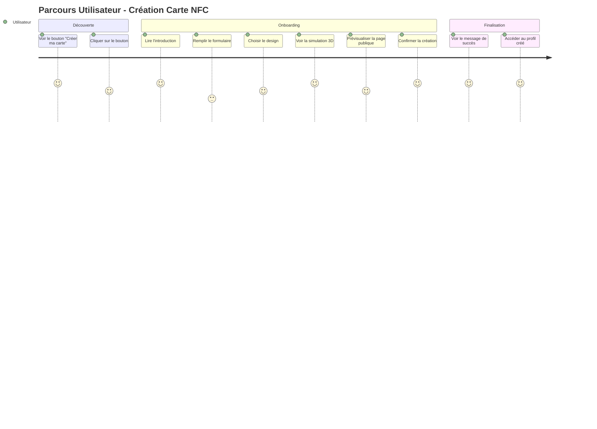

---

## 📋 SPÉCIFICATIONS FONCTIONNELLES

### Étape 1 : Introduction & Explication
**Objectif** : Présenter le concept et motiver l'utilisateur

**Contenu** :
- Titre accrocheur : "Créez votre carte de visite NFC"
- Description claire : "Une carte physique qui redirige vers votre profil OFIKA"
- Illustration visuelle (icône NFC/QR)
- Bouton d'action : "Commencer"

**Comportement** :
- Animation d'entrée fluide
- Pas de formulaire, juste une présentation
- Transition vers l'étape suivante au clic

### Étape 2 : Informations Personnelles
**Objectif** : Collecter toutes les données nécessaires pour la carte

**Champs Obligatoires** :
- Nom complet
- Entreprise
- Poste/Titre
- Téléphone
- Email
- Nom du profil

**Champs Optionnels** :
- Bio (description personnelle)
- Instagram, TikTok, LinkedIn
- Autres liens personnels
- Localisation
- Nom d'utilisateur
- URL personnalisée

**Upload de Logo** :
- Formats acceptés : PNG, JPG, SVG
- Taille maximale : 5MB
- Prévisualisation immédiate
- Validation automatique

**Validations** :
- Format email valide
- Format téléphone valide
- URLs valides pour les réseaux sociaux
- Vérification unicité URL personnalisée

### Étape 3 : Choix du Design & Modèle
**Objectif** : Personnaliser l'apparence de la carte

**Modèles Disponibles** :
- **Classique** : Design épuré et professionnel
- **Moderne** : Style contemporain avec gradients
- **Minimaliste** : Simplicité et élégance
- **Ofika Optimisé** : Design spécialement conçu pour la marque

**Options de Couleur** :
- Palette Ofika (orange/rose)
- Bleu/Violet
- Vert/Cyan
- Rouge/Orange
- Violet/Rose
- Gris
- Noir
- Blanc

**Interface** :
- Grille de modèles avec vignettes
- Sélection radio pour le modèle
- Palette de couleurs avec aperçu
- Aperçu miniature en temps réel

### Étape 4 : Prévisualisation Interactive
**Objectif** : Montrer la carte finale en 3D avant validation

**Fonctionnalités** :
- Carte 3D interactive (flip recto/verso)
- Mise à jour temps réel des données
- Changement de couleur instantané
- Prévisualisation du logo uploadé
- QR code dynamique avec URL temporaire
- Dimensions réelles (85mm × 55mm)

**Contrôles** :
- Bouton flip pour voir recto/verso
- Possibilité de modifier les couleurs
- Retour aux étapes précédentes si besoin

### Étape 5 : Aperçu Page Publique
**Objectif** : Vérifier l'apparence du profil public

**Fonctionnalités** :
- Bouton "Voir ma page publique"
- Ouverture dans nouvel onglet
- Aperçu du profil Link to BIO avec données NFC
- Possibilité de revenir à la simulation

**Comportement** :
- Génération d'un lien temporaire
- Affichage de la page publique
- Retour facile à l'onboarding

### Étape 6 : Confirmation & Enregistrement
**Objectif** : Finaliser la création et sauvegarder les données

**Processus** :
- Récapitulatif des informations
- Aperçu final de la carte
- Bouton "Créer ma carte"
- Gestion des erreurs avec retry
- Loading state pendant sauvegarde

**Sauvegarde** :
- Upload du logo vers Supabase Storage
- Génération du lien NFC unique
- Création du profil dans la base de données
- Génération du QR code

### Étape 7 : Succès & Redirection
**Objectif** : Confirmer la création et rediriger l'utilisateur

**Contenu** :
- Message de succès avec animation
- Aperçu de la carte créée
- Lien vers le profil créé
- Bouton "Voir mes profils"
- Redirection automatique après 5 secondes

---

## 🏗️ ARCHITECTURE TECHNIQUE

### Stack Technologique
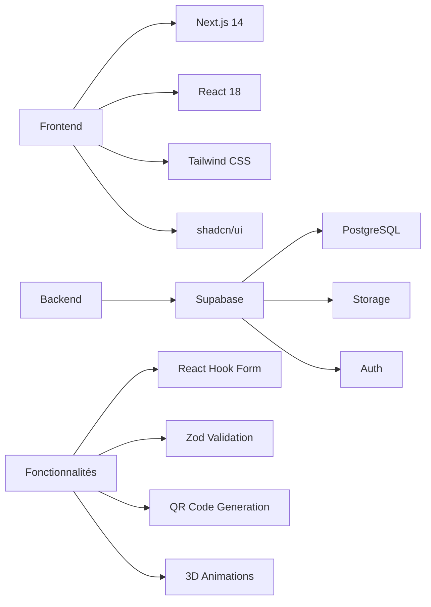

### Structure des Données
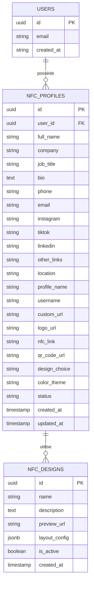

### Flux de Données
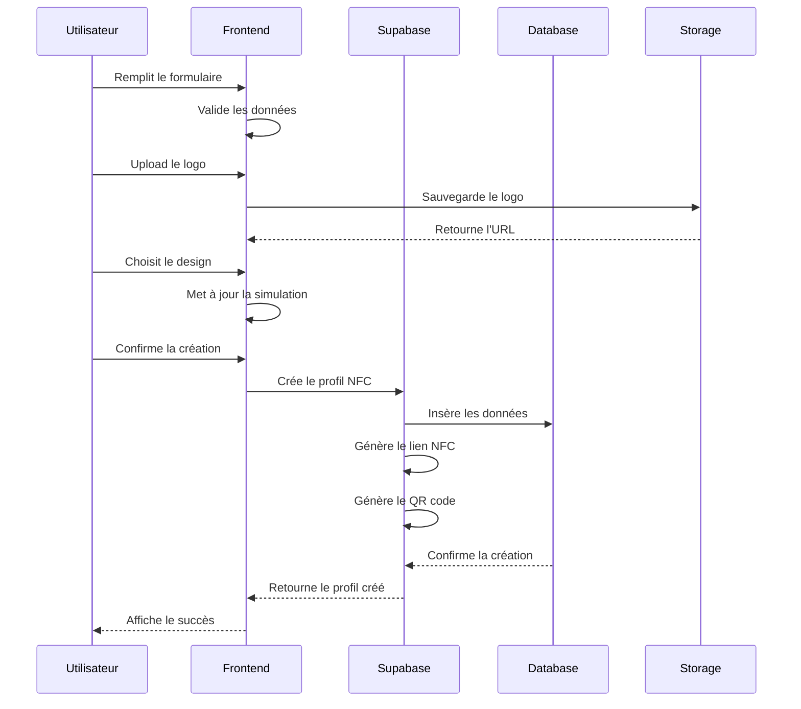

---

## 🎨 DESIGN SYSTEM

### Palette de Couleurs
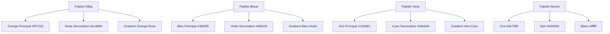

### Composants UI
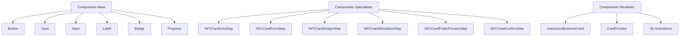

---

## 🔐 SÉCURITÉ & VALIDATION

### Stratégie de Sécurité
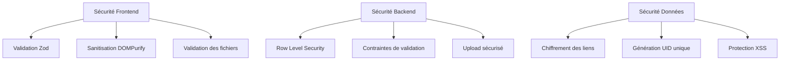

### Validation des Données
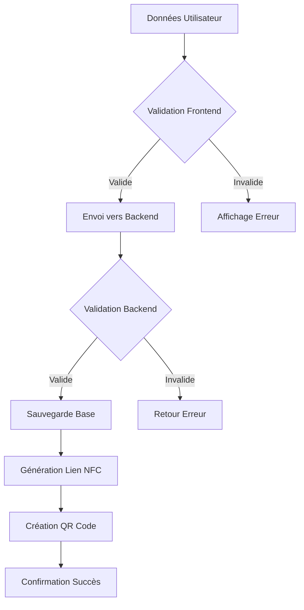

---

## 📱 RESPONSIVE DESIGN

### Breakpoints et Layouts
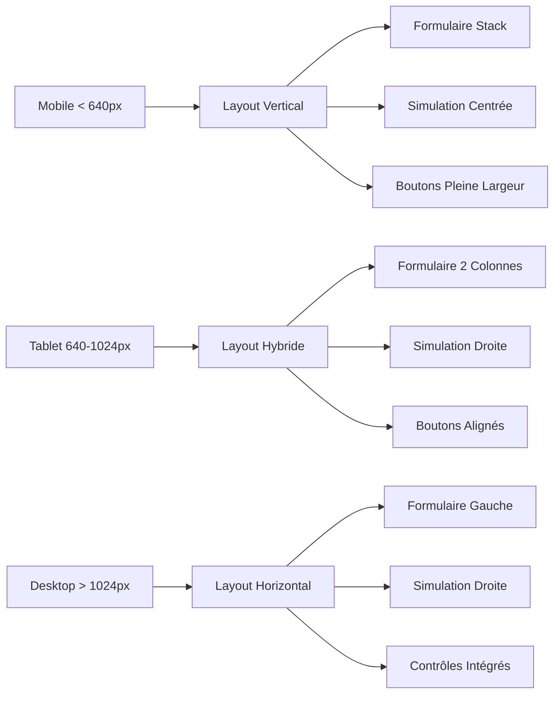

### Adaptation Mobile
- **Formulaire** : Champs empilés verticalement
- **Simulation** : Carte centrée, contrôles en dessous
- **Navigation** : Boutons pleine largeur
- **Touch** : Zones de clic optimisées

### Adaptation Desktop
- **Formulaire** : 2 colonnes côte à côte
- **Simulation** : Carte à droite, contrôles à gauche
- **Navigation** : Boutons alignés horizontalement
- **Hover** : Effets de survol

---

## 🧪 STRATÉGIE DE TESTS

### Types de Tests
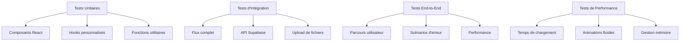

### Scénarios de Test
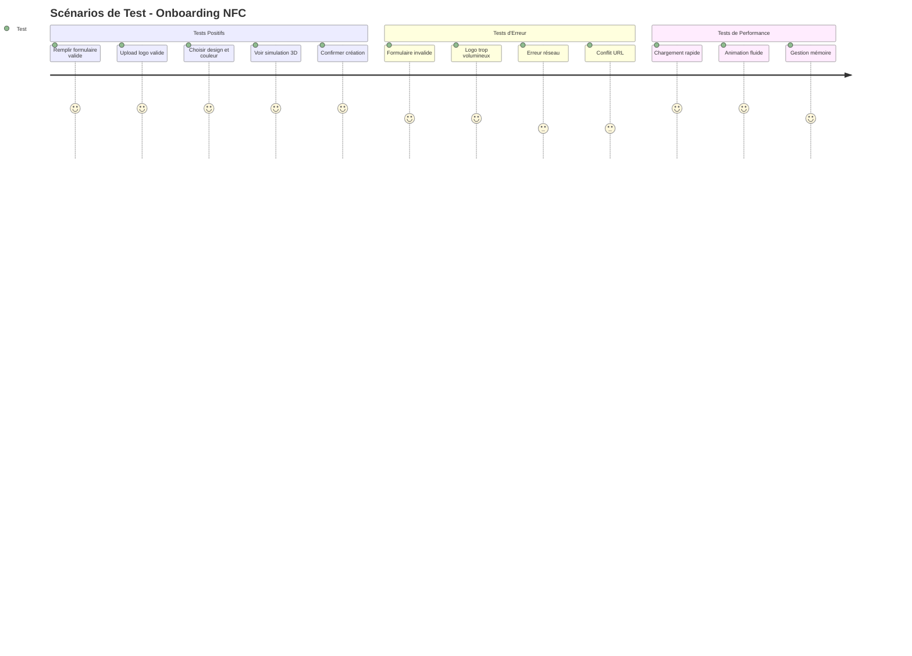

---

## 📅 PLANNING D'IMPLÉMENTATION

### Phases de Développement
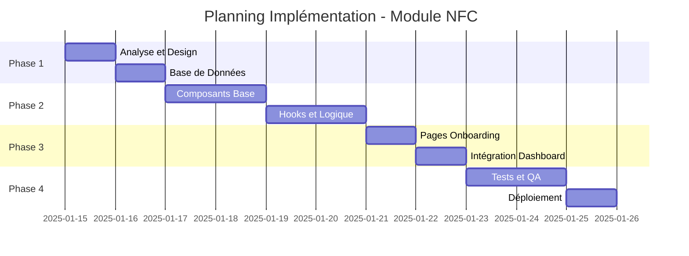

### Jalons Critiques
1. **Jalon 1** : Base de données configurée et testée
2. **Jalon 2** : Composants d'onboarding fonctionnels
3. **Jalon 3** : Simulation 3D intégrée et fluide
4. **Jalon 4** : Flux complet testé et validé
5. **Jalon 5** : Module déployé et opérationnel

---

## 📊 MÉTRIQUES DE SUCCÈS

### Indicateurs Techniques
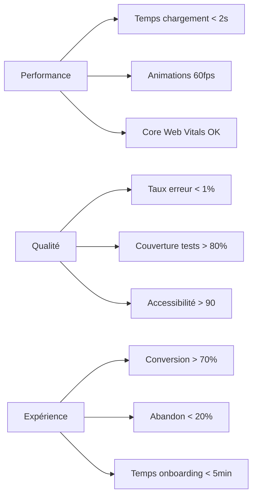

### Indicateurs Business
- **Création de cartes** : > 50 cartes/semaine
- **Engagement** : > 80% cartes activées
- **Satisfaction** : > 4.5/5 expérience
- **Rétention** : > 90% utilisateurs satisfaits

---

## 🔧 MAINTENANCE & ÉVOLUTION

### Maintenance Continue
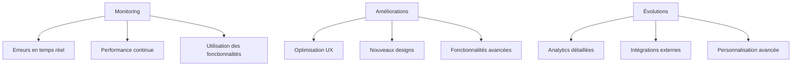

### Roadmap Future
- **Q1 2025** : Analytics des cartes créées
- **Q2 2025** : Nouveaux modèles de design
- **Q3 2025** : Personnalisation avancée
- **Q4 2025** : Intégrations tierces

---

## 📚 RESSOURCES & RÉFÉRENCES

### Documentation Technique
- Next.js App Router
- Supabase Documentation
- React Hook Form
- Zod Validation
- Tailwind CSS

### Composants Existants
- InteractiveBusinessCard.tsx
- CardPreview.tsx
- Animations 3D CSS

### Outils de Développement
- Supabase Studio
- React DevTools
- Lighthouse
- Jest/Testing Library

---

*Document créé le : Janvier 2025*
*Version : 1.0*
*Statut : Prêt pour implémentation*
*Type : Spécifications techniques en language naturel*
