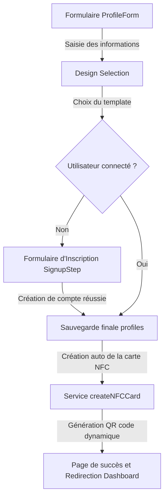

# Guide des Flux de Création de Profils Publics

Ce guide documente en détail le fonctionnement technique de la création de profils publics sur Ofika. Il est structuré pour aider à comprendre les deux chemins (onboarding anonyme et création connectée) et lister les fichiers impliqués.

---

## 1. Procédures Simplifiées

### A. Flux d'Onboarding Public (Visiteur non connecté)
Ce flux est conçu pour convertir un simple visiteur en utilisateur enregistré possédant une page publique et une carte NFC virtuelle.

1. **Saisie des Coordonnées** : L'utilisateur remplit son identité, sa biographie et ses liens sociaux sur la page d'onboarding.
2. **Choix du Visuel** : L'utilisateur choisit l'un des templates visuels disponibles (Design 1, Bento, Influenceur, etc.).
3. **Inscription d'urgence (Signup)** : 
   - Si l'utilisateur n'est pas connecté, les données sont stockées dans le `localStorage` sous la clé `'pending_profile_creation'`.
   - L'utilisateur saisit son mot de passe.
   - À l'inscription réussie, le compte est créé et la session s'ouvre.
4. **Persistance en Base & Synchro NFC** :
   - Le profil est inséré dans la table `profiles`.
   - La carte NFC est automatiquement générée via `createNFCCard` et liée au profil.
   - Un QR Code dynamique est configuré pour rediriger vers le profil.

### B. Flux du Tableau de Bord (Utilisateur connecté)
Ce flux permet à un utilisateur connecté de créer un profil supplémentaire ou un nouveau profil professionnel.

1. **Saisie des Coordonnées** : L'utilisateur remplit le formulaire.
2. **Choix du Visuel** : Sélection du design de la page.
3. **Persistance & Synchro NFC** : L'insertion en base de données et la création de la carte NFC se font immédiatement sans passer par l'étape d'inscription.

---

## 2. Liste des Fichiers Intervenants

| Catégorie | Fichier | Rôle / Description |
| :--- | :--- | :--- |
| **Pages & Routes** | [app/onboarding/public-page/page.tsx](file:///c:/Users/Toto.ADMINISTRATOR/Desktop/Ofika-c-main/app/onboarding/public-page/page.tsx) | Page d'onboarding public gérant l'état et l'enchaînement des étapes pour un visiteur. |
| **Pages & Routes** | [app/dashboard/profiles/create/page.tsx](file:///c:/Users/Toto.ADMINISTRATOR/Desktop/Ofika-c-main/app/dashboard/profiles/create/page.tsx) | Page de création de profil depuis le tableau de bord (accès sécurisé). |
| **Pages & Routes** | [app/\[username\]/page.tsx](file:///c:/Users/Toto.ADMINISTRATOR/Desktop/Ofika-c-main/app/%5Busername%5D/page.tsx) | Route dynamique gérant la résolution d'une URL de profil public. |
| **Composants UI** | [components/features/profiles/ProfileForm.tsx](file:///c:/Users/Toto.ADMINISTRATOR/Desktop/Ofika-c-main/components/features/profiles/ProfileForm.tsx) | Formulaire unifié de saisie d'informations avec validation Zod (`profileSchema`). |
| **Composants UI** | [components/features/profiles/TemplateSelectionStep.tsx](file:///c:/Users/Toto.ADMINISTRATOR/Desktop/Ofika-c-main/components/features/profiles/TemplateSelectionStep.tsx) | Composant de choix visuel du design. |
| **Composants UI** | [components/features/profiles/SignupStep.tsx](file:///c:/Users/Toto.ADMINISTRATOR/Desktop/Ofika-c-main/components/features/profiles/SignupStep.tsx) | Formulaire d'inscription rapide gérant la saisie de mot de passe et l'appel à Supabase Auth. |
| **Composants UI** | [app/\[username\]/ProfileClient.tsx](file:///c:/Users/Toto.ADMINISTRATOR/Desktop/Ofika-c-main/app/%5Busername%5D/ProfileClient.tsx) | Composant client résolvant l'affichage du template et enregistrant les analytics de visite. |
| **Services & Hooks** | [lib/services/public-profile.ts](file:///c:/Users/Toto.ADMINISTRATOR/Desktop/Ofika-c-main/lib/services/public-profile.ts) | Service de récupération de profil avec gestion du cache (`unstable_cache`) et fallback sur les cartes NFC numériques actives. |
| **Services & Hooks** | [lib/services/nfc-cards.ts](file:///c:/Users/Toto.ADMINISTRATOR/Desktop/Ofika-c-main/lib/services/nfc-cards.ts) | Logique de création de la carte NFC numérique et appel optionnel à la création automatique de profil. |
| **Services & Hooks** | [lib/hooks/useAuth.ts](file:///c:/Users/Toto.ADMINISTRATOR/Desktop/Ofika-c-main/lib/hooks/useAuth.ts) / `AuthContext.tsx` | Hook et contexte d'authentification interférant avec Supabase Auth (`signUp`, `signIn`). |

---

## 3. Améliorations UX Implémentées (Session Actuelle)

Les fonctionnalités suivantes ont été implémentées et validées pour offrir une expérience onboarding fluide et premium :

### 🚀 1. Aperçu Smartphone Réaliste à Échelle Réduite
*   **Composant** : [ScaledSmartphonePreview.tsx](file:///c:/Users/Toto.ADMINISTRATOR/Desktop/Ofika-c-main/components/ui/scaled-smartphone-preview.tsx)
*   **Fonctionnement** : Résout le rendu disproportionné des textes et boutons dans le téléphone en enfermant le profil dans une résolution mobile standard (`360x720px`) puis en appliquant une transformation CSS `scale` (`0.42` à `0.62` selon l'écran). Cela simule fidèlement un écran de mobile haute définition avec des proportions parfaites.

### 🧩 2. Layout Responsive & Viewport Lock
*   **Fichiers** : [page.tsx](file:///c:/Users/Toto.ADMINISTRATOR/Desktop/Ofika-c-main/app/onboarding/public-page/page.tsx) / [ProfileForm.tsx](file:///c:/Users/Toto.ADMINISTRATOR/Desktop/Ofika-c-main/components/features/profiles/ProfileForm.tsx) / [TemplateSelectionStep.tsx](file:///c:/Users/Toto.ADMINISTRATOR/Desktop/Ofika-c-main/components/features/profiles/TemplateSelectionStep.tsx)
*   **Fonctionnement** : 
    - *Sur ordinateur* : L'interface est verrouillée à la hauteur de l'écran (`100dvh`) et n'affiche aucune scrollbar globale. Seuls les champs de saisie du formulaire défilent en interne, tandis que les onglets et les boutons de navigation restent ancrés et fixes.
    - *Sur mobile* : Les contraintes de hauteur fixe et d'overflow sont désactivées (`lg:`). La page défile de manière classique pour s'adapter naturellement à l'ouverture des claviers virtuels.

### 🔗 3. Génération Automatique d'URL (Auto-slug)
*   **Composant** : [ProfileForm.tsx](file:///c:/Users/Toto.ADMINISTRATOR/Desktop/Ofika-c-main/components/features/profiles/ProfileForm.tsx)
*   **Fonctionnement** : L'URL personnalisée se remplit automatiquement lors de la saisie du nom (avec suppression des accents, espaces et caractères non-alphanumériques). Si l'utilisateur saisit lui-même une URL, la génération automatique s'interrompt pour ne pas écraser ses modifications. Vider le champ réactive automatiquement le comportement.

### 📏 4. Stepper Simplifié à 3 Étapes
*   **Composant** : [stepper.tsx](file:///c:/Users/Toto.ADMINISTRATOR/Desktop/Ofika-c-main/components/ui/stepper.tsx) et [page.tsx](file:///c:/Users/Toto.ADMINISTRATOR/Desktop/Ofika-c-main/app/onboarding/public-page/page.tsx)
*   **Fonctionnement** : Réduction de l'affichage du stepper de 4 à 3 étapes : **Informations** ➔ **Design** ➔ **Compte** (qui affiche directement le message de fin et les boutons de succès après l'inscription). Les dimensions du stepper ont également été réduites pour libérer de la hauteur.

### 🔍 5. Résolution du Bug d'Affichage des Icônes Sociales
*   **Fichiers** : [page.tsx](file:///c:/Users/Toto.ADMINISTRATOR/Desktop/Ofika-c-main/app/onboarding/public-page/page.tsx) / [TemplateSelectionStep.tsx](file:///c:/Users/Toto.ADMINISTRATOR/Desktop/Ofika-c-main/components/features/profiles/TemplateSelectionStep.tsx)
*   **Fonctionnement** : Ajout de la liaison `social_links` manquante dans la structure `createPreviewProfile` pour les profils temporaires d'aperçu. Les icônes s'actualisent maintenant instantanément au fur et à mesure de leur configuration.
