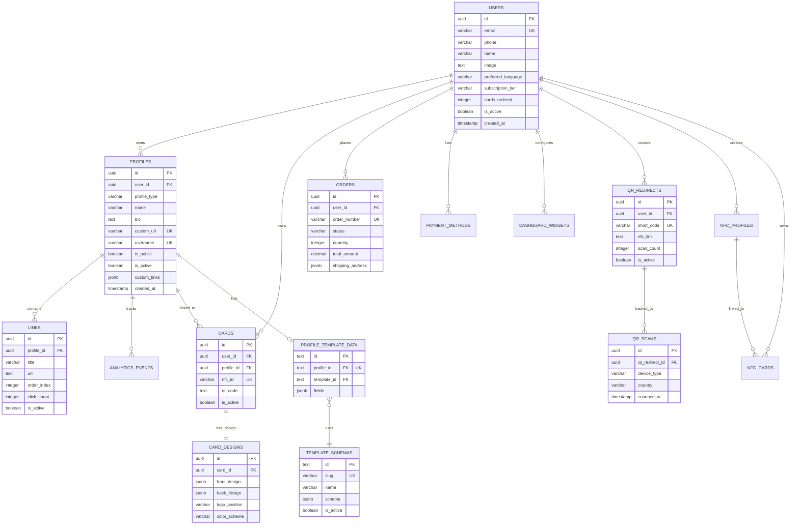

# 📊 DATABASE RELATIONSHIP DIAGRAM

## Entity Relationship Diagram (ERD)



---

## Simplified Architecture View

```
┌─────────────────────────────────────────────────────────────────┐
│                          USERS (Central)                        │
│  • Authentication & Subscription Management                     │
│  • 1 user can have multiple profiles                           │
└───┬─────────────────────────────────────────────────────────────┘
    │
    ├──→ PROFILES (1:n) ─────┬──→ LINKS (1:n)
    │                         ├──→ ANALYTICS_EVENTS (1:n)
    │                         ├──→ CARDS (1:n) ──→ CARD_DESIGNS (1:1)
    │                         └──→ PROFILE_TEMPLATE_DATA (1:1) ──→ TEMPLATE_SCHEMAS (n:1)
    │
    ├──→ ORDERS (1:n)
    ├──→ PAYMENT_METHODS (1:n)
    ├──→ DASHBOARD_WIDGETS (1:n)
    │
    ├──→ QR_REDIRECTS (1:n) ──→ QR_SCANS (1:n)
    │
    └──→ NFC_PROFILES (1:n) ──→ NFC_CARDS (1:n)
```

---

## Business Logic Flow

### Profile Creation & Management

```
User Signs Up
    ↓
Creates Profile (professional/personal/event)
    ↓
Selects Template (design1-7, influencer, ecommerce, freelance)
    ↓
Fills Template Fields (profile_template_data)
    ↓
Adds Links (social media, website, etc.)
    ↓
Profile is Public/Private
    ↓
Analytics Tracked (views, clicks)
```

### Card Order Flow

```
User Places Order
    ↓
Selects Profile to Link
    ↓
Chooses Card Design (front/back)
    ↓
Provides Shipping Address
    ↓
Payment Processed
    ↓
Card Produced (nfc_cards table)
    ↓
Shipped with Tracking
    ↓
User Activates NFC Card
```

### QR Code System

```
User Creates QR Redirect
    ↓
Gets Short Code (e.g., /q/abc123)
    ↓
Sets Target URL (can be changed anytime)
    ↓
QR Code Generated
    ↓
Someone Scans QR
    ↓
Redirect Happens + Analytics Recorded (qr_scans)
```

---

## Data Relationships Summary

| Parent Table | Child Table | Relationship | Delete Rule |
|--------------|-------------|--------------|-------------|
| users | profiles | 1:n | CASCADE |
| users | cards | 1:n | CASCADE |
| users | orders | 1:n | CASCADE |
| users | payment_methods | 1:n | CASCADE |
| users | dashboard_widgets | 1:n | CASCADE |
| users | qr_redirects | 1:n | CASCADE |
| users | nfc_profiles | 1:n | CASCADE |
| users | nfc_cards | 1:n | CASCADE |
| profiles | links | 1:n | CASCADE |
| profiles | analytics_events | 1:n | CASCADE |
| profiles | cards | 1:n | CASCADE |
| profiles | profile_template_data | 1:1 | CASCADE |
| cards | card_designs | 1:1 | CASCADE |
| template_schemas | profile_template_data | 1:n | RESTRICT |
| qr_redirects | qr_scans | 1:n | CASCADE |
| nfc_profiles | nfc_cards | 1:n | SET NULL |

**Total Relationships**: 17 foreign keys

---

## Security Model (RLS Policies)

### Access Control Matrix

| Table | Public Read | Owner Full Access | Notes |
|-------|-------------|-------------------|-------|
| users | ❌ | ✅ | Users see only their own data |
| profiles | ✅ if is_public=true | ✅ | Public profiles visible to all |
| links | ✅ if profile public | ✅ | Links visible with profiles |
| cards | ❌ | ✅ | Private to owner |
| card_designs | ❌ | ✅ | Private to owner |
| orders | ❌ | ✅ | Private to owner |
| payment_methods | ❌ | ✅ | Private to owner |
| analytics_events | ❌ read, ✅ write | ✅ | Anyone can track, owner sees data |
| dashboard_widgets | ❌ | ✅ | Private to owner |
| qr_redirects | ⚠️ Partial | ✅ | Public can redirect, owner sees stats |
| qr_scans | ❌ read, ✅ write | ✅ via FK | Anyone can scan, owner sees via qr_redirects |
| template_schemas | ✅ if is_active | ❌ (Admin only) | Public templates, admin management |
| profile_template_data | ❌ | ✅ | Private to profile owner |
| nfc_profiles | ✅ if is_active | ✅ | Active profiles publicly accessible |
| nfc_cards | ❌ | ✅ | Private to owner |

**Total Policies**: 32 granular RLS policies

---

## Indexes Strategy

### Primary Indexes (47 total)

**Foreign Key Indexes** (for JOIN performance):
- All FK columns indexed (user_id, profile_id, card_id, etc.)

**Unique Constraint Indexes**:
- email, custom_url, username, nfc_id, short_code, order_number

**Query Optimization Indexes**:
- Composite: (profile_id, order_index) for links
- Composite: (user_id, status) for orders
- Composite: (profile_id, created_at) for analytics
- Partial: WHERE is_active for filtering

**JSONB Indexes** (GIN):
- custom_links, schema, fields (for JSON queries)

---

## Template System Architecture

```
template_schemas (8 presets)
├── design1 (Classic Professional)
├── design2 (Modern Creative)
├── design3 (Creative with Effects)
├── design4 (Nature Minimal)
├── influencer (Social Media Focus)
├── ecommerce (E-commerce Focus)
├── design7 (Dark Elegant)
└── freelance (Freelancer Focus)

Each template defines:
{
  "fields": [
    {
      "name": "company",
      "type": "text",
      "label": "Entreprise",
      "required": false,
      "max": 100
    }
  ]
}

User Profile selects template → profile_template_data stores values
```

---

## Analytics Data Flow

```
User Views Profile
    ↓
analytics_events INSERT
    {
      event_type: 'view',
      device_type: 'mobile',
      country: 'FR',
      ip_address: '1.2.3.4'
    }
    ↓
Aggregated in Dashboard
    ↓
User sees: Total Views, Click Rate, Geographic Distribution
```

```
User Clicks Link
    ↓
links.click_count INCREMENT
    +
analytics_events INSERT
    {
      event_type: 'click',
      link_id: '...'
    }
```

```
Someone Scans QR Code
    ↓
qr_scans INSERT (device, location data)
    +
qr_redirects.scan_count INCREMENT
    +
qr_redirects.last_scanned_at UPDATE
    ↓
Redirect to nfc_link
```

---

## JSONB Schema Examples

### profiles.custom_links
```json
[
  {
    "title": "My Portfolio",
    "url": "https://myportfolio.com",
    "icon": "link"
  },
  {
    "title": "Buy Me a Coffee",
    "url": "https://buymeacoffee.com/user",
    "icon": "coffee"
  }
]
```

### orders.shipping_address
```json
{
  "name": "John Doe",
  "address_line1": "123 Main Street",
  "address_line2": "Apartment 4B",
  "city": "Paris",
  "postal_code": "75001",
  "country": "FR",
  "phone": "+33612345678"
}
```

### card_designs.front_design
```json
{
  "background_color": "#ffffff",
  "text_color": "#000000",
  "logo_url": "https://example.com/logo.png",
  "elements": [
    {
      "type": "text",
      "value": "John Doe",
      "style": {
        "fontSize": "24px",
        "fontWeight": "bold",
        "textAlign": "center"
      },
      "position": {"x": 50, "y": 100}
    },
    {
      "type": "image",
      "url": "https://example.com/photo.jpg",
      "position": {"x": 150, "y": 50},
      "style": {"width": "100px", "height": "100px", "borderRadius": "50%"}
    }
  ]
}
```

### template_schemas.schema
```json
{
  "fields": [
    {
      "name": "company",
      "type": "text",
      "label": "Entreprise",
      "placeholder": "Nom de votre entreprise",
      "required": false,
      "max": 100
    },
    {
      "name": "position",
      "type": "text",
      "label": "Poste",
      "placeholder": "Votre fonction",
      "required": false,
      "max": 100
    },
    {
      "name": "linkedin",
      "type": "url",
      "label": "LinkedIn",
      "placeholder": "https://linkedin.com/in/votre-profil",
      "required": false
    }
  ]
}
```

### profile_template_data.fields
```json
{
  "company": "ACME Corporation",
  "position": "Senior Developer",
  "linkedin": "https://linkedin.com/in/johndoe"
}
```

---

## Performance Characteristics

### Query Patterns

**Fast Queries** (well-indexed):
- Get user's profiles: `WHERE user_id = ?`
- Get profile's links: `WHERE profile_id = ?` + `ORDER BY order_index`
- Get public profiles: `WHERE is_public = true`
- Search by username: `WHERE username = ?`
- Get active templates: `WHERE is_active = true`

**Moderate Queries** (acceptable with indexes):
- Analytics aggregation: `GROUP BY profile_id, DATE(created_at)`
- Dashboard stats: Multiple JOINs with aggregates

**Potential Slow Queries** (needs optimization):
- Full-text search across profiles (consider adding tsvector)
- Complex JSONB queries without proper GIN indexes

### Recommendations for Scale

1. **Add tsvector for search**:
```sql
ALTER TABLE profiles ADD COLUMN search_vector tsvector;
CREATE INDEX idx_profiles_search ON profiles USING GIN(search_vector);
```

2. **Materialized views for analytics**:
```sql
CREATE MATERIALIZED VIEW mv_profile_stats AS ...
REFRESH MATERIALIZED VIEW CONCURRENTLY mv_profile_stats;
```

3. **Partition analytics_events by date**:
```sql
-- For high-volume analytics data
CREATE TABLE analytics_events_2025_01 PARTITION OF analytics_events ...
```

---

**Diagram Version**: 1.0  
**Last Updated**: 2025-01-05  
**Format**: Mermaid ERD + ASCII diagrams
