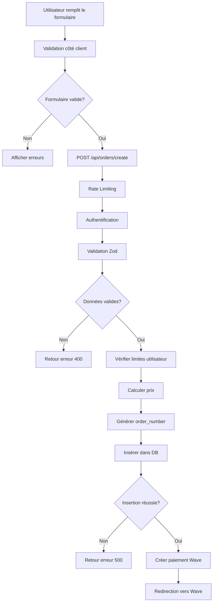

# 📊 Structure de la Table `orders` - Documentation Complète

## 🎯 Vue d'ensemble

Ce document détaille la structure de la table `orders` dans votre base de données et vérifie la cohérence avec les données envoyées depuis le formulaire web lors de la création d'une commande.

---

## 📋 Structure de la Table `orders`

### Schéma de la table (Drizzle - Version actuelle)

```sql
CREATE TABLE "orders" (
    "id" text PRIMARY KEY NOT NULL,
    "user_id" text NOT NULL,
    "order_number" varchar(20) NOT NULL,
    "status" varchar(20) DEFAULT 'pending' NOT NULL,
    "quantity" integer NOT NULL,
    "unit_price" numeric(10, 2) NOT NULL,
    "total_amount" numeric(10, 2) NOT NULL,
    "currency" varchar(3) DEFAULT 'USD' NOT NULL,
    "card_type" varchar(50),
    "payment_method" varchar(20) NOT NULL,
    "payment_status" varchar(20) DEFAULT 'pending' NOT NULL,
    "payment_reference" varchar(100),
    "shipping_address" jsonb NOT NULL,
    "tracking_number" varchar(100),
    "estimated_delivery" date,
    "actual_delivery" date,
    "wave_payment_id" text,
    "wave_payment_url" text,
    "created_at" timestamp with time zone DEFAULT now() NOT NULL,
    "updated_at" timestamp with time zone DEFAULT now() NOT NULL,
    CONSTRAINT "orders_order_number_unique" UNIQUE("order_number")
);

-- Clé étrangère
ALTER TABLE "orders" ADD CONSTRAINT "orders_user_id_users_id_fk" 
FOREIGN KEY ("user_id") REFERENCES "public"."users"("id") 
ON DELETE cascade ON UPDATE no action;
```

### 📝 Description des champs

| Champ | Type | Requis | Valeur par défaut | Description |
|-------|------|--------|-------------------|-------------|
| **id** | text | ✅ | gen_random_uuid() | Identifiant unique de la commande |
| **user_id** | text | ✅ | - | Référence vers l'utilisateur (FK) |
| **order_number** | varchar(20) | ✅ | - | Numéro de commande unique (ex: ORD-1733328000000-ABC123) |
| **status** | varchar(20) | ✅ | 'pending' | Statut de la commande (pending, paid, failed, cancelled, shipped, delivered) |
| **quantity** | integer | ✅ | - | Quantité de cartes commandées (1-2) |
| **unit_price** | numeric(10,2) | ✅ | - | Prix unitaire d'une carte |
| **total_amount** | numeric(10,2) | ✅ | - | Montant total de la commande |
| **currency** | varchar(3) | ✅ | 'USD' | Devise (XOF pour la Côte d'Ivoire) |
| **card_type** | varchar(50) | ❌ | - | Type de carte (nfc_qr, qr_only, premium_subscription, custom) |
| **payment_method** | varchar(20) | ✅ | - | Méthode de paiement (Wave, wave, orange_money, mtn_money) |
| **payment_status** | varchar(20) | ✅ | 'pending' | Statut du paiement (pending, completed, failed, refunded) |
| **payment_reference** | varchar(100) | ❌ | - | Référence de transaction du fournisseur de paiement |
| **shipping_address** | jsonb | ✅ | - | Adresse de livraison (format JSON) |
| **tracking_number** | varchar(100) | ❌ | - | Numéro de suivi de livraison |
| **estimated_delivery** | date | ❌ | - | Date de livraison estimée |
| **actual_delivery** | date | ❌ | - | Date de livraison réelle |
| **wave_payment_id** | text | ❌ | - | ID de paiement Wave |
| **wave_payment_url** | text | ❌ | - | URL de paiement Wave |
| **created_at** | timestamp | ✅ | now() | Date de création |
| **updated_at** | timestamp | ✅ | now() | Date de dernière modification |

---

## 🌐 Données envoyées depuis le formulaire web

### Localisation du formulaire
**Fichier**: `app/dashboard/orders/new/page.tsx`

### Structure des données envoyées (POST /api/orders/create)

```typescript
{
  card_type: 'nfc_qr',              // Type de carte (fixe pour l'instant)
  quantity: 1,                       // Quantité (fixe à 1)
  payment_method: 'Wave',          // Méthode de paiement
  shipping_address: {                // Adresse de livraison (JSONB)
    name: string,                    // Nom complet
    email: string,                   // Email
    phone: string,                   // Téléphone
    address: string,                 // Adresse complète
    city: string,                    // Ville
    postalCode: string               // Code postal (optionnel)
  }
}
```

### Exemple de données réelles envoyées

```json
{
  "card_type": "nfc_qr",
  "quantity": 1,
  "payment_method": "Wave",
  "shipping_address": {
    "name": "Jean Kouassi",
    "email": "jean.kouassi@example.com",
    "phone": "+225 07 12 34 56 78",
    "address": "Cocody, Riviera 3, Rue des Jardins",
    "city": "Abidjan",
    "postalCode": "BP 1234"
  }
}
```

---

## ✅ Validation des données (Zod Schema)

### Schéma de validation côté API
**Fichier**: `app/api/orders/create/route.ts` (lignes 15-38)

```typescript
const shippingAddressSchema = z.object({
  name: z.string().min(2, 'Nom complet requis (minimum 2 caractères)').max(100, 'Nom trop long'),
  email: z.union([z.string().email('Email valide requis'), z.literal('')]).optional(),
  phone: z.string().min(8, 'Numéro de téléphone requis (minimum 8 caractères)').max(20, 'Numéro trop long'),
  address: z.string().min(2, 'Adresse requise (minimum 2 caractères)').max(255, 'Adresse trop longue'),
  city: z.string().min(2, 'Ville requise (minimum 2 caractères)').max(100, 'Ville trop longue'),
  postalCode: z.union([z.string().min(2, 'Code postal requis').max(10, 'Code postal trop long'), z.literal('')]).optional(),
})

const orderCreateSchema = z.object({
  profile_id: z.string().uuid('ID de profil invalide').optional(),
  card_type: z.enum(['nfc_qr', 'qr_only', 'premium_subscription', 'custom']).default('nfc_qr'),
  quantity: z.union([z.number(), z.string()])
    .transform(val => typeof val === 'string' ? parseInt(val, 10) : val)
    .refine(val => Number.isInteger(val) && val >= 1 && val <= 2,
      'Quantité doit être un entier entre 1 et 2'),
  unit_price: z.union([z.number(), z.string()])
    .transform(val => typeof val === 'string' ? parseFloat(val) : val)
    .refine(val => val >= 0, 'Prix unitaire doit être positif')
    .optional(),
  payment_method: z.enum(['Wave', 'wave', 'orange_money', 'mtn_money']).default('Wave'),
  shipping_address: shippingAddressSchema,
  metadata: z.record(z.any()).optional(),
})
```

---

## 🔄 Traitement des données dans l'API

### Données insérées dans la base de données
**Fichier**: `app/api/orders/create/route.ts` (lignes 369-387)

```typescript
const orderInsertData = {
  user_id: user.id,                          // ✅ Récupéré de la session
  order_number: orderNumber,                 // ✅ Généré automatiquement (ORD-timestamp-random)
  card_type: orderData.card_type,           // ✅ Depuis le formulaire
  quantity: orderData.quantity,             // ✅ Depuis le formulaire
  unit_price: unitPrice,                    // ✅ Calculé selon le type de carte
  total_amount: totalAmount,                // ✅ Calculé (unit_price × quantity)
  currency: 'XOF',                          // ✅ Fixé à XOF (Franc CFA)
  payment_method: orderData.payment_method, // ✅ Depuis le formulaire
  shipping_address: orderData.shipping_address, // ✅ Depuis le formulaire (JSONB)
  status: 'pending',                        // ✅ Statut initial
  payment_status: 'pending',                // ✅ Statut de paiement initial
  metadata: {                               // ✅ Métadonnées additionnelles
    ...orderData.metadata,
    profile_id: orderData.profile_id,
    created_via: 'api',
    processing_time_ms: Date.now() - startTime
  },
}
```

---

## 🔍 Analyse de cohérence

### ✅ Champs cohérents

| Champ DB | Source | Cohérence |
|----------|--------|-----------|
| **user_id** | Session utilisateur | ✅ Automatique |
| **order_number** | Généré par l'API | ✅ Unique et sécurisé |
| **card_type** | Formulaire web | ✅ Validé par Zod |
| **quantity** | Formulaire web (fixe à 1) | ✅ Validé (1-2) |
| **unit_price** | Calculé selon CARD_PRICING | ✅ Sécurisé |
| **total_amount** | Calculé (unit_price × quantity) | ✅ Sécurisé |
| **currency** | Fixé à 'XOF' | ✅ Cohérent |
| **payment_method** | Formulaire web | ✅ Validé par Zod |
| **shipping_address** | Formulaire web | ✅ Validé par Zod (JSONB) |
| **status** | Fixé à 'pending' | ✅ Logique métier |
| **payment_status** | Fixé à 'pending' | ✅ Logique métier |

### ⚠️ Champs non remplis lors de la création

Ces champs sont remplis ultérieurement par d'autres processus :

- **payment_reference** : Rempli après confirmation du paiement
- **tracking_number** : Rempli lors de l'expédition
- **estimated_delivery** : Calculé après validation
- **actual_delivery** : Rempli à la livraison
- **wave_payment_id** : Rempli par le webhook Wave (si utilisé)
- **wave_payment_url** : Rempli par l'API Wave (si utilisé)

---

## 📊 Structure du champ `shipping_address` (JSONB)

### Format stocké en base de données

```json
{
  "name": "Jean Kouassi",
  "email": "jean.kouassi@example.com",
  "phone": "+225 07 12 34 56 78",
  "address": "Cocody, Riviera 3, Rue des Jardins",
  "city": "Abidjan",
  "postalCode": "BP 1234"
}
```

### Avantages du format JSONB
- ✅ Flexibilité : Permet d'ajouter des champs sans migration
- ✅ Performance : Indexable et requêtable
- ✅ Validation : Schéma Zod garantit la structure
- ✅ Évolutivité : Facile d'ajouter pays, région, etc.

---

## 🔐 Sécurité et validations

### Validations côté client (formulaire)
**Fichier**: `app/dashboard/orders/new/page.tsx` (lignes 77-84)

```typescript
const validateForm = () => {
  if (!shippingInfo.name || shippingInfo.name.length < 2) 
    return 'Le nom est requis (min 2 caractères)'
  if (!shippingInfo.email) 
    return 'L\'email est requis'
  if (!shippingInfo.phone || shippingInfo.phone.length < 8) 
    return 'Le téléphone est requis (min 8 caractères)'
  if (!shippingInfo.address || shippingInfo.address.length < 2) 
    return 'L\'adresse est requise (min 2 caractères)'
  if (!shippingInfo.city || shippingInfo.city.length < 2) 
    return 'La ville est requise (min 2 caractères)'
  return null
}
```

### Validations côté serveur (API)
- ✅ **Zod Schema** : Validation stricte des types et formats
- ✅ **Rate Limiting** : 5 requêtes par minute par IP
- ✅ **Authentification** : Vérification de la session utilisateur
- ✅ **Limites utilisateur** : Maximum 2 commandes par utilisateur
- ✅ **Calcul sécurisé** : Prix calculés côté serveur (non modifiables)

---

## 🎯 Flux complet de création de commande



---

## 📌 Points importants à retenir

### ✅ Cohérence totale
- Tous les champs requis sont bien remplis
- Les validations sont cohérentes entre client et serveur
- Le format JSONB permet une flexibilité future

### 🔒 Sécurité
- Prix calculés côté serveur (non manipulables)
- Authentification obligatoire
- Rate limiting actif
- Validation stricte avec Zod

### 🚀 Évolutivité
- Champs de paiement pour Wave et Wave
- Métadonnées extensibles
- Structure JSONB flexible pour shipping_address

### 📝 Améliorations possibles
1. Ajouter un champ `profile_id` NOT NULL après migration des données existantes
2. Ajouter un champ `metadata` JSONB pour stocker des données additionnelles
3. Créer des index sur `payment_status` et `card_type` pour les requêtes fréquentes
4. Ajouter une contrainte CHECK sur `status` pour limiter les valeurs possibles

---

## 📚 Références

- **Schéma DB**: `drizzle/migrations/0000_black_drax.sql` (lignes 120-144)
- **API Create Order**: `app/api/orders/create/route.ts`
- **Formulaire Web**: `app/dashboard/orders/new/page.tsx`
- **Types**: `lib/types/payments.ts`
- **Configuration**: `lib/config/urls.ts`

---

**Dernière mise à jour**: 2025-12-04
**Version**: 1.0
