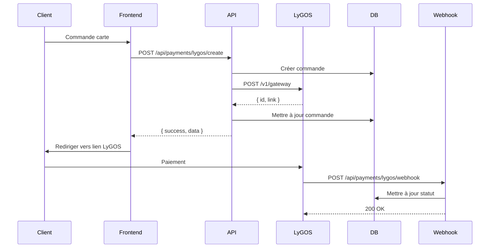

# 🚀 GUIDE COMPLET DE MIGRATION WAVE-CI → LYGOS

## 📋 TABLE DES MATIÈRES

1. [Vue d'ensemble](#vue-densemble)
2. [Prérequis](#prérequis)
3. [Configuration](#configuration)
4. [Architecture](#architecture)
5. [API Routes](#api-routes)
6. [Frontend](#frontend)
7. [Webhooks](#webhooks)
8. [Tests](#tests)
9. [Déploiement](#déploiement)
10. [Dépannage](#dépannage)

---

## 🎯 Vue d'ensemble

Ce guide documente la migration complète de **Wave-CI** vers **LyGOS** pour le système de paiement de votre SaaS.

### Changements principaux
- ✅ **Suppression** de tous les fichiers Wave-CI
- ✅ **Ajout** des API routes LyGOS complètes
- ✅ **Mise à jour** du frontend pour LyGOS
- ✅ **Implémentation** des webhooks sécurisés
- ✅ **Tests** automatisés complets
- ✅ **Documentation** exhaustive

### Avantages LyGOS vs Wave-CI
| Fonctionnalité | Wave-CI | LyGOS |
|----------------|---------|-------|
| API Backend | ❌ Non | ✅ Oui |
| Webhooks | ❌ Non | ✅ Oui |
| Signature HMAC | ❌ Non | ✅ Oui |
| Tracking avancé | ❌ Limité | ✅ Complet |
| Documentation | ❌ Basique | ✅ Complète |
| Multi-pays | ❌ CI uniquement | ✅ Plusieurs pays |

---

## 🔧 Prérequis

### Variables d'environnement requises

```bash
# LyGOS Configuration
LYGOS_API_KEY=votre_clé_api_lygos
LYGOS_WEBHOOK_SECRET=votre_secret_webhook_lygos
LYGOS_BASE_URL=https://api.lygosapp.com
LYGOS_SHOP_NAME=Ofika

# URLs de redirection
LYGOS_SUCCESS_URL=https://votresite.com/payment/success
LYGOS_FAILURE_URL=https://votresite.com/payment/cancelled

# Application (existantes)
NEXT_PUBLIC_APP_URL=https://votresite.com
NEXT_PUBLIC_LYGOS_DEFAULT_AMOUNT=14600
```

### Comptes requis
1. **Compte LyGOS** - Créez un compte sur [LyGOS](https://lygosapp.com)
2. **Clés API** - Obtenez votre API Key et Webhook Secret
3. **Configuration webhook** - Configurez l'URL: `https://votresite.com/api/payments/lygos/webhook`

---

## 🏗️ Architecture

### Structure des fichiers

```
📁 src/
├── 📁 app/api/payments/lygos/
│   ├── 📄 create/route.ts          # Création paiement
│   ├── 📄 webhook/route.ts         # Réception webhooks
│   └── 📄 status/route.ts           # Vérification statut
├── 📁 lib/services/
│   ├── 📄 lygos-api.ts             # Service API LyGOS
│   └── 📄 payments-lygos.ts        # Service paiements
├── 📁 lib/hooks/
│   └── 📄 usePayments.ts           # Hooks React LyGOS
├── 📁 components/features/card-ordering/
│   └── 📄 PaymentProcessStatus.tsx  # UI Paiement LyGOS
└── 📁 scripts/
    ├── 📄 test-lygos-integration.ts
    ├── 📄 test-lygos-webhook-simulation.ts
    └── 📄 test-lygos-full-integration.ts
```

### Flux de paiement



---

## 🔌 API Routes

### 1. Création de paiement

**Endpoint**: `POST /api/payments/lygos/create`

```json
// Request
{
  "amount": 14600,
  "order_id": "order-123",
  "message": "Commande carte NFC",
  "success_url": "https://site.com/payment/success/order-123",
  "failure_url": "https://site.com/payment/cancelled"
}

// Response
{
  "success": true,
  "data": {
    "id": "lygos_payment_abc123",
    "link": "https://api.lygosapp.com/gateway/xyz789",
    "amount": 14600,
    "currency": "XOF",
    "status": "pending"
  }
}
```

### 2. Vérification de statut

**Endpoint**: `GET /api/payments/lygos/status?id={gateway_id}`

```json
// Response
{
  "success": true,
  "data": {
    "id": "lygos_payment_abc123",
    "amount": 14600,
    "currency": "XOF",
    "shop_name": "Ofika",
    "link": "https://api.lygosapp.com/gateway/xyz789"
  }
}
```

### 3. Webhook

**Endpoint**: `POST /api/payments/lygos/webhook`

```json
// Payload envoyé par LyGOS
{
  "id": "lygos_payment_abc123",
  "order_id": "order-123",
  "amount": 14600,
  "currency": "XOF",
  "status": "paid",
  "timestamp": "2025-01-25T12:00:00Z"
}
```

**Headers**:
- `x-lygos-signature`: Signature HMAC SHA256

---

## 🎨 Frontend

### Hooks React

```typescript
// Utiliser le hook de processus de commande
import { useOrderProcess } from '@/lib/hooks/usePayments'

function PaymentComponent() {
  const { processOrder, isProcessing, currentStep, error, paymentUrl } = useOrderProcess()

  const handleOrder = async (orderData) => {
    const result = await processOrder(orderData)
    if (result.success) {
      // Rediriger vers le paiement
      window.location.href = result.paymentUrl
    }
  }

  return (
    // JSX du composant
  )
}
```

### Composant de statut

```typescript
// Afficher le statut du paiement
import { PaymentProcessStatus } from '@/components/features/card-ordering/PaymentProcessStatus'

<PaymentProcessStatus 
  order={order}
  onPaymentRedirect={() => window.location.href = order.lygos_payment_url}
/>
```

---

## 🪝 Webhooks

### Configuration

1. **URL du webhook**: `https://votresite.com/api/payments/lygos/webhook`
2. **Secret**: Utilisez `LYGOS_WEBHOOK_SECRET`
3. **Événements**: Paiements réussis, échoués, annulés

### Sécurité

- ✅ **Signature HMAC SHA256** vérifiée
- ✅ **Idempotence** (pas de double traitement)
- ✅ **Validation** des données
- ✅ **Logs** détaillés

### Payloads

#### Paiement réussi
```json
{
  "id": "lygos_payment_123",
  "order_id": "order_456",
  "amount": 14600,
  "currency": "XOF",
  "status": "paid",
  "timestamp": "2025-01-25T12:00:00Z"
}
```

#### Paiement échoué
```json
{
  "id": "lygos_payment_123",
  "order_id": "order_456",
  "amount": 14600,
  "currency": "XOF",
  "status": "failed",
  "timestamp": "2025-01-25T12:00:00Z"
}
```

---

## 🧪 Tests

### 1. Test d'intégration de base

```bash
npx tsx scripts/test-lygos-integration.ts
```

**Tests**:
- ✅ Configuration LyGOS
- ✅ Création paiement
- ✅ Vérification statut
- ✅ Simulation webhook

### 2. Test de webhook

```bash
npx tsx scripts/test-lygos-webhook-simulation.ts
```

**Tests**:
- ✅ Envoi webhook réussi
- ✅ Envoi webhook échoué
- ✅ Idempotence
- ✅ Signature invalide

### 3. Test complet

```bash
npx tsx scripts/test-lygos-full-integration.ts
```

**Tests**:
- ✅ Configuration
- ✅ API routes
- ✅ Base de données
- ✅ Webhooks
- ✅ Post-webhook

---

## 🚀 Déploiement

### 1. Migration de la base de données

```bash
# Appliquer les migrations Drizzle
npx drizzle-kit push
# OU
npx drizzle-kit migrate
```

### 2. Variables d'environnement

Configurez toutes les variables requises dans votre environnement de production.

### 3. Configuration webhook LyGOS

1. Connectez-vous à votre dashboard LyGOS
2. Allez dans **Settings → Webhooks**
3. Ajoutez l'URL: `https://votresite.com/api/payments/lygos/webhook`
4. Utilisez le `LYGOS_WEBHOOK_SECRET`

### 4. Tests de production

```bash
# Tester l'API
curl -X GET https://votresite.com/api/payments/lygos/status?id=test

# Tester le webhook
curl -X POST https://votresite.com/api/payments/lygos/webhook \
  -H "Content-Type: application/json" \
  -d '{"test": true}'
```

---

## 🔧 Dépannage

### Erreurs communes

#### 1. "Configuration LyGOS incomplète"
**Cause**: Variables d'environnement manquantes
**Solution**: Vérifiez `LYGOS_API_KEY` et `LYGOS_WEBHOOK_SECRET`

#### 2. "Signature webhook invalide"
**Cause**: Secret webhook incorrect
**Solution**: Vérifiez la configuration webhook dans LyGOS

#### 3. "Commande non trouvée"
**Cause**: ID de commande incorrect ou utilisateur non autorisé
**Solution**: Vérifiez l'authentification et les IDs

#### 4. "Paiement non mis à jour"
**Cause**: Webhook non reçu ou mal configuré
**Solution**: Vérifiez les logs et la configuration webhook

### Logs utiles

```typescript
// Logs de création paiement
console.log('🚀 Création paiement LyGOS:', { amount, order_id })

// Logs de webhook
console.log('📥 Webhook LyGOS reçu:', { id, status, order_id })

// Logs d'erreur
console.error('❌ Erreur paiement LyGOS:', error)
```

### Monitoring

Surveillez ces métriques:
- ✅ Taux de réussite des paiements
- ✅ Temps de réponse API
- ✅ Erreurs webhook
- ✅ Échecs de signature

---

## 📊 Checklist de migration

### Avant le déploiement
- [ ] Variables d'environnement configurées
- [ ] Tests locaux passés
- [ ] Documentation revue
- [ ] Backup de la base de données

### Après le déploiement
- [ ] Migration DB appliquée
- [ ] Webhook LyGOS configuré
- [ ] Tests de production passés
- [ ] Monitoring activé

### Validation finale
- [ ] Création paiement fonctionne
- [ ] Redirection vers LyGOS fonctionne
- [ ] Webhooks reçus et traités
- [ ] Statut des commandes mis à jour
- [ ] Frontend affiche correctement

---

## 🎉 Conclusion

La migration **Wave-CI → LyGOS** est maintenant complète ! 

### Réalisations
- ✅ **Suppression** complète de Wave-CI
- ✅ **Intégration** complète de LyGOS
- ✅ **Sécurité** renforcée avec HMAC
- ✅ **Tests** automatisés complets
- ✅ **Documentation** exhaustive

### Prochaines étapes
1. **Monitor** les transactions en production
2. **Optimiser** les taux de conversion
3. **Ajouter** les notifications email
4. **Étendre** à d'autres pays si besoin

---

## 📞 Support

Pour toute question sur l'intégration LyGOS:
- 📖 [Documentation LyGOS](https://docs.lygosapp.com)
- 🧪 [Scripts de test](./../scripts/)
- 📧 Support technique LyGOS

---

**Migration réalisée avec succès le 25 janvier 2025** ✨
