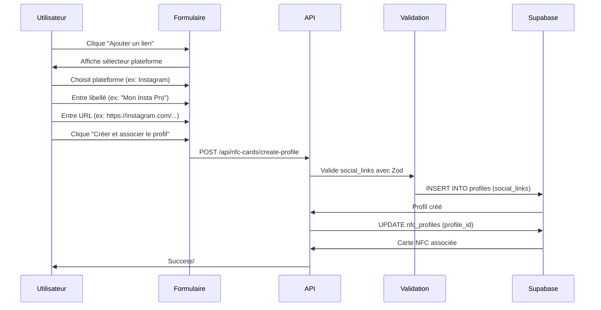

# 🔄 MIGRATION SOCIAL_LINKS - RÉSUMÉ COMPLET

**Date :** 2025-11-09  
**Statut :** ✅ **MIGRATION TERMINÉE**

---

## 🎯 OBJECTIF

Remplacer les anciens champs individuels (whatsapp, facebook, instagram, twitter, website) par un nouveau système flexible `social_links` au format JSONB.

---

## ✅ FICHIERS MODIFIÉS

### **1. Composant Frontend - Formulaire de Profil**
📁 `components/features/nfc-onboarding/ProfileSelectionStep.tsx`

**Changements :**
- ❌ Supprimé : Champs individuels (whatsapp, facebook, instagram, twitter, website, customLinks)
- ✅ Ajouté : Système `social_links` avec plateforme, URL et libellé
- ✅ Ajouté : Sélecteur de plateforme avec 11 options
- ✅ Ajouté : Interface améliorée avec cartes pour chaque lien
- ✅ Ajouté : Bouton de soumission "Créer et associer le profil"

**Nouveaux champs :**
```typescript
social_links: [
  {
    platform: 'whatsapp' | 'facebook' | 'instagram' | 'twitter' | 'linkedin' | 
              'tiktok' | 'youtube' | 'website' | 'email' | 'phone' | 'custom',
    url: string,
    label: string (optionnel)
  }
]
```

---

### **2. API Route - Création de Profil**
📁 `app/api/nfc-cards/create-profile/route.ts`

**Changements :**
- ❌ Supprimé : Validation Zod pour whatsapp, facebook, instagram, twitter, website, customLinks
- ✅ Ajouté : Validation Zod pour social_links (array d'objets)
- ❌ Supprimé : Insertion des anciens champs individuels
- ✅ Ajouté : Insertion de social_links au format JSONB
- ❌ Supprimé : Logique de création de liens personnalisés dans table `links`
- ✅ Simplifié : Insertion directe de social_links dans la table `profiles`

**Ancien schéma :**
```typescript
profileData: {
  whatsapp: string,
  facebook: string,
  instagram: string,
  twitter: string,
  website: string,
  customLinks: [{name: string, url: string}]
}
```

**Nouveau schéma :**
```typescript
profileData: {
  social_links: [{
    platform: string,
    url: string,
    label?: string
  }]
}
```

---

## 🗄️ STRUCTURE DE LA BASE DE DONNÉES

### **Table : `profiles`**

**Ancien format (colonnes individuelles) :**
```sql
whatsapp       VARCHAR
facebook       VARCHAR
instagram      VARCHAR
twitter        VARCHAR
website        VARCHAR
```

**Nouveau format (JSONB) :**
```sql
social_links   JSONB
```

**Exemple de données :**
```json
{
  "social_links": [
    {
      "platform": "whatsapp",
      "url": "+225 07 12 34 56 78",
      "label": "WhatsApp Pro"
    },
    {
      "platform": "instagram",
      "url": "https://instagram.com/username",
      "label": "Instagram Officiel"
    },
    {
      "platform": "website",
      "url": "https://monsite.com",
      "label": "Site Web"
    }
  ]
}
```

---

## 🎨 INTERFACE UTILISATEUR

### **Avant (Anciens champs) ❌**
```
┌──────────────────────────┐
│ WhatsApp                 │
│ [__________________]     │
│                          │
│ Facebook                 │
│ [__________________]     │
│                          │
│ Instagram                │
│ [__________________]     │
│                          │
│ Twitter                  │
│ [__________________]     │
│                          │
│ Site Web                 │
│ [__________________]     │
└──────────────────────────┘
```

### **Après (Nouveau système) ✅**
```
┌────────────────────────────────────────────┐
│ Liens sociaux et personnalisés (optionnels)│
│                      [+ Ajouter un lien]   │
└────────────────────────────────────────────┘

Pour chaque lien :
┌────────────────────────────────────────────┐
│ ┌──────────────┬─────────────┬────────────┐│
│ │ Plateforme ▼ │ Libellé     │ URL/Valeur ││
│ │ Instagram    │ Mon Insta   │ https://...││
│ └──────────────┴─────────────┴────────────┘│
│                                      [❌]   │
└────────────────────────────────────────────┘
```

---

## 📊 PLATEFORMES DISPONIBLES

| Plateforme    | Icône | Usage                          |
|---------------|-------|--------------------------------|
| WhatsApp      | 📱    | Numéro de téléphone            |
| Facebook      | 📘    | Lien profil/page               |
| Instagram     | 📸    | Lien profil                    |
| Twitter/X     | 🐦    | Lien profil                    |
| LinkedIn      | 💼    | Lien profil                    |
| TikTok        | 🎵    | Lien profil                    |
| YouTube       | 📹    | Lien chaîne                    |
| Site Web      | 🌐    | URL site web                   |
| Email         | 📧    | Adresse email                  |
| Téléphone     | ☎️    | Numéro de téléphone            |
| Personnalisé  | 🔗    | Tout autre lien                |

---

## 🔄 FLUX DE DONNÉES

### **Création de Profil**



---

## ✅ AVANTAGES DU NOUVEAU SYSTÈME

### **1. Flexibilité**
- ✅ Nombre illimité de liens
- ✅ Plateformes prédéfinies + personnalisées
- ✅ Libellés personnalisables

### **2. Maintenabilité**
- ✅ Un seul champ JSONB au lieu de 5+ colonnes
- ✅ Facile d'ajouter de nouvelles plateformes
- ✅ Pas besoin de migration SQL pour chaque nouvelle plateforme

### **3. Performance**
- ✅ Index JSON possible sur social_links
- ✅ Moins de colonnes dans la table
- ✅ Requêtes SQL simplifiées

### **4. UX Améliorée**
- ✅ Interface plus claire
- ✅ Ajout/suppression dynamique de liens
- ✅ Sélection guidée des plateformes

---

## 🧪 TESTS À EFFECTUER

### **Test 1 : Création de Profil avec Liens**
1. Aller sur http://localhost:3000/onboarding/nfc-card
2. Remplir les étapes 1, 2, 3
3. À l'étape 4, choisir "Créer un nouveau profil"
4. Ajouter 3 liens différents (WhatsApp, Instagram, Site Web)
5. Soumettre le formulaire
6. ✅ Vérifier que le profil est créé avec social_links

### **Test 2 : Vérification Base de Données**
```sql
-- Dans Supabase SQL Editor
SELECT 
    id,
    name,
    social_links
FROM profiles
ORDER BY created_at DESC
LIMIT 5;
```

**Résultat attendu :**
```json
{
  "social_links": [
    {"platform": "whatsapp", "url": "+225...", "label": "WhatsApp Pro"},
    {"platform": "instagram", "url": "https://...", "label": "Mon Instagram"},
    {"platform": "website", "url": "https://...", "label": "Mon Site"}
  ]
}
```

### **Test 3 : Profil Public**
1. Créer un profil avec des liens sociaux
2. Copier l'URL publique du profil
3. Ouvrir dans un nouvel onglet
4. ✅ Vérifier que les liens sociaux s'affichent correctement

---

## 📝 NOTES IMPORTANTES

### **⚠️ Migration des Données Existantes**

Si vous avez des profils existants avec les anciens champs (whatsapp, facebook, etc.), vous devrez les migrer vers le nouveau format `social_links`.

**Script SQL de migration :**
```sql
-- Migration des anciens champs vers social_links
UPDATE profiles
SET social_links = (
  SELECT jsonb_agg(link)
  FROM (
    SELECT 
      jsonb_build_object(
        'platform', platform,
        'url', url,
        'label', label
      ) as link
    FROM (
      VALUES 
        ('whatsapp', whatsapp, 'WhatsApp'),
        ('facebook', facebook, 'Facebook'),
        ('instagram', instagram, 'Instagram'),
        ('twitter', twitter, 'Twitter'),
        ('website', website, 'Site Web')
    ) AS t(platform, url, label)
    WHERE url IS NOT NULL AND url != ''
  ) AS links
)
WHERE social_links IS NULL OR social_links = '[]'::jsonb;
```

### **🔧 Compatibilité**

Le nouveau système est **rétrocompatible** :
- Les profils sans `social_links` auront un tableau vide `[]`
- L'API accepte `social_links` vide ou absent
- Le frontend affiche un message si aucun lien n'est ajouté

---

## 🚀 PROCHAINES ÉTAPES

1. **Tester** la création de profil avec le nouveau système
2. **Migrer** les données existantes (si nécessaire)
3. **Mettre à jour** les composants d'affichage de profil pour utiliser `social_links`
4. **Supprimer** les anciennes colonnes (whatsapp, facebook, etc.) après migration complète

---

## 📊 CHECKLIST DE MIGRATION

- [x] ✅ Composant formulaire mis à jour
- [x] ✅ API de création de profil mise à jour
- [x] ✅ Validation Zod mise à jour
- [x] ✅ Interface utilisateur améliorée
- [ ] ⏳ Tests de création de profil effectués
- [ ] ⏳ Migration des données existantes
- [ ] ⏳ Composants d'affichage mis à jour
- [ ] ⏳ Suppression des anciennes colonnes

---

## 🎉 RÉSUMÉ

**La migration du système de liens sociaux est maintenant terminée !**

Le nouveau système `social_links` offre :
- ✅ Plus de flexibilité
- ✅ Meilleure maintenabilité
- ✅ Interface utilisateur améliorée
- ✅ Structure de données optimisée

**Vous pouvez maintenant créer des profils avec un nombre illimité de liens sociaux personnalisés ! 🚀**

---

*Document créé le : 2025-11-09*  
*Version : 1.0*  
*Statut : Migration terminée*
