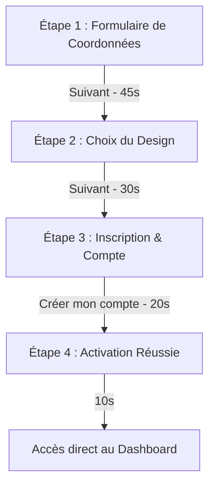
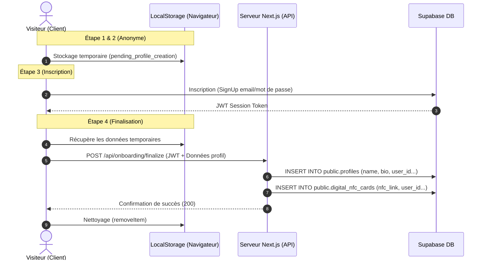

# 🚀 Guide de l'Onboarding Public (Option A)

Ce document détaille le fonctionnement technique, le parcours utilisateur et la persistance du flux d'onboarding public classique (Option A), qui place le formulaire de création en premier.

---

## 📝 Résumé de l'Onboarding Option A
Dans ce flux, un visiteur anonyme configure sa page de liens (Link-in-Bio) directement depuis la page d'accueil en remplissant d'abord ses coordonnées, puis en choisissant son style de profil. L'inscription est requise juste avant la publication finale pour lier et sécuriser le profil créé.

## 🔘 Points d'Entrée (Boutons de déclenchement)
Le flux d'onboarding Option A commence lorsque l'utilisateur clique sur l'un de ces boutons sur la page d'accueil (visiteur non connecté) :
* Bouton **"Créer mon profil gratuit"** (dans la section Hero principale)
* Bouton **"Créer mon lien"** (dans l'en-tête de navigation)
* Bouton **"Démarrer"** (dans le menu mobile)
* Bouton **"Je veux mon profil gratuit"** (dans la section noire tout en bas)

---

## 🗺️ Diagramme du Parcours Utilisateur (Mermaid)
Le diagramme suivant montre la progression à travers les 4 étapes de l'Option A :



---

## 🔄 Flux des Données et Architecture (Mermaid)
Le schéma ci-dessous illustre la persistance locale dans le navigateur et l'écriture finale en base de données :



---

## 🏃 Le Parcours Utilisateur : Étape par Étape

### 📝 Étape 1 : Vos Coordonnées (Formulaire)
* **Actions** : Saisie du Nom, E-mail, Téléphone, Entreprise, Poste, Biographie, Réseaux Sociaux (Instagram, Facebook, WhatsApp, etc.), et Liens personnalisés.
* **Persistance** : Sauvegarde dans l'état de l'application Next.js.
* **Temps estimé** : **45 secondes**.

### 🎨 Étape 2 : Le Design de votre Carte (Personnalisation)
* **Actions** : Choix du template visuel parmi les 8 designs disponibles.
* **Aperçu** : Rendu en temps réel dans un canevas mobile épuré et arrondi sans cadre obstructif.
* **Persistance** : Sauvegarde de l'état complet dans le `localStorage` sous la clé `pending_profile_creation` pour résister aux rechargements.
* **Temps estimé** : **30 secondes**.

### 🔒 Étape 3 : Création sécurisée du compte (Inscription)
* **Actions** : Choix du mot de passe pour finaliser l'inscription.
* **Utilité** : Crée le compte utilisateur dans Supabase Auth, récupère le payload du `localStorage` et déclenche les écritures DB.
* **Temps estimé** : **20 secondes**.

### 🎉 Étape 4 : Activation réussie ! (Succès)
* **Actions** : Écran festif confirmant l'activation de la page de liens, puis redirection automatique vers le Tableau de bord.
* **Temps estimé** : **10 secondes**.

---

## 🛠️ Script de Test d'Intégration
Pour tester le flux complet de l'Option A (remplissage, persistance locale, écriture DB et nettoyage final) :
```bash
npx tsx scripts/test-public-onboarding-flow.ts
```
