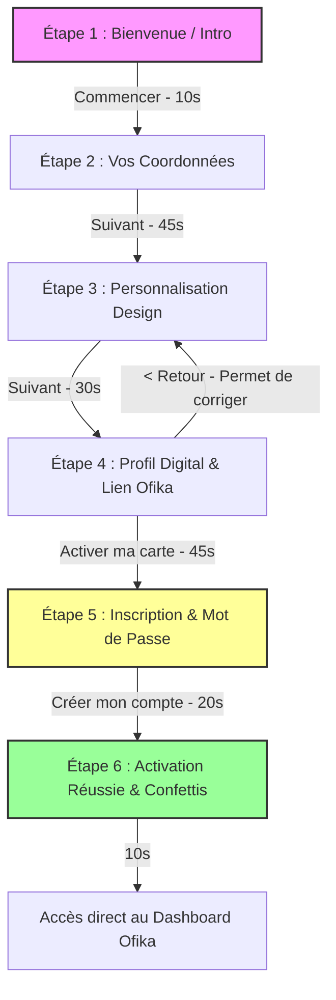
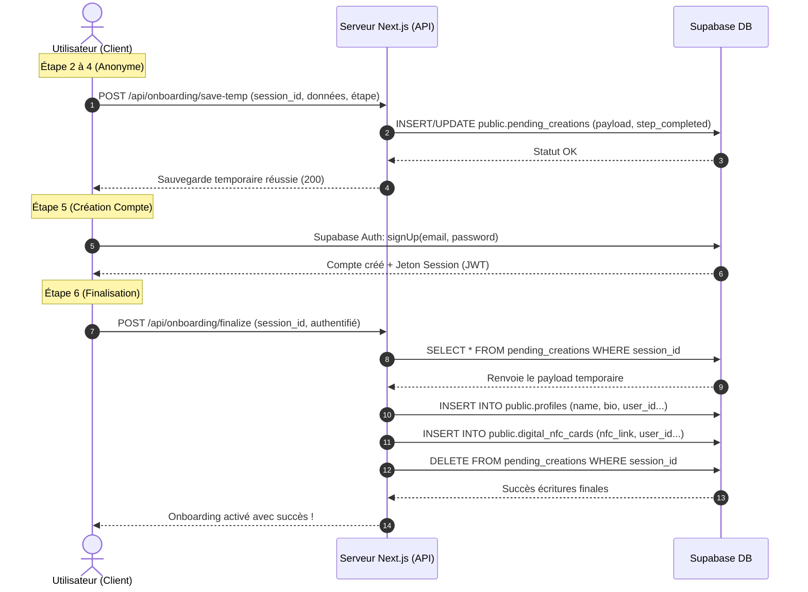

# 🚀 Guide du Flux d'Onboarding NFC Ofika (Option B)

Ce document détaille le parcours d'activation des cartes NFC Ofika (Option B - Inscription à la toute fin).

---

## 📝 Résumé de l'Onboarding Option B
L'utilisateur configure entièrement son profil et sa carte de manière anonyme, ses choix sont conservés de manière résiliente (via la base de données temporaire et le stockage local), et son compte Ofika est créé à la dernière étape, déclenchant automatiquement la création et l'association de son profil et de sa carte numérique. Le parcours complet prend en moyenne **2 minutes et 40 secondes**.

## 🔘 Points d'Entrée (Boutons de déclenchement)
Le flux d'onboarding Option B commence lorsque l'utilisateur clique sur l'un de ces boutons :
* Depuis le Tableau de Bord (utilisateur connecté) :
  * Le bouton **« Démarrer la création »** (présent dans la bannière d'alerte bleue indiquant *« Étape suivante : Créez votre carte numérique »*).
  * Le bouton **« Créer une carte NFC »** (dans l'onglet Profils & Cartes).

---

## 🗺️ Diagramme du Parcours Utilisateur (Mermaid)
Le diagramme suivant montre la progression de l'utilisateur à travers les 6 étapes de l'onboarding Option B :



---

## 🔄 Flux des Données et Architecture (Mermaid)
Le schéma ci-dessous illustre la communication entre le navigateur de l'utilisateur (Client), le serveur Next.js (API Routes) et la base de données (Supabase) :



---

## 🏃 Le Parcours Utilisateur : Étape par Étape

### 🏁 Étape 1 : L'Accueil (Intro)
* **Actions** : Une page de bienvenue moderne présentant la carte NFC Ofika.
* **Temps estimé** : **10 secondes**.

### 📝 Étape 2 : Vos Coordonnées (Formulaire)
* **Actions** : Saisie du Nom Complet, E-mail, Téléphone, Entreprise, Poste, et acceptation des conditions d'utilisation.
* **Temps estimé** : **45 secondes**.

### 🎨 Étape 3 : Le Design de votre Carte (Personnalisation)
* **Actions** : Sélecteur de styles (Classic, Grid, Creative, Showcase, E-commerce, Freelance, Dark) et de couleurs pour la carte physique.
* **Temps estimé** : **30 secondes**.

### 🎴 Étape 4 : Configuration du Profil Digital
* **Actions** : Choix du nom d'affichage, biographie et lien Ofika unique.
* **Bouton de retour** : Permet de revenir à l'étape précédente sans rien effacer.
* **Temps estimé** : **45 secondes**.

### 🔒 Étape 5 : Création sécurisée du compte (Inscription)
* **Actions** : Saisie du mot de passe pour le compte et application de tous les choix temporaires en base de données.
* **Temps estimé** : **20 secondes**.

### 🎉 Étape 6 : Activation réussie ! (Succès)
* **Actions** : Écran festif confirmant l'activation de la carte et du profil.
* **Temps estimé** : **10 secondes**.

---

## 📋 Plan d'Implantation Technique

### 1. Structure de la Base de Données (Supabase)
Pendant le parcours de l'utilisateur anonyme, ses sélections sont écrites temporairement dans la table `pending_creations` :
* Colonne `session_id` : Identifiant de session stocké localement.
* Colonne `type` : `'nfc'` pour différencier les flux.
* Colonne `step_completed` : Dernière étape franchie (de 1 à 4).
* Colonne `payload` : Objet JSON contenant les données temporaires de saisie.

Après l'inscription (Étape 5), la route API `/api/onboarding/finalize` effectue les écritures réelles :
* Crée le profil final dans la table `profiles`.
* Crée la carte NFC dans la table `digital_nfc_cards` associée au profil.
* Supprime la session temporaire de `pending_creations`.

### 2. Politiques RLS (Row Level Security) Requises
Les politiques suivantes doivent être présentes en base de données pour permettre la persistance :
* **INSERT** : Autoriser le public si `session_id IS NOT NULL`.
* **SELECT** : Autoriser le public si `session_id IS NOT NULL`.
* **UPDATE** : Autoriser le public si `session_id IS NOT NULL`.
* **DELETE** : Autoriser le public si `session_id IS NOT NULL`.

---

## 🛠️ Script de Test d'Intégration
Pour tester le flux complet de l'Option B (remplissage temporaire en DB, inscription, et finalisation) :
```bash
npx tsx scripts/test-nfc-onboarding-flow.ts
```
