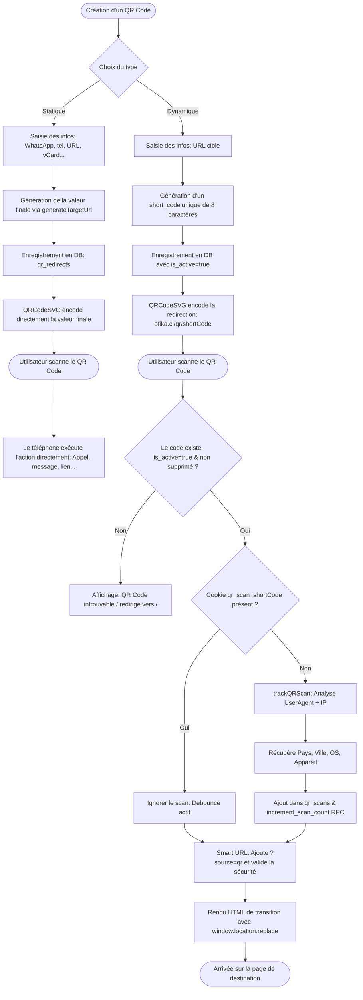

# Onboarding & Cycle de vie des QR Codes (Statiques vs Dynamiques)

Ce document décrit en détail le fonctionnement technique et utilisateur des QR codes dans l'application **Ofika**. Il regroupe les flux d'enregistrement, les structures de liens, la gestion des erreurs, le schéma de base de données ainsi que les scripts SQL pour configurer Supabase.

---

## 1. Vue d'Ensemble & Comparaison

| Fonctionnalité | QR Code Dynamique | QR Code Statique |
| :--- | :--- | :--- |
| **Description** | Pointeur vers notre serveur qui redirige l'utilisateur vers la cible. | Contient directement l'information brute ou le lien de destination finale. |
| **Donnée encodée** | URL de redirection unique : `https://ofika.ci/qr/{shortCode}` | URL ou protocole final (ex: `https://...`, `tel:...`, `mailto:...`). |
| **Édition après impression**| **Oui** (on peut modifier l'URL cible sans réimprimer le QR code). | **Non** (toute modification requiert d'imprimer un nouveau QR code). |
| **Suivi des Scans (Analytics)**| **Oui** (enregistre l'appareil, OS, navigateur, pays et ville). | **Non** (le scan ouvre directement la cible sans passer par Ofika). |
| **Mode hors-ligne** | Impossible (nécessite une connexion internet pour la redirection). | Possible (ex: importer une vCard de contact sans internet). |

---

## 2. Structure des Liens et Formats supportés

Lors de la création d'un QR code, l'utilisateur choisit le type de contenu. La fonction `generateTargetUrl` dans [new/page.tsx](file:///c:/Users/Toto.ADMINISTRATOR/Desktop/Ofika-c-main/app/dashboard/qr-codes/new/page.tsx) se charge de formater l'information de destination.

### A. Lien web simple (URL)
*   **Format standard :** `https://mon-lien.com` ou `http://mon-lien.com`
*   **En Dynamique :** Le QR code pointe vers `https://ofika.ci/qr/aB3d5fgH`. Quand le serveur résout le code, il redirige vers la cible en ajoutant un tracking : `https://mon-lien.com?source=qr`.
*   **En Statique :** Le QR code contient directement `https://mon-lien.com`.

### B. Message WhatsApp
*   **Format standard :** `https://wa.me/{téléphone}?text={message_encodé}`
*   **Construction :** Le numéro de téléphone est nettoyé de ses espaces, et le message pré-rempli est encodé avec `encodeURIComponent`.
*   *Exemple :* `https://wa.me/22507080910?text=Bonjour%20Ofika`

### C. Fiche de Contact (vCard)
*   **Format standard :** Fichier de texte brut structuré selon la norme vCard 3.0.
*   **Construction (Statique uniquement) :**
    ```text
    BEGIN:VCARD
    VERSION:3.0
    FN:Jean Dupont
    ORG:Ofika Company
    TEL;TYPE=CELL:+22507080910
    EMAIL:jean.dupont@ofika.ci
    URL:https://ofika.ci/jean-dupont
    END:VCARD
    ```
    *Note :* Pour un QR code dynamique, le QR code pointe vers le lien court `/qr/{shortCode}`, et c'est l'URL cible de redirection qui renvoie le fichier vCard en téléchargement.

### D. Appel Téléphonique
*   **Format standard :** `tel:{numéro}`
*   *Exemple :* `tel:+22507080910`

### E. E-mail
*   **Format standard :** `mailto:{adresse}?subject={sujet}&body={corps}`
*   *Exemple :* `mailto:contact@ofika.ci?subject=Demande&body=Bonjour...`

### F. Géolocalisation (Coordonnées GPS)
*   **Format standard :**
    *   *Avec coordonnées :* `https://www.google.com/maps?q={latitude},{longitude}`
    *   *Avec adresse textuelle :* `https://www.google.com/maps/search/?api=1&query={adresse_encodée}`

---

## 3. Logique de Fonctionnement de A à Z (Diagramme)

Le diagramme suivant illustre le parcours de création et d'utilisation pour les deux modes de QR codes.



---

## 4. Gestion des Erreurs et Sécurité

1.  **Validation de Saisie (Zod) :**
    Toutes les données de création et de mise à jour sont validées avec Zod pour bloquer les formats invalides.
2.  **Sécurité des Liens (XSS & Protocoles) :**
    La fonction `validateTargetUrl()` dans [qr-validation.ts](file:///c:/Users/Toto.ADMINISTRATOR/Desktop/Ofika-c-main/lib/utils/qr-validation.ts) vérifie que l'URL cible utilise uniquement des protocoles autorisés (`http:`, `https:`, `mailto:`, `tel:`, `wa.me`). Toute tentative d'injection de scripts (`javascript:`) est bloquée et affiche une page d'erreur sécurisée au lieu de rediriger l'utilisateur.
3.  **Rate Limiting :**
    La fonction `rateLimitQRCreation(userId)` limite le nombre de créations de QR Codes par période de temps pour éviter les abus et le spam de la base de données.
4.  **Double Scans (Debounce) :**
    Pour éviter que le compteur de scans ne s'incrémente plusieurs fois lorsqu'un visiteur rafraîchit la page, un cookie temporaire de 30 secondes (`qr_scan_{shortCode}=1`) est déposé sur son navigateur. Si le cookie est présent, le scan est comptabilisé comme "déjà traité" et n'est pas réenregistré.

---

## 5. Gestion du cycle de vie (Soft Delete)

### Pourquoi ce choix ?
Pour conserver les données de scan et l'historique d'utilisation à des fins d'audit ou de statistiques administratives (backend), l'application implémente le **Soft Delete** (suppression logique) pour les QR codes.

*   **Soft Delete Logique :** Lorsque l'utilisateur supprime un QR code depuis le dashboard, l'application met à jour la colonne `deleted_at` avec la date et l'heure courante (au lieu d'exécuter un `DELETE` physique).
*   **Masquage du Frontend :** Tous les services de récupération (`getUserQRRedirects`) et la route publique de redirection filtreront les lignes contenant un `deleted_at` non nul (`deleted_at IS NULL`). Le code n'est donc plus accessible aux utilisateurs ou aux visiteurs.
*   **Intégrité des données :** L'historique et les scans associés (table `qr_scans`) sont conservés intacts dans la base de données PostgreSQL pour l'administrateur.

---

## 6. Schéma SQL pour Supabase

Copiez et collez le script suivant dans l'éditeur SQL de votre console **Supabase** pour initialiser ou réinitialiser les tables et fonctions RPC :

```sql
-- 1. Création de la table des QR Codes / Redirections (avec Soft Delete)
CREATE TABLE IF NOT EXISTS "qr_redirects" (
  "id" TEXT PRIMARY KEY NOT NULL DEFAULT gen_random_uuid()::text,
  "user_id" UUID NOT NULL,
  "short_code" VARCHAR(20) NOT NULL,
  "nfc_link" TEXT NOT NULL,
  "redirect_type" VARCHAR(50) DEFAULT 'custom',
  "title" VARCHAR(200),
  "description" TEXT,
  "scan_count" INTEGER DEFAULT 0,
  "last_scanned_at" TIMESTAMP WITH TIME ZONE,
  "is_active" BOOLEAN DEFAULT true,
  "created_at" TIMESTAMP WITH TIME ZONE DEFAULT now() NOT NULL,
  "updated_at" TIMESTAMP WITH TIME ZONE DEFAULT now() NOT NULL,
  "deleted_at" TIMESTAMP WITH TIME ZONE,
  CONSTRAINT "qr_redirects_short_code_unique" UNIQUE("short_code")
);

-- 2. Création de la table pour le suivi des Scans (Analytics)
CREATE TABLE IF NOT EXISTS "qr_scans" (
  "id" TEXT PRIMARY KEY NOT NULL DEFAULT gen_random_uuid()::text,
  "qr_redirect_id" TEXT NOT NULL,
  "ip_address" VARCHAR(45),
  "user_agent" TEXT,
  "country" VARCHAR(2),
  "city" VARCHAR(100),
  "device_type" VARCHAR(20),
  "browser" VARCHAR(50),
  "os" VARCHAR(50),
  "referrer" VARCHAR(500),
  "scanned_at" TIMESTAMP WITH TIME ZONE DEFAULT now() NOT NULL
);

-- 3. Ajout des contraintes de clés étrangères avec CASCADE
ALTER TABLE "qr_redirects" 
  DROP CONSTRAINT IF EXISTS "qr_redirects_user_id_users_id_fk",
  ADD CONSTRAINT "qr_redirects_user_id_users_id_fk" 
  FOREIGN KEY ("user_id") REFERENCES "public"."users"("id") ON DELETE CASCADE;

ALTER TABLE "qr_scans" 
  DROP CONSTRAINT IF EXISTS "qr_scans_qr_redirect_id_qr_redirects_id_fk",
  ADD CONSTRAINT "qr_scans_qr_redirect_id_qr_redirects_id_fk" 
  FOREIGN KEY ("qr_redirect_id") REFERENCES "public"."qr_redirects"("id") ON DELETE CASCADE;

-- 4. Index pour optimiser la recherche par code court, et filtrer les non-supprimés (indispensables en production)
CREATE INDEX IF NOT EXISTS "idx_qr_redirects_short_code" ON "qr_redirects"("short_code");
CREATE INDEX IF NOT EXISTS "idx_qr_scans_redirect_id" ON "qr_scans"("qr_redirect_id");
CREATE INDEX IF NOT EXISTS "idx_qr_redirects_deleted_at" ON "qr_redirects"("deleted_at") WHERE "deleted_at" IS NULL;

-- 5. RPC PostgreSQL pour incrémenter de manière atomique le compteur de scan
CREATE OR REPLACE FUNCTION increment_scan_count(qr_id TEXT)
RETURNS VOID AS $$
BEGIN
  UPDATE qr_redirects
  SET 
    scan_count = scan_count + 1,
    last_scanned_at = NOW()
  WHERE id = qr_id;
END;
$$ LANGUAGE plpgsql SECURITY DEFINER;

-- 6. Attribution des droits d'exécution sur la fonction RPC
GRANT EXECUTE ON FUNCTION increment_scan_count(TEXT) TO authenticated;
GRANT EXECUTE ON FUNCTION increment_scan_count(TEXT) TO anon;
```
