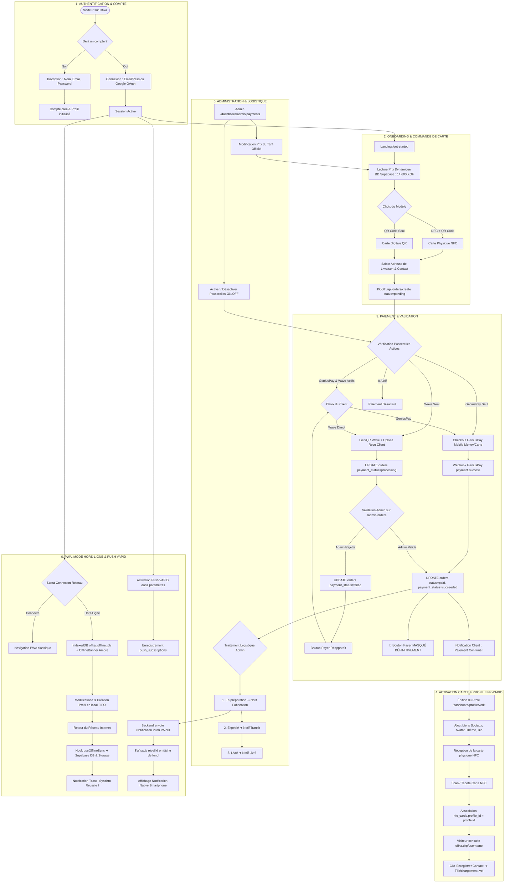

# Cartographie Générale Unifiée des Flux Utilisateur Ofika

> **Document Maître de Cartographie Fonctionnelle & Technique**  
> Ce document relie l'ensemble des parcours utilisateurs de la plateforme Ofika, de l'inscription initiale à l'administration des commandes et au partage de cartes NFC/vCard.

---

## 📌 Vue d'Ensemble des 6 Catégories de Flux

Le dossier `flux-utilisateur/` est structuré en **6 sous-dossiers thématiques** :

1. 📂 **`auth-et-compte/`** : Inscription, Connexion classique & Google OAuth, Réinitialisation de mot de passe.
2. 📂 **`onboarding/`** : Parcours d'accueil Get-Started, sélection de carte (NFC + QR / Digital), adresse de livraison.
3. 📂 **`paiement/`** : Gateway GeniusPay (automatique), Wave Direct (virement + reçu), masquage dynamique du bouton Payer.
4. 📂 **`cartes-et-profils/`** : Activation & liaison de puce NFC, édition du profil Link-in-Bio, scan visiteur et vCard.
5. 📂 **`administration/`** : Suivi logistique (Préparation, Expédition, Livraison), configuration du prix & passerelles.
6. 📂 **`pwa-et-offline/`** : Architecture PWA Offline-First, magasin IndexedDB, file d'attente FIFO, synchronisation réactive et notifications Push VAPID.

---

## 🌐 Schéma Général Unifié & Ramifications (Mermaid)

---

## 📂 Index Complet des Fichiers de Flux

| Catégorie | Fichier de Document | Contenu |
| :--- | :--- | :--- |
| **Authentification** | 📄 [connexion-et-oauth.md](auth-et-compte/connexion-et-oauth.md) | Connexion par Identifiants & Google OAuth avec gestion des rôles. |
| **Authentification** | 📄 [creation-de-compte.md](auth-et-compte/creation-de-compte.md) | Inscription, validations d'email et initialisation de profil. |
| **Onboarding** | 📄 [parcours-get-started.md](onboarding/parcours-get-started.md) | Découverte de l'offre et récupération dynamique du prix Supabase. |
| **Onboarding** | 📄 [selection-carte-et-livraison.md](onboarding/selection-carte-et-livraison.md) | Choix entre carte NFC physique / digitale et formulaire de livraison. |
| **Paiement** | 📄 [paiement-geniuspay-automatique.md](paiement/paiement-geniuspay-automatique.md) | Flow automatique via Webhook GeniusPay, HMAC & idempotence. |
| **Paiement** | 📄 [paiement-wave-direct-manuel.md](paiement/paiement-wave-direct-manuel.md) | Flow manuel via virement Wave, upload de reçu et revue Admin. |
| **Paiement** | 📄 [suivi-et-masquage-bouton-payer.md](paiement/suivi-et-masquage-bouton-payer.md) | Matrice des statuts et arbre de décision pour le bouton "Payer". |
| **Cartes & Profils** | 📄 [activation-liaison-nfc.md](cartes-et-profils/activation-liaison-nfc.md) | Scan initial d'une carte NFC vierge et association au profil. |
| **Cartes & Profils** | 📄 [edition-profil-link-in-bio.md](cartes-et-profils/edition-profil-link-in-bio.md) | Personnalisation visuelle, thèmes, liens sociaux et dnd-kit. |
| **Cartes & Profils** | 📄 [consultation-visiteur-et-vcard.md](cartes-et-profils/consultation-visiteur-et-vcard.md) | Vue publique par un tiers et téléchargement du vCard .vcf. |
| **Administration** | 📄 [gestion-logistique-commandes.md](administration/gestion-logistique-commandes.md) | Cycle logistique : Préparation ➔ Expédition ➔ Livraison. |
| **Administration** | 📄 [configuration-passerelles-systeme.md](administration/configuration-passerelles-systeme.md) | Modification du tarif de base et bascule ON/OFF des passerelles. |
| **PWA & Offline** | 📄 [pwa-offline-first-et-synchro.md](pwa-et-offline/pwa-offline-first-et-synchro.md) | Mode hors-ligne, stockage local IndexedDB, file d'attente et synchronisation réactive. |
| **PWA & Offline** | 📄 [notifications-push-et-vapid.md](pwa-et-offline/notifications-push-et-vapid.md) | Souscription aux notifications Push VAPID, gestionnaire Service Worker `sw.js` et alertes natives. |
