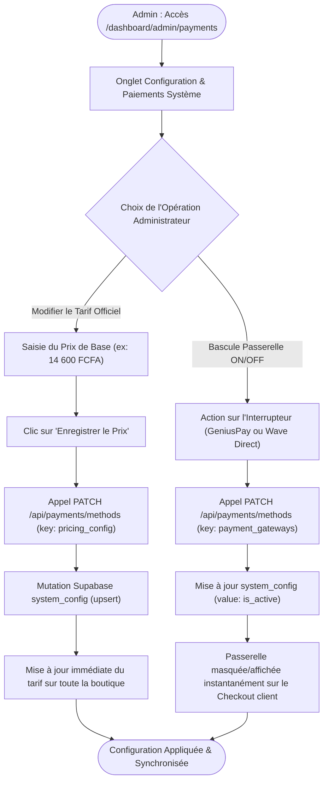

# Procédure de Flux : Configuration Système & Gestion des Passerelles de Paiement (FLOW-OFIKA-ADMIN-01)

## 1. Synthèse Exécutive

Famille de Flux : `05_Administration`
Code du Flux : `FLOW-OFIKA-ADMIN-01`
Acteurs Principaux : Administrateur Système, Super Admin, Client (impacté en lecture)
Objectif Fonctionnel : Gestion du tarif de base officiel de la carte NFC (ex: 14 600 FCFA) et contrôle en temps réel de l'activation/désactivation des passerelles de paiement (GeniusPay et Wave Direct).
Préréquis : Session administrateur active avec rôle `admin` ou `super_admin` dans `public.users`.
Livrables & État Final : Lignes de configuration mises à jour dans la table `system_config` (clés `pricing_config` et `payment_gateways`), formulaire de checkout mis à jour dynamiquement pour l'ensemble des clients.

## 2. Matrice d'Habilitation RBAC (Rôles & Permissions)

| Rôle Utilisateur | Niveau d'Accès | Écrans Autorisés après cette étape |
| :--- | :--- | :--- |
| **Visiteur Public** | `visiteur` | `/get-started` (Lecture seule du tarif dynamique) |
| **Client Membre** | `client` | `/dashboard/orders` (Lecture seule des moyens de paiement actifs) |
| **Agent / Manager** | `agent` | `/dashboard/admin/orders` (Consultation sans modification système) |
| **Administrateur** | `admin` | `/dashboard/admin/payments` (Modification des tarifs et activation passerelles) |
| **Super Admin** | `super_admin` | `/dashboard/admin/payments` (Accès universel & override système) |

## 3. Cartographie du Flux (Diagramme Mermaid)

## 4. Déroulé Algorithmique Détaillé en Langage Naturel (Du Début à la Fin)

Le flux de configuration système et de gestion des passerelles est modélisé sous la forme d'un algorithme déterministe sécurisé, articulé en 3 branches principales.

### BRANCHE A : Parcours de Modification du Tarif Officiel de la Carte NFC

Étape A.1 — Accès au Panneau de Configuration (`/dashboard/admin/payments`)
L'administrateur se connecte et navigue vers l'interface de gestion des paiements. Le serveur contrôle le rôle de la session (`user.role`). Si le rôle est inférieur à `admin`, l'accès est immédiatement refusé et redirigé vers `/dashboard`. Le composant `PaymentMethodsAdmin` effectue une requête de lecture initiale `GET /api/payments/methods` pour récupérer le prix actuel stocké dans la clé `pricing_config`.

Étape A.2 — Saisie et Validation du Nouveau Tarif
L'administrateur saisit le nouveau montant dans le champ dédié (ex: `14600` FCFA). Le composant frontend valide que la valeur saisie est un nombre positif supérieur ou égal à 200 XOF (seuil minimal de sécurité).

Étape A.3 — Enregistrement Serveur & Mutation Supabase (`system_config`)
Le formulaire transmet les données via la route API `PATCH /api/payments/methods`. La route serveur utilise le client Supabase Service Role Key pour contourner les verrous RLS et exécute la mutation `upsert` dans la table `system_config` pour la clé `pricing_config`. Une fois la base de données mise à jour, un toast de confirmation s'affiche : *"Tarif mis à jour avec succès !"*.

Étape A.4 — Répercussion Immédiate sur l'Expérience Client
La nouvelle valeur tarifaire devient instantanément la source de vérité pour tous les nouveaux visiteurs et clients sur `/get-started` et lors de la création d'une commande via `POST /api/orders/create`.

### BRANCHE B : Parcours d'Activation / Désactivation des Passerelles (GeniusPay & Wave Direct)

Étape B.1 — Consultation de l'État des Passerelles
Sur le même panneau d'administration, la liste des passerelles de paiement (GeniusPay Mobile Money/Carte et Wave Direct Link) s'affiche avec leur statut actuel (Actif / Inactif).

Étape B.2 — Action sur l'Interrupteur (Toggle Switch)
L'administrateur bascule l'interrupteur ON/OFF en face d'une passerelle (par exemple, désactivation temporaire de Wave Direct).

Étape B.3 — Mise à Jour du Schéma JSON (`payment_gateways`)
L'application soumet la modification via `PATCH /api/payments/methods` en transmettant l'objet mis à jour `{ geniuspay: { is_active: true }, wave: { is_active: false } }`. Le serveur enregistre le nouvel état dans la colonne `value` de la table `system_config` pour la clé `payment_gateways`.

Étape B.4 — Adaptation Dynamique du Checkout Client
Lors du chargement du formulaire de choix de paiement côté client, la route `GET /api/payments/methods` filtre les options actives. Si Wave Direct est inactif, seule l'option GeniusPay est présentée au client. Si les deux sont inactives, un message d'information s'affiche : *"Aucun moyen de paiement disponible pour le moment"*.

### BRANCHE C : Parcours de Sécurité Secours & Fallback Tarifaire

Étape C.1 — Détection d'Indisponibilité de la Base de Données
En cas de panne temporaire du réseau ou d'indisponibilité de la table `system_config`.

Étape C.2 — Bascule sur le Tarif Hardcodé de Secours
Le code backend intercepte l'erreur et bascule automatiquement sur la constante de secours définie dans `lib/types/payments.ts` (`14 600 XOF`). L'application continue de fonctionner sans interruption pour le client final.

## 5. Synthèse des Contrôles de Sécurité & Résilience

1. Isolation par Service Role Key : Les routes de modification `/api/payments/methods` utilisent exclusivement le client de service sécurisé Supabase, inaccessible aux utilisateurs standards.
2. Résilience Tarifaire (Fallback) : En cas d'échec de lecture dans la base de données, la plateforme bascule sur le prix officiel de secours (14 600 FCFA), garantissant 100 % de disponibilité du tunnel de vente.
3. Validation Stricte des Entrées : Enregistrement sous forme d'objets JSON structurés dans `system_config` empêchant toute injection de données corrompues.
4. Prise en Charge Temps Réel : Aucun redéploiement de code ni redémarrage de serveur n'est nécessaire lors des ajustements tarifaires ou des bascules de passerelles.

## 6. Résumé Général du Fonctionnement

Le panneau de configuration des paiements d'Ofika a été conçu pour offrir à l'équipe dirigeante une maîtrise totale et intuitive sur la boutique en ligne, à l'image d'un tableau de bord de commande d'une grande maison. Depuis leur espace sécurisé, les responsables peuvent ajuster en un instant le prix de vente des cartes intelligentes NFC ou décider d'ouvrir et d'interrompre l'accès à un moyen de paiement (comme le paiement automatique GeniusPay par Mobile Money ou le virement manuel Wave Direct). Lorsqu'un choix est effectué — qu'il s'agisse de modifier le tarif officiel à 14 600 FCFA ou de fermer temporairement une passerelle pour maintenance — la plateforme enregistre immédiatement cette directive et l'applique sans le moindre délai sur l'ensemble du site internet. Les clients qui parcourent la boutique découvrent ainsi des tarifs toujours exacts et des options de paiement parfaitement fonctionnelles, sans qu'aucune intervention technique ou coupure de service ne soit nécessaire.
