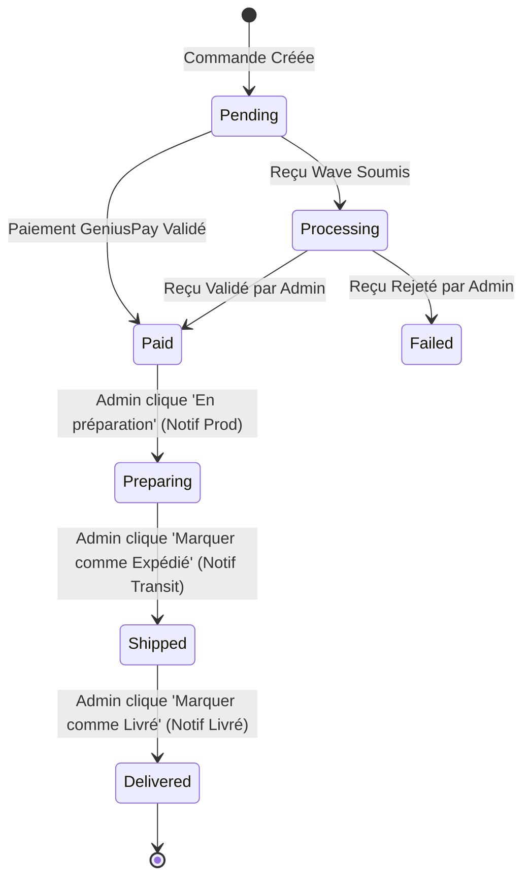

# Procédure de Flux : Gestion Logistique & Suivi des Commandes (FLOW-OFIKA-ADMIN-02)

## 1. Synthèse Exécutive

Famille de Flux : `05_Administration`
Code du Flux : `FLOW-OFIKA-ADMIN-02`
Acteurs Principaux : Administrateur Système, Agent Logistique, Client Destinataire
Objectif Fonctionnel : Traitement logistique complet d'une commande de carte NFC Ofika, du statut payé jusqu'à la livraison finale avec notifications en temps réel.
Préréquis : Commande enregistrée avec paiement confirmé (`payment_status = 'succeeded'` ou `'paid'`).
Livrables & État Final : Statuts logistiques mis à jour dans `public.orders` (`preparing`, `shipped`, `delivered`), notifications in-app expédiées au client.

## 2. Matrice d'Habilitation RBAC (Rôles & Permissions)

| Rôle Utilisateur | Niveau d'Accès | Écrans Autorisés après cette étape |
| :--- | :--- | :--- |
| **Visiteur Public** | `visiteur` | Aucun accès |
| **Client Destinataire** | `client` | `/dashboard/orders` (Suivi de l'avancement & numéros de colis) |
| **Agent / Manager** | `agent` | `/dashboard/admin/orders` (Mise à jour des statuts logistiques) |
| **Administrateur** | `admin` | `/dashboard/admin/orders` (Gestion complète & réattribution) |
| **Super Admin** | `super_admin` | `/dashboard/admin/orders` (Override & annulation de commande) |

## 3. Cartographie du Flux (Diagramme Mermaid)

## 4. Déroulé Algorithmique Détaillé en Langage Naturel (Du Début à la Fin)

Le flux logistique de traitement des commandes est modélisé sous la forme d'un algorithme déterministe articulé en 3 étapes principales.

### BRANCHE A : Étape de Fabrication & Production ("En préparation")

Étape A.1 — Prise en Charge par l'Équipe Logistique (`/dashboard/admin/orders`)
L'administrateur consulte la liste des commandes payées. Il clique sur le bouton "En préparation".

Étape A.2 — Mutation BD & Notification de Fabrication
L'application émet la requête `PATCH /api/admin/orders` avec `status = 'preparing'`. Le serveur met à jour la table `orders`. Le trigger PostgreSQL `on_order_status_update` génère la notification client : *"🔨 En production : Votre carte NFC est en cours de fabrication"*.

### BRANCHE B : Étape d'Expédition & Remise au Transporteur ("Expédié")

Étape B.1 — Saisie du Numéro de Suivi Colis
Une fois la puce NFC encodée et la carte imprimée, l'administrateur saisit le numéro de suivi du livreur (ex: `TRACK-CI-9988`).

Étape B.2 — Mutation BD & Notification d'Expédition
L'admin clique sur "Marquer comme Expédié". Le serveur enregistre `status = 'shipped'` et `tracking_number`. Le client reçoit la notification : *"🚚 Commande expédiée !"*.

### BRANCHE C : Étape de Remise au Client ("Livré")

Étape C.1 — Confirmation de la Réception Colis
Lorsque le livreur confirme la remise en main propre du colis au client.

Étape C.2 — Clôture de la Commande
L'admin clique sur "Marquer comme Livré". Le statut passe à `delivered`. Le client reçoit la notification finale : *"📦 Commande livrée !"*.

## 5. Synthèse des Contrôles de Sécurité & Résilience

1. Traçabilité Complète : Chaque changement de statut est consigné avec l'horodatage et l'identifiant de l'administrateur responsable.
2. Déclenchement Automatique de Notifications : Utilisation des triggers PostgreSQL natifs garantissant que le client est toujours notifié sans dépendre du code frontend.
3. Sécurisation RLS : Les modifications de statuts logistiques requièrent les permissions administrateur via Supabase Service Role.

## 6. Résumé Général du Fonctionnement

Ce flux illustre le parcours de préparation et de livraison d'une carte Ofika, du moment où le client règle sa commande jusqu'à sa remise en main propre. Une fois le paiement confirmé, l'équipe d'administration prend en charge la commande depuis son espace de gestion. L'administrateur fait passer le statut de la carte en production, ce qui envoie automatiquement un message rassurant au client sur son téléphone pour l'informer que sa carte NFC est en cours de fabrication. Dès que la carte est prête et remise au livreur, l'administrateur ajoute le numéro de suivi et marque la commande comme expédiée, déclenchant une alerte de livraison. Enfin, lorsque le client réceptionne sa carte, le statut final passe à "Livré", clôturant avec succès toute l'aventure d'achat.
