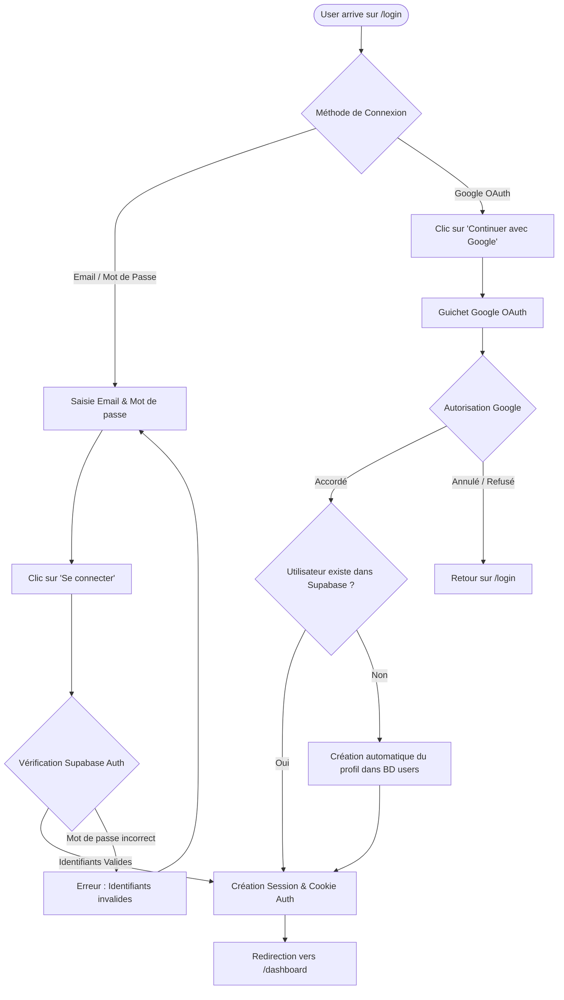

# Procédure de Flux : Connexion Utilisateur & Google OAuth (FLOW-OFIKA-AUTH-01)

## 1. Synthèse Exécutive

Famille de Flux : `01_Auth`
Code du Flux : `FLOW-OFIKA-AUTH-01`
Acteurs Principaux : Visiteur, Client Membre, Administrateur System, Service Google OAuth
Objectif Fonctionnel : Authentification sécurisée par Email / Mot de passe ou par Google OAuth avec création automatique du compte et gestion des rôles.
Préréquis : Accès à la page `/login`.
Livrables & État Final : Jeton de session JWT scellé dans les cookies de navigateur, redirection vers `/dashboard`.

## 2. Matrice d'Habilitation RBAC (Rôles & Permissions)

| Rôle Utilisateur | Niveau d'Accès | Écrans Autorisés après cette étape |
| :--- | :--- | :--- |
| **Visiteur Public** | `visiteur` | `/login` (Accès au formulaire d'authentification) |
| **Client Membre** | `client` | `/dashboard` (Espace client personnel) |
| **Agent / Manager** | `agent` | `/dashboard/admin/orders` (Console d'administration) |
| **Administrateur** | `admin` | `/dashboard/admin` (Console complète administrateur) |
| **Super Admin** | `super_admin` | Accès universel |

## 3. Cartographie du Flux (Diagramme Mermaid)

## 4. Déroulé Algorithmique Détaillé en Langage Naturel (Du Début à la Fin)

Le flux de connexion et d'authentification OAuth est modélisé sous la forme d'un algorithme déterministe sécurisé articulé en 2 branches principales.

### BRANCHE A : Connexion par Identifiants Classiques (Email / Mot de Passe)

Étape A.1 — Accès à la Page `/login` et Saisie
L'utilisateur saisit son adresse email et son mot de passe sur le formulaire de connexion.

Étape A.2 — Authentification Serveur (`signInWithPassword`)
L'application transmet les identifiants à Supabase Auth. Le serveur valide le hash du mot de passe. Si les identifiants sont invalides, une alerte s'affiche sans révéler quel champ est erroné. Si la validation réussit, le jeton de session JWT est créé.

Étape A.3 — Redirection vers le Dashboard
Le serveur positionne le cookie de session sécurisé et redirige l'utilisateur vers son tableau de bord `/dashboard`.

### BRANCHE B : Connexion Rapide via Google OAuth

Étape B.1 — Redirection vers le Guichet Google
L'utilisateur clique sur "Continuer avec Google". L'application invoque `signInWithOAuth({ provider: 'google' })` et redirige le navigateur vers le guichet sécurisé Google.

Étape B.2 — Validation Google & Création Automatique de Compte
Une fois l'accord donné par l'utilisateur, Supabase vérifie la présence de son compte dans la table `users`. S'il s'agit d'un nouveau membre, une entrée est créée automatiquement dans `users` avec le rôle `user`. L'utilisateur est immédiatement redirigé vers son espace connecté `/dashboard`.

## 5. Synthèse des Contrôles de Sécurité & Résilience

1. Protection contre l'Énumération de Comptes : Les messages d'erreur restent neutres en cas d'échec d'identifiants.
2. Sécurisation des Cookies : Utilisation de jetons HTTP-Only SameSite=Lax.
3. Auto-Provisioning OAuth : Création transparente du profil utilisateur lors de la première connexion Google.

## 6. Résumé Général du Fonctionnement

Ce flux décrit le parcours simple d'un utilisateur qui souhaite se connecter à son compte Ofika. L'utilisateur se rend sur la page de connexion et peut choisir soit de saisir son adresse email et son mot de passe, soit de cliquer sur "Continuer avec Google" pour une connexion rapide en un seul clic. Le système vérifie instantanément les identifiants ou l'autorisation Google. Si c'est la première fois qu'il utilise Google, Ofika crée automatiquement son compte en arrière-plan sans lui demander de formulaire supplémentaire. Une fois la connexion confirmée, l'utilisateur est immédiatement redirigé vers son espace personnel où il retrouve l'ensemble de ses cartes numériques et de ses réglages.
