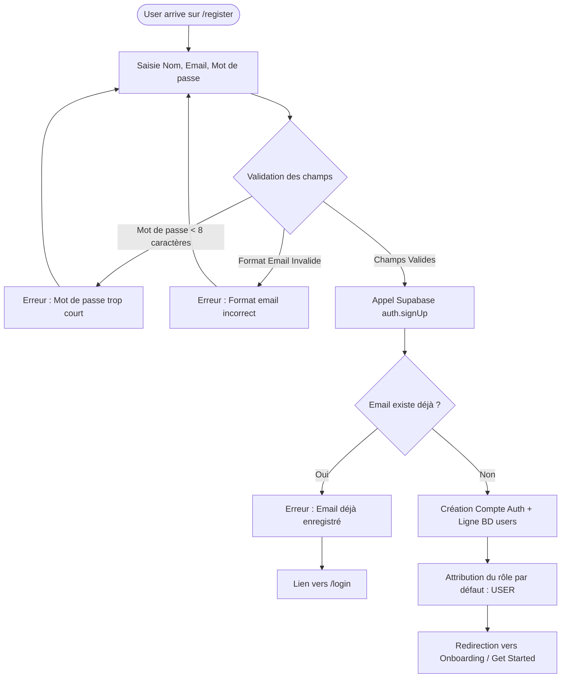

# Procédure de Flux : Inscription & Création de Compte (FLOW-OFIKA-AUTH-02)

## 1. Synthèse Exécutive

Famille de Flux : `01_Auth`
Code du Flux : `FLOW-OFIKA-AUTH-02`
Acteurs Principaux : Nouveau Client, Serveur Supabase Auth, Base de Données Ofika
Objectif Fonctionnel : Inscription d'un nouveau membre, création sécurisée des identifiants et initialisation automatique du profil dans la base de données.
Préréquis : Accès à `/register` ou `/get-started`.
Livrables & État Final : Ligne d'utilisateur créée dans `auth.users` et `public.users`, profil virtuel initial créé dans `public.profiles`, session ouverte.

## 2. Matrice d'Habilitation RBAC (Rôles & Permissions)

| Rôle Utilisateur | Niveau d'Accès | Écrans Autorisés après cette étape |
| :--- | :--- | :--- |
| **Visiteur Public** | `visiteur` | `/register` (Accès au formulaire d'inscription) |
| **Client Membre** | `client` | `/get-started` (Accès à l'onboarding et à la commande) |
| **Agent / Manager** | `agent` | N/A |
| **Administrateur** | `admin` | N/A |
| **Super Admin** | `super_admin` | N/A |

## 3. Cartographie du Flux (Diagramme Mermaid)

## 4. Déroulé Algorithmique Détaillé en Langage Naturel (Du Début à la Fin)

Le flux d'inscription est modélisé sous la forme d'un algorithme déterministe sécurisé.

### Étape 1 — Saisie du Formulaire d'Inscription (`/register`)
Le prospect renseigne son nom complet, son adresse email et choisit un mot de passe d'au moins 8 caractères.

### Étape 2 — Validation Frontend & Soumission Supabase (`signUp`)
Le composant vérifie le format des champs puis appelle `supabase.auth.signUp()`. Si l'email est déjà utilisé, un message d'erreur propose de se connecter.

### Étape 3 — Insertion BD & Redirection Onboarding
Supabase crée l'utilisateur dans `auth.users`, insère la ligne correspondante dans `public.users` avec `role = 'user'`, et génère un profil par défaut dans `public.profiles`. Le membre est immédiatement connecté et redirigé vers l'onboarding `/get-started`.

## 5. Synthèse des Contrôles de Sécurité & Résilience

1. Robustesse des Mots de Passe : Exigence minimale de 8 caractères.
2. Unicité de l'Email : Blocage des doublons au niveau de la base de données.
3. Rôle par Défaut : Attribution automatique du rôle le plus restreint (`user`).

## 6. Résumé Général du Fonctionnement

Ce flux détaille la première inscription d'un nouveau membre sur la plateforme Ofika. Le futur client accède au formulaire de création de compte, renseigne son nom complet, son adresse email et choisit un mot de passe sécurisé. La plateforme vérifie la validité des informations fournies, s'assure que cet email n'est pas déjà enregistré, puis crée son espace membre en une seconde. Le système prépare automatiquement sa première carte de visite virtuelle avec un profil modèle prêt à être personnalisé. Le nouveau membre est directement connecté et accompagné vers l'étape de découverte de son offre et de commande de sa carte NFC physique.
