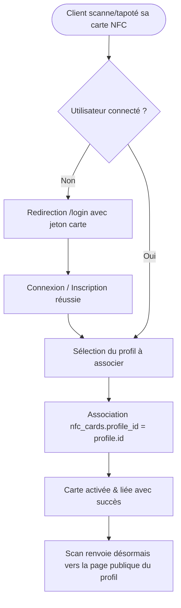

# Procédure de Flux : Activation & Liaison d'une Carte NFC (FLOW-OFIKA-CARD-01)

## 1. Synthèse Exécutive

Famille de Flux : `04_NFC_Profil`
Code du Flux : `FLOW-OFIKA-CARD-01`
Acteurs Principaux : Client Membre, Smartphone Visiteur, Puce NFC Physique, Serveur Ofika
Objectif Fonctionnel : Première lecture d'une puce NFC neuve, authentification du propriétaire et association permanente de la carte à un profil Link-in-Bio.
Préréquis : Carte physique NFC livrée contenant un `card_id` valide.
Livrables & État Final : Ligne d'association créée dans `public.nfc_cards` avec `is_active = true`, redirection automatique de tout scan vers la page publique du profil.

## 2. Matrice d'Habilitation RBAC (Rôles & Permissions)

| Rôle Utilisateur | Niveau d'Accès | Écrans Autorisés après cette étape |
| :--- | :--- | :--- |
| **Visiteur Public** | `visiteur` | `/p/[username]` (Scan et affichage de la page publique) |
| **Client Membre** | `client` | `/dashboard/profiles` (Gestion des cartes associées) |
| **Agent / Manager** | `agent` | N/A |
| **Administrateur** | `admin` | `/dashboard/admin` (Audit des puces NFC actives) |
| **Super Admin** | `super_admin` | Accès universel |

## 3. Cartographie du Flux (Diagramme Mermaid)

## 4. Déroulé Algorithmique Détaillé en Langage Naturel (Du Début à la Fin)

Le flux d'activation NFC est modélisé sous la forme d'un algorithme déterministe.

### Étape 1 — Tapote initial de la carte NFC neuve
Le client approche son smartphone de la carte physique. Le téléphone lit le tag NFC et ouvre l'URL d'activation `/activate/[card_id]`.

### Étape 2 — Contrôle d'Authentification & Choix du Profil
Si le client n'est pas connecté, l'application le redirige vers `/login`. Une fois connecté, le serveur affiche la liste de ses profils virtuels. Le client sélectionne le profil qu'il désire lier.

### Étape 3 — Association en Base de Données & Redirection Intelligente
La route API exécute l'insertion dans la table `nfc_cards` (`card_id`, `profile_id`, `is_active = true`). Désormais, tout scan ultérieur redirige vers la page publique `ofika.ci/p/[username]`.

## 5. Synthèse des Contrôles de Sécurité & Résilience

1. Protection contre la Ré-association : Une puce NFC déjà liée à un autre utilisateur ne peut pas être volée ou ré-associée sans l'accord de son propriétaire initial.
2. Continuité de Redirection : Si le profil associé est modifié ou renommé, l'URL de la puce s'adapte automatiquement.

## 6. Résumé Général du Fonctionnement

Ce flux explique la magie du premier contact avec la carte physique Ofika. Dès que le client reçoit sa carte neuve par courrier ou par livreur, il lui suffit d'approcher son smartphone de la puce NFC pour la réveiller. Le téléphone ouvre automatiquement une page d'activation sécurisée qui lui demande de se connecter et d'associer la carte physique au profil de son choix (par exemple son profil professionnel). Une fois ce lien établi, la carte est liée pour toujours. Désormais, chaque fois que le client posera sa carte sur le téléphone d'un prospect, ce dernier verra s'afficher sa carte de visite virtuelle complète sans avoir besoin de télécharger d'application.
