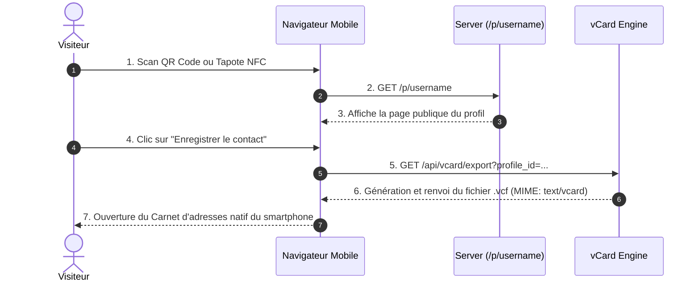

# Procédure de Flux : Consultation Visiteur & Export vCard (FLOW-OFIKA-CARD-03)

## 1. Synthèse Exécutive

Famille de Flux : `04_NFC_Profil`
Code du Flux : `FLOW-OFIKA-CARD-03`
Acteurs Principaux : Visiteur Public, Navigateur Mobile, Moteur vCard Ofika
Objectif Fonctionnel : Chargement de la carte de visite virtuelle publique lors d'un scan et génération dynamique du fichier vCard .vcf pour sauvegarde dans les contacts du smartphone.
Préréquis : Scan d'un QR Code ou d'une puce NFC renvoyant vers `/p/[username]`.
Livrables & État Final : Page profil rendue côté serveur, fichier vCard `.vcf` téléchargé et ouvert par l'application Contacts native.

## 2. Matrice d'Habilitation RBAC (Rôles & Permissions)

| Rôle Utilisateur | Niveau d'Accès | Écrans Autorisés après cette étape |
| :--- | :--- | :--- |
| **Visiteur Public** | `visiteur` | `/p/[username]` (Consultation publique et export du contact vCard) |
| **Client Membre** | `client` | `/p/[username]` (Aperçu de son profil public) |
| **Agent / Manager** | `agent` | N/A |
| **Administrateur** | `admin` | N/A |
| **Super Admin** | `super_admin` | N/A |

## 3. Cartographie du Flux (Diagramme Mermaid)

## 4. Déroulé Algorithmique Détaillé en Langage Naturel (Du Début à la Fin)

Le flux de consultation et export vCard est modélisé sous la forme d'un algorithme déterministe.

### Étape 1 — Scan et Rendu de la Page Publique (`/p/[username]`)
Le visiteur scanne la carte NFC. Le navigateur mobile ouvre `/p/[username]`. Le serveur génère la page publique personnalisée.

### Étape 2 — Clic sur "Enregistrer le contact" & Génération vCard (`GET /api/vcard/export`)
Le visiteur clique sur le bouton "Enregistrer le contact". Le serveur génère le fichier `.vcf` vCard 3.0 avec le type MIME `text/vcard` et le header `Content-Disposition: attachment; filename="contact.vcf"`.

### Étape 3 — Ouverture du Carnet d'Adresses Natif
Le navigateur du smartphone (iOS Safari ou Android Chrome) intercepte le fichier vCard et déclenche directement l'ouverture de l'application Contacts pour enregistrer les coordonnées en 1 clic.

## 5. Synthèse des Contrôles de Sécurité & Résilience

1. Compatibilité Multi-Smartphones : Format de fichier `.vcf` testé et optimisé pour iOS (iPhone), Samsung, Huawei et Android Stock.
2. Anonymat du Visiteur : Consultation et export réalisables sans aucune création de compte obligatoire pour le visiteur.

## 6. Résumé Général du Fonctionnement

Ce flux décrit l'expérience vécue par un prospect ou un partenaire lorsqu'il entre en contact avec un membre Ofika. Lorsqu'un visiteur scanne le QR Code ou tapote la carte NFC, le profil du membre s'ouvre instantanément sur le navigateur de son téléphone, affichant son design soigné et ses liens professionnels. Si le visiteur souhaite conserver ce contact, il clique simplement sur le bouton "Enregistrer le contact". En une seconde, son smartphone (iPhone ou Android) ouvre son carnet d'adresses habituel prérempli avec le nom, le numéro de téléphone, l'email et la fonction du membre. Il n'a plus qu'à valider pour enregistrer définitivement la fiche dans ses contacts.
