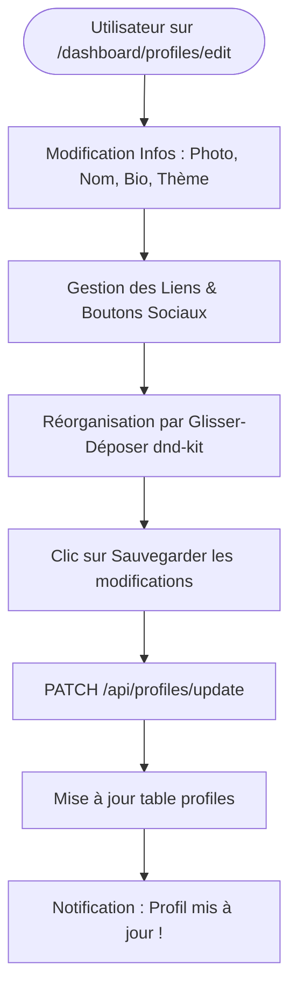

# Procédure de Flux : Édition de Profil Link-in-Bio (FLOW-OFIKA-CARD-02)

## 1. Synthèse Exécutive

Famille de Flux : `04_NFC_Profil`
Code du Flux : `FLOW-OFIKA-CARD-02`
Acteurs Principaux : Client Membre, Studio d'Édition React, Base de Données Supabase
Objectif Fonctionnel : Personnalisation complète de la carte de visite virtuelle (photo, titre, bio, liens sociaux avec glisser-déposer dnd-kit et thèmes visuels).
Préréquis : Session client active avec au moins un profil dans `public.profiles`.
Livrables & État Final : Profil mis à jour dans `public.profiles`, page publique `/p/[username]` actualisée instantanément.

## 2. Matrice d'Habilitation RBAC (Rôles & Permissions)

| Rôle Utilisateur | Niveau d'Accès | Écrans Autorisés après cette étape |
| :--- | :--- | :--- |
| **Visiteur Public** | `visiteur` | `/p/[username]` (Consultation du profil mis à jour) |
| **Client Membre** | `client` | `/dashboard/profiles/edit` (Édition complète de ses profils) |
| **Agent / Manager** | `agent` | N/A |
| **Administrateur** | `admin` | `/dashboard/admin` (Modération de contenu si nécessaire) |
| **Super Admin** | `super_admin` | Accès universel |

## 3. Cartographie du Flux (Diagramme Mermaid)

## 4. Déroulé Algorithmique Détaillé en Langage Naturel (Du Début à la Fin)

Le flux d'édition de profil est modélisé sous la forme d'un algorithme déterministe.

### Étape 1 — Accès au Studio d'Édition (`/dashboard/profiles/edit`)
Le client ouvre le formulaire de personnalisation de son profil.

### Étape 2 — Saisie des Informations & Glisser-Déposer des Liens
Le client modifie ses textes, téléverse sa photo et réorganise ses boutons sociaux grâce à l'interface glisser-déposer `@hello-pangea/dnd`. Il sélectionne son thème visuel.

### Étape 3 — Sauvegarde Serveur (`PATCH /api/profiles/update`)
Lors du clic sur "Sauvegarder", la route API exécute `UPDATE public.profiles SET title = ..., social_links = ..., theme = ... WHERE id = profile_id AND user_id = user_id`. Un toast confirme la sauvegarde, et la page publique reflète les changements immédiatement.

## 5. Synthèse des Contrôles de Sécurité & Résilience

1. Isolation par Identifiant Utilisateur : Un client ne peut modifier que les profils dont la colonne `user_id` correspond strictement à sa session.
2. Assainissement des Données (Sanitization) : Nettoyage des liens d'URL pour empêcher les scripts malveillants (XSS).

## 6. Résumé Général du Fonctionnement

Ce flux montre comment chaque utilisateur personnalise l'apparence et le contenu de sa carte de visite virtuelle. Depuis son studio de création sur l'espace membre, l'utilisateur peut modifier sa photo de profil, son nom, sa fonction et sa biographie. Il peut ajouter ses différents comptes sociaux (WhatsApp, LinkedIn, Instagram, site web) et les réordonner simplement en les faisant glisser avec le doigt. Il choisit enfin le thème visuel qui reflète le mieux son image (par exemple le style sombre élégant ou doré). Dès qu'il enregistre, ses changements apparaissent immédiatement aux yeux de tous ses contacts lors des prochains scans.
