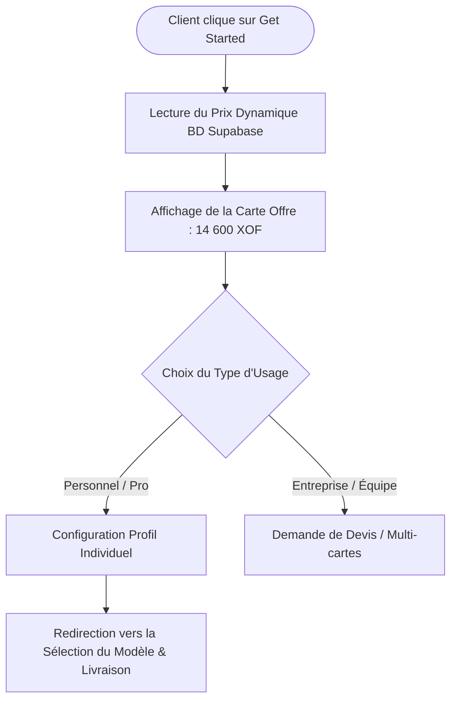

# Procédure de Flux : Parcours Onboarding Get-Started (FLOW-OFIKA-ONB-01)

## 1. Synthèse Exécutive

Famille de Flux : `02_Onboarding`
Code du Flux : `FLOW-OFIKA-ONB-01`
Acteurs Principaux : Visiteur, Client Membre, Serveur API Ofika
Objectif Fonctionnel : Accueil du client, lecture dynamique du tarif officiel de la carte NFC dans Supabase BD et orientation vers la sélection du modèle.
Préréquis : Accès à la page `/get-started`.
Livrables & État Final : Prix officiel affiché dynamiquement (ex: 14 600 FCFA), type d'usage sélectionné.

## 2. Matrice d'Habilitation RBAC (Rôles & Permissions)

| Rôle Utilisateur | Niveau d'Accès | Écrans Autorisés après cette étape |
| :--- | :--- | :--- |
| **Visiteur Public** | `visiteur` | `/get-started` (Découverte de l'offre) |
| **Client Membre** | `client` | `/get-started` (Passage à la commande) |
| **Agent / Manager** | `agent` | N/A |
| **Administrateur** | `admin` | N/A |
| **Super Admin** | `super_admin` | N/A |

## 3. Cartographie du Flux (Diagramme Mermaid)

## 4. Déroulé Algorithmique Détaillé en Langage Naturel (Du Début à la Fin)

Le flux de démarrage est modélisé sous la forme d'un algorithme déterministe.

### Étape 1 — Accès à la Page `/get-started` et Lecture du Tarif
Lors du chargement de la page, l'application consulte `GET /api/payments/methods` pour lire la clé `pricing_config` dans `system_config`. Le tarif à jour (14 600 FCFA) s'affiche dynamiquement sur la carte de présentation.

### Étape 2 — Choix du Type d'Usage
Le client sélectionne s'il souhaite équiper une personne (Individuel/Pro) ou une entreprise.

### Étape 3 — Orientation vers le Choix de Produit
Le client valide son choix et bascule sur l'étape de sélection du modèle et de saisie de livraison.

## 5. Synthèse des Contrôles de Sécurité & Résilience

1. Synchronisation Tarifaire : Garantit que le prix affiché sur la boutique est toujours conforme aux réglages de l'administrateur.
2. Fallback de Secours : Bascule automatique sur la valeur de secours 14 600 XOF en cas d'erreur de lecture.

## 6. Résumé Général du Fonctionnement

Ce flux présente les premiers pas d'un visiteur qui découvre la carte intelligente Ofika. En arrivant sur la page de présentation, le site interroge automatiquement la base de données de l'entreprise pour afficher le tarif officiel en vigueur (par exemple 14 600 FCFA), garantissant ainsi un prix toujours exact et à jour. Le client sélectionne s'il désire équiper une seule personne ou une équipe entière. Une fois son choix effectué, il est guidé naturellement vers l'étape de personnalisation du modèle et la saisie de son adresse de livraison.
