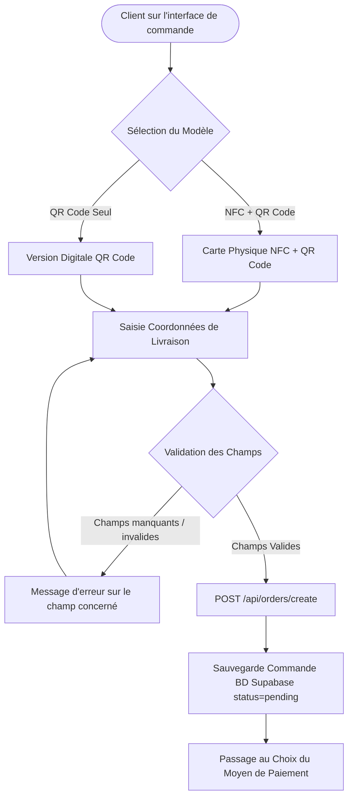

# Procédure de Flux : Sélection de Carte & Formulaire de Livraison (FLOW-OFIKA-ONB-02)

## 1. Synthèse Exécutive

Famille de Flux : `02_Onboarding`
Code du Flux : `FLOW-OFIKA-ONB-02`
Acteurs Principaux : Client Membre, Serveur API Ofika, Base de Données Supabase
Objectif Fonctionnel : Choix du modèle de carte (NFC Physique + QR ou QR Digital), saisie et validation des coordonnées de livraison et création de la commande.
Préréquis : Session client active et accès au formulaire de commande.
Livrables & État Final : Commande insérée dans `public.orders` avec `status = 'pending'`, redirection vers l'écran de paiement.

## 2. Matrice d'Habilitation RBAC (Rôles & Permissions)

| Rôle Utilisateur | Niveau d'Accès | Écrans Autorisés après cette étape |
| :--- | :--- | :--- |
| **Visiteur Public** | `visiteur` | Redirection vers `/login` ou `/register` |
| **Client Membre** | `client` | `/dashboard/orders` (Passage au règlement) |
| **Agent / Manager** | `agent` | N/A |
| **Administrateur** | `admin` | N/A |
| **Super Admin** | `super_admin` | N/A |

## 3. Cartographie du Flux (Diagramme Mermaid)

## 4. Déroulé Algorithmique Détaillé en Langage Naturel (Du Début à la Fin)

Le flux de sélection et livraison est modélisé sous la forme d'un algorithme déterministe.

### Étape 1 — Sélection du Modèle de Produit
Le client choisit entre le modèle physique `nfc_qr` (Carte NFC + QR Code) ou la version digitale `qr_only`.

### Étape 2 — Saisie du Formulaire de Livraison
Le client renseigne son nom (`full_name`), son adresse (`line1`), sa ville (`city`), son code postal (`postal_code`), son pays (`country`) et son téléphone (`phone`).

### Étape 3 — Validation Serveur & Création de Commande (`POST /api/orders/create`)
La route API valide que les champs satisfont la contrainte PostgreSQL `valid_shipping_address`, calcule le tarif `amount_cents` (min 200 XOF) et insère la commande dans la table `orders` avec `status = 'pending'`. Le client est redirigé vers l'écran de paiement.

## 5. Synthèse des Contrôles de Sécurité & Résilience

1. Contrôle de Structure PostgreSQL : Validation stricte des clés du JSON de livraison pour respecter la contrainte `valid_shipping_address`.
2. Validation de Numéro de Téléphone : Vérification de la longueur minimale (min 8 chiffres).

## 6. Résumé Général du Fonctionnement

Ce flux illustre l’étape de configuration de la commande et de saisie des coordonnées d'expédition. Le client choisit d'abord la version qui lui convient : la carte physique avec puce NFC intégrée et QR Code imprimé, ou la carte 100 % digitale. Il remplit ensuite le formulaire d'expédition en indiquant son nom, son adresse complète, sa ville, son pays et son numéro de téléphone. Le système vérifie attentivement que toutes les informations indispensables sont correctes afin d'éviter toute erreur lors de la livraison du colis, puis crée la commande. Le client est immédiatement invité à passer à l'étape du règlement.
