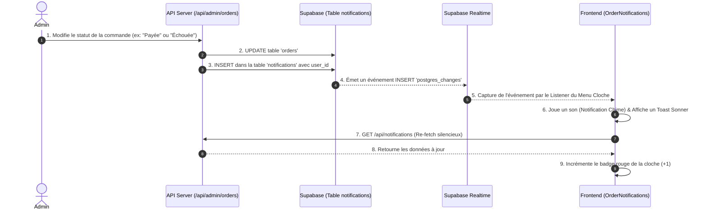

# Procédure de Flux : Système de Notifications Push & Temps Réel (FLOW-OFIKA-NOTIF-01)

## 1. Synthèse Exécutive

Famille de Flux : `03_Paiements_et_Suivi`
Code du Flux : `FLOW-OFIKA-NOTIF-01`
Acteurs Principaux : Client Membre, Administrateur System, API Server, Supabase BD (Realtime)
Objectif Fonctionnel : Centraliser, persister et afficher en temps réel toutes les notifications liées au cycle de vie d'une commande (paiement, production, livraison, erreur).
Livrables & État Final : L'utilisateur reçoit une alerte visuelle/sonore (si connecté) et le compteur de sa cloche s'incrémente instantanément. Toutes les alertes sont conservées dans la base de données pour consultation ultérieure.

## 2. Matrice d'Habilitation RBAC (Rôles & Permissions)

| Rôle Utilisateur | Niveau d'Accès | Écrans Autorisés après cette étape |
| :--- | :--- | :--- |
| **Client Membre** | `client` | Barre de navigation globale (Menu Cloche Popover accessible partout) |
| **Administrateur** | `admin` | Déclenchement via `/dashboard/admin/orders` |

## 3. Cartographie du Flux (Diagramme Mermaid)

## 4. Déroulé Algorithmique Détaillé en Langage Naturel (Du Début à la Fin)

### BRANCHE A : Génération de la Notification (Backend)

Étape A.1 — Déclencheur Administrateur
L'administrateur met à jour l'état d'une commande via son tableau de bord (ex: validation d'un reçu Wave, rejet pour reçu non valide, marquage en production ou expédition). 

Étape A.2 — Insertion Sécurisée en Base de Données
Le serveur API (route `PATCH /api/admin/orders`) enregistre la modification de la commande. Simultanément, il évalue le nouveau statut et insère une entrée formatée (Titre, Message, Type, URL d'action) directement dans la table `notifications`. Ceci garantit que la notification est **persistante** et ne sera jamais perdue, même si le client a son navigateur fermé.

### BRANCHE B : Réception Temps Réel & Affichage UI (Frontend)

Étape B.1 — Écoute Active via Supabase Realtime
Le composant unifié `OrderNotifications`, situé dans la barre de navigation globale (Layout de l'application), maintient une connexion WebSocket ouverte (Canal Realtime). Cette écoute est filtrée strictement sur le `user_id` du client connecté, garantissant la sécurité et la confidentialité des données.

Étape B.2 — Alerte Sonore & Visuelle (Toast)
Dès qu'une nouvelle ligne est insérée dans la base de données, le listener intercepte l'événement en moins de 100 millisecondes. Il joue un effet sonore agréable ("Chime") et affiche une bulle de notification flottante (Toast) avec le contenu explicite du message à l'écran.

Étape B.3 — Mise à Jour du Popover (Menu Cloche)
Simultanément, le composant exécute une fonction `loadNotifications()` silencieuse pour récupérer la liste actualisée. Le badge rouge au-dessus de l'icône Cloche s'incrémente instantanément (ex: de 0 à 1). Si le client clique sur la cloche, un menu élégant et compact (Popover responsive) s'ouvre pour afficher l'historique de toutes les alertes (qu'il peut marquer comme lues ou supprimer).

## 5. 📝 Résumé du Flux

Ce flux garantit que le client est tenu informé de façon fluide, fiable et élégante à chaque étape vitale du traitement de sa commande. Lorsque l'administrateur déclenche un changement de statut, le système API insère immédiatement une alerte sécurisée et persistante dans la base de données (table "notifications"). Si le client est en ligne à cet instant, un canal WebSocket (Supabase Realtime) intercepte cet ajout, fait retentir un léger son de cloche, affiche un bref message flottant informatif, et met immédiatement à jour le compteur rouge d'alertes non lues. Tout l'historique reste consultable à tout moment depuis le menu déroulant de cette cloche, offrant une expérience utilisateur sans faille où aucune communication éphémère ne se perd.
