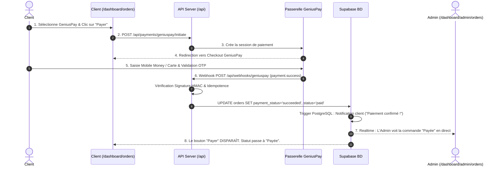

# Procédure de Flux : Paiement GeniusPay Automatique (FLOW-OFIKA-PAY-01)

## 1. Synthèse Exécutive

Famille de Flux : `03_Paiements`
Code du Flux : `FLOW-OFIKA-PAY-01`
Acteurs Principaux : Client Membre, Passerelle GeniusPay, Serveur API Ofika, Administrateur System
Objectif Fonctionnel : Règlement automatique et instantané d'une commande par Mobile Money (Orange, MTN, Moov, Wave) ou Carte Bancaire avec validation par Webhook.
Préréquis : Commande créée avec le statut `pending` et passerelle GeniusPay active dans `system_config`.
Livrables & État Final : Commande mise à jour à `status = 'paid'` et `payment_status = 'succeeded'`, notification in-app envoyée au client, bouton Payer masqué.

## 2. Matrice d'Habilitation RBAC (Rôles & Permissions)

| Rôle Utilisateur | Niveau d'Accès | Écrans Autorisés après cette étape |
| :--- | :--- | :--- |
| **Visiteur Public** | `visiteur` | Redirection vers l'inscription avant le paiement |
| **Client Membre** | `client` | `/dashboard/orders` (Accès au checkout & suivi de commande) |
| **Agent / Manager** | `agent` | `/dashboard/admin/orders` (Consultation des transactions payées) |
| **Administrateur** | `admin` | `/dashboard/admin/orders` (Validation et suivi logistique) |
| **Super Admin** | `super_admin` | Accès universel & gestion des clés API GeniusPay |

## 3. Cartographie du Flux (Diagramme Mermaid)

## 4. Déroulé Algorithmique Détaillé en Langage Naturel (Du Début à la Fin)

Le flux de paiement automatique GeniusPay est modélisé sous la forme d'un algorithme déterministe sécurisé articulé en 3 branches.

### BRANCHE A : Initiation du Paiement & Redirection Checkout

Étape A.1 — Sélection de la Passerelle sur le Dashboard Client
Le client consulte sa commande en attente sur `/dashboard/orders`. Il sélectionne l'option GeniusPay (Mobile Money & Carte) et clique sur "Payer ma commande".

Étape A.2 — Appel API d'Initiation (`POST /api/payments/geniuspay/initiate`)
Le frontend transmet l'identifiant de la commande (`orderId`). Notre serveur vérifie le montant (en s'assurant d'un minimum de 200 XOF), interroge l'API GeniusPay et génère l'URL de paiement sécurisée.

Étape A.3 — Redirection du Client vers le Guichet GeniusPay
Le navigateur redirige le client vers le guichet de paiement GeniusPay Checkout.

### BRANCHE B : Saisie des Identifiants & Validation OTP par l'Opérateur

Étape B.1 — Choix du Mode de Règlement par le Client
Le client sélectionne son moyen de règlement (Orange Money, MTN Mobile Money, Moov Money, Wave ou Carte Bancaire) et saisit son numéro de téléphone ou sa carte.

Étape B.2 — Saisie du Code OTP & Validation
Le client reçoit un SMS de son opérateur mobile et valide son code secret OTP sur le guichet sécurisé.

### BRANCHE C : Traitement du Webhook & Synchronisation Temps Réel

Étape C.1 — Émission et Réception du Webhook (`POST /api/webhooks/geniuspay`)
Dès la validation, GeniusPay émet une requête serveur-à-serveur `payment.success` sur notre route webhook.

Étape C.2 — Contrôle d'Idempotence & Signature VAPID
Notre backend vérifie la signature HMAC et s'assure dans la table `geniuspay_webhook_events` que l'événement n'a pas déjà été traité.

Étape C.3 — Mutation BD & Notification Client
Le serveur exécute `UPDATE public.orders SET payment_status = 'succeeded', status = 'paid', paid_at = NOW()`. Le trigger PostgreSQL notifie automatiquement le client (*"Paiement confirmé !"*). Le canal Supabase Realtime met à jour l'écran Admin `/dashboard/admin/orders` et masque définitivement le bouton Payer sur le dashboard client.

## 5. Synthèse des Contrôles de Sécurité & Résilience

1. Contrôle du Seuil Minimal : Envoi garanti d'un montant supérieur ou égal à 200 XOF pour éviter le rejet HTTP 422 de GeniusPay.
2. Verification HMAC & Idempotence : Immunité contre les attaques par rejeu de webhook grâce à la table de suivi `geniuspay_webhook_events`.
3. Masquage Dynamique du Bouton Payer : Retrait immédiat du bouton sur le DOM du client dès validation du paiement.

## 6. Résumé Général du Fonctionnement

Ce flux décrit le paiement instantané d'une carte Ofika grâce au service automatique GeniusPay. Le client commence par choisir GeniusPay lors de la finalisation de sa commande et valide son panier. Il est alors immédiatement redirigé vers une page de paiement sécurisée où il peut régler par Mobile Money (Orange Money, MTN, Moov, Wave) ou par Carte Bancaire en entrant son code secret. Dès que la transaction est approuvée par l'opérateur, la plateforme Ofika enregistre le paiement en une fraction de seconde, met à jour le statut de la commande en "Payée" et envoie une confirmation immédiate sur le compte du client. Le bouton de paiement disparaît de l'écran et l'équipe d'administration aperçoit la commande comme payée sans aucun délai.
