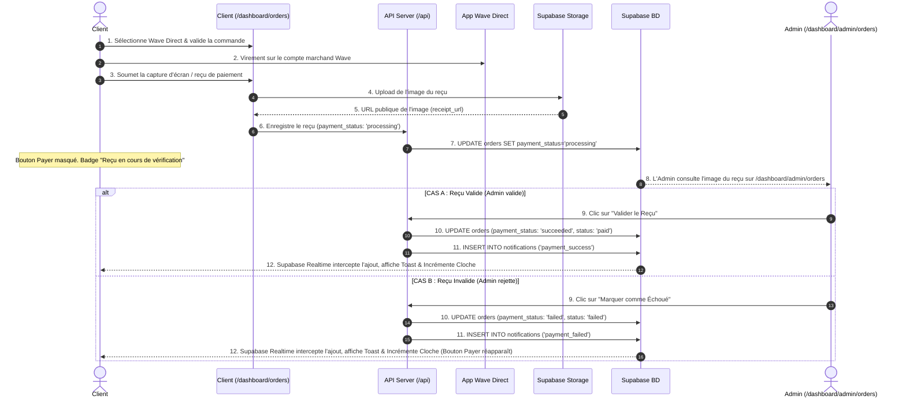

# Procédure de Flux : Paiement Wave Direct Link & Validation Manuelle (FLOW-OFIKA-PAY-02)

## 1. Synthèse Exécutive

Famille de Flux : `03_Paiements`
Code du Flux : `FLOW-OFIKA-PAY-02`
Acteurs Principaux : Client Membre, App Wave Direct, Supabase Storage, Administrateur System
Objectif Fonctionnel : Règlement par virement direct sur le compte marchand Wave, téléversement de la preuve de paiement par le client et validation manuelle par l'administrateur.
Préréquis : Commande créée avec le statut `pending` et passerelle Wave Direct active dans `system_config`.
Livrables & État Final : Reçu de paiement stocké dans Supabase Storage (`receipt_url`), commande validée par l'admin à `status = 'paid'` et `payment_status = 'succeeded'`.

## 2. Matrice d'Habilitation RBAC (Rôles & Permissions)

| Rôle Utilisateur | Niveau d'Accès | Écrans Autorisés après cette étape |
| :--- | :--- | :--- |
| **Visiteur Public** | `visiteur` | Aucun accès |
| **Client Membre** | `client` | `/dashboard/orders` (Transfert Wave & Téléversement de reçu) |
| **Agent / Manager** | `agent` | `/dashboard/admin/orders` (Consultation du reçu téléversé) |
| **Administrateur** | `admin` | `/dashboard/admin/orders` (Boutons Valider le Reçu / Marquer comme Échoué) |
| **Super Admin** | `super_admin` | Accès universel & gestion du lien marchand Wave |

## 3. Cartographie du Flux (Diagramme Mermaid)

## 4. Déroulé Algorithmique Détaillé en Langage Naturel (Du Début à la Fin)

Le flux de paiement manuel par Wave Direct Link est modélisé sous la forme d'un algorithme déterministe sécurisé articulé en 3 branches.

### BRANCHE A : Virement Wave & Téléversement du Reçu

Étape A.1 — Sélection du Paiement Wave Direct
Le client sélectionne Wave Direct sur son écran de commande. Le site lui affiche le lien direct marchand Wave (`https://pay.wave.com/m/...`) et le QR Code.

Étape A.2 — Virement sur l'Application Wave
Le client effectue le paiement depuis son application mobile Wave et réalise une capture d'écran de sa confirmation.

Étape A.3 — Téléversement de l'Image du Reçu (`POST /api/payments/receipt/upload`)
Le client charge sa capture d'écran via l'interface. La route API enregistre le fichier dans le bucket Supabase `profile-images/receipts/` et génère l'URL publique `receipt_url`.

Étape A.4 — Passage du Statut en Vérification (`processing`)
Le serveur exécute `UPDATE orders SET payment_status = 'processing'`. Côté client, le bouton "Payer" est remplacé par le badge violet "Reçu en cours de vérification" pour éviter tout double paiement accidentel.

### BRANCHE B : Examen et Validation par l'Administrateur (Cas Reçu Valide)

Étape B.1 — Aperçu du Reçu sur l'Interface Admin (`/dashboard/admin/orders`)
L'administrateur ouvre l'écran de gestion des commandes et aperçoit l'image du reçu téléversé.

Étape B.2 — Validation par l'Admin ("Valider le Reçu")
L'admin clique sur "Valider le Reçu" (Marquer comme Payé). L'application émet la requête `PATCH /api/admin/orders`. Le serveur applique `payment_status = 'succeeded'` et `status = 'paid'`, puis insère obligatoirement une notification de confirmation dans la table `notifications`. Supabase Realtime pousse l'alerte à la cloche du client en instantané. Le statut passe à "Payée" et le bouton Payer est retiré définitivement.

### BRANCHE C : Rejet du Reçu par l'Administrateur (Cas Reçu Invalide)

Étape C.1 — Rejet par l'Admin ("Marquer comme Échoué")
Si la preuve de paiement est illisible ou incorrecte, l'admin clique sur "Marquer comme Échoué".

Étape C.2 — Mutation BD, Notification Push & Réaffichage du Bouton Payer
L'application enregistre `payment_status = 'failed'` et `status = 'failed'`, puis insère l'erreur détaillée dans la table `notifications`. Le client reçoit une alerte Push (Toast + Cloche incrémentée) et le bouton "Payer / Réessayer" réapparaît sur son tableau de bord pour lui permettre de soumettre un nouveau reçu ou de passer par GeniusPay.

## 5. Synthèse des Contrôles de Sécurité & Résilience

1. Protection contre les Conflits de Paiement : Le passage à `payment_status = 'processing'` bloque toute tentative d'initiation d'un paiement GeniusPay parallèle.
2. Contournement RLS Administrateur : L'API administrateur utilise le client de service sécurisé pour enregistrer les validations.
3. Sécurisation du Stockage d'Images : Les reçus téléversés sont isolés dans le bucket sécurisé Supabase Storage.

## 6. Résumé Général du Fonctionnement

Ce flux détaille le processus de virement manuel via le lien direct Wave. Le client sélectionne l'option Wave Direct, clique sur le lien sécurisé pour effectuer le transfert d'argent depuis son application Wave, puis effectue une capture d'écran de son reçu. Il téléverse cette preuve de paiement directement sur le site Ofika. Dès que le reçu est soumis, l'application informe le client que son paiement est en cours de vérification par l'équipe et remplace temporairement le bouton d'achat. L'administrateur contrôle ensuite l'image de la preuve depuis son tableau de bord : s'il valide le reçu, la commande est confirmée comme payée et le client reçoit une alerte. Si la preuve est incorrecte ou illisible, l'administrateur la rejette, ce qui permet au client de soumettre une nouvelle preuve ou de choisir GeniusPay pour réessayer.
