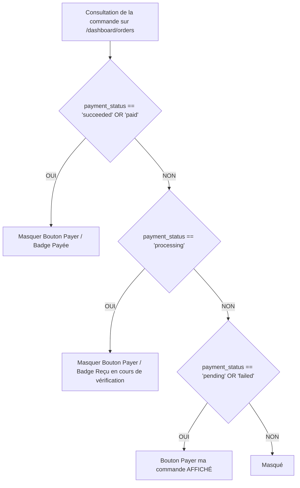

# Procédure de Flux : Suivi des Commandes & Règle du Bouton Payer (FLOW-OFIKA-PAY-03)

## 1. Synthèse Exécutive

Famille de Flux : `03_Paiements`
Code du Flux : `FLOW-OFIKA-PAY-03`
Acteurs Principaux : Client Membre, Interface Dashboard Client, Serveur API Ofika
Objectif Fonctionnel : Logique d'affichage dynamique du bouton "Payer ma commande" sur le tableau de bord `/dashboard/orders` selon le statut exact du paiement.
Préréquis : Commande existante dans `public.orders`.
Livrables & État Final : Contrôle d'affichage réactif sur le DOM React selon `payment_status` (`pending`, `processing`, `succeeded`, `failed`).

## 2. Matrice d'Habilitation RBAC (Rôles & Permissions)

| Rôle Utilisateur | Niveau d'Accès | Écrans Autorisés après cette étape |
| :--- | :--- | :--- |
| **Visiteur Public** | `visiteur` | Aucun accès |
| **Client Membre** | `client` | `/dashboard/orders` (Visibilité dynamique du bouton Payer) |
| **Agent / Manager** | `agent` | `/dashboard/admin/orders` (Suivi global des statuts) |
| **Administrateur** | `admin` | `/dashboard/admin/orders` (Mise à jour des statuts) |
| **Super Admin** | `super_admin` | Accès universel |

## 3. Cartographie du Flux (Diagramme Mermaid)

## 4. Déroulé Algorithmique Détaillé en Langage Naturel (Du Début à la Fin)

Le flux de décision d'affichage du bouton de paiement est modélisé sous la forme d'un algorithme déterministe évalué lors du rendu de chaque commande.

### BRANCHE A : Commande Payée (`payment_status == 'succeeded'` ou `'paid'`)

Étape A.1 — Détection du Statut Validé
Le composant React lit l'état de la commande (`payment_status`). Si le statut est `succeeded` ou `paid`.

Étape A.2 — Retrait Définitif du Bouton Payer
Le bouton "Payer" est retiré du DOM. L'interface affiche le badge vert "Payée".

### BRANCHE B : Reçu Wave en Vérification (`payment_status == 'processing'`)

Étape B.1 — Détection de Soumission de Reçu
Le composant lit `payment_status == 'processing'`.

Étape B.2 — Remplacement par le Badge Violet
Le bouton "Payer" est masqué et remplacé par le badge violet "Reçu en cours de vérification" afin de bloquer tout double paiement accidentel.

### BRANCHE C : Commande Non Payée (`payment_status == 'pending'` ou `'failed'`)

Étape C.1 — Détection de l'Attente de Paiement
Si le statut est `pending` ou `failed`.

Étape C.2 — Restitution du Bouton Payer
Le bouton "Payer ma commande" est affiché, permettant au client de lancer GeniusPay ou de téléverser son reçu Wave.

## 5. Synthèse des Contrôles de Sécurité & Résilience

1. Immunité aux Conflits d'Interface : Impossibilité pour un utilisateur d'initier deux paiements simultanés.
2. Synchronisation Temps Réel : Mise à jour du DOM en direct lors des mutations de statut serveur.

## 6. Résumé Général du Fonctionnement

Ce flux explique les règles intelligentes qui gèrent l'affichage du bouton de paiement sur l'espace client d'Ofika. Tant qu'une commande est en attente de règlement ou si une tentative précédente a échoué, le bouton "Payer ma commande" reste clairement visible pour permettre au client de finaliser son achat à tout moment. Dès que le client téléverse un reçu de paiement Wave, le système masque intelligemment le bouton et affiche le message "Reçu en cours de vérification" afin d'éviter tout double paiement accidentel. Enfin, dès que le paiement est définitivement confirmé et validé, le bouton d'achat disparaît définitivement pour laisser place au statut officiel "Payée".
