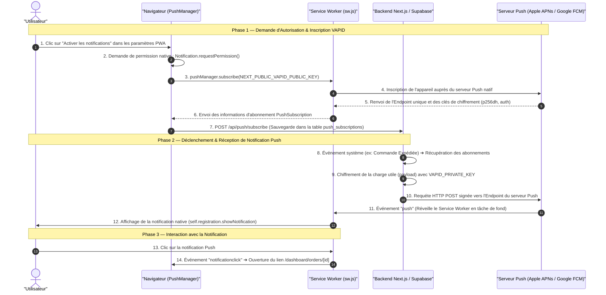

# Procédure de Flux : Notifications Push VAPID & Service Worker (FLOW-OFIKA-PWA-02)

## 1. Synthèse Exécutive

Famille de Flux : `06_PWA_Offline`  
Code du Flux : `FLOW-OFIKA-PWA-02`  
Acteurs Principaux : Utilisateur, Navigateur Web (`PushNotificationManager`), Service Worker (`sw.js`), Backend Next.js / Supabase (`push_subscriptions`), Passerelle de Push (Google FCM / Apple APNs)  
Objectif Fonctionnel : Permettre aux membres et clients d'Ofika de s'abonner aux notifications Push natives et de recevoir des alertes en temps réel (confirmation de commande, changement de statut d'expédition, nouvelles consultations de carte) directement sur l'écran de verrouillage ou la barre de notifications de leur appareil.  
Préréquis : Autorisation explicite de notification accordée par l'utilisateur (`Notification.requestPermission() === 'granted'`) et navigateur compatible Web Push API.  
Livrables & État Final : Abonnement enregistré dans la table Supabase `push_subscriptions` avec clés VAPID `p256dh` et `auth`, notifications Push affichées de manière native par le Service Worker.

---

## 2. Matrice d'Habilitation RBAC (Rôles & Permissions)

| Rôle Utilisateur | Niveau d'Accès | Écrans & Actions Autorisés |
| :--- | :--- | :--- |
| **Visiteur Public** | `visiteur` | Demande d'activation des notifications lors de l'accès au site ou du suivi d'une commande. |
| **Client Membre** | `client` | Réception des notifications de suivi de livraison, d'interactions NFC et d'actualités. |
| **Agent / Manager** | `agent` | Réception des alertes de nouvelles commandes et demandes de validation. |
| **Administrateur** | `admin` | Déclenchement et envoi de notifications Push globales ou ciblées via `/dashboard/admin/push-all`. |
| **Super Admin** | `super_admin` | Gestion et configuration des clés VAPID système. |

---

## 3. Cartographie du Flux (Diagramme Mermaid)

---

## 4. Déroulé Algorithmique Détaillé en Langage Naturel (Du Début à la Fin)

### Étape 1 — Consentement et Souscription VAPID
1. L'utilisateur accepte d'activer les notifications dans l'application PWA Ofika.
2. Le navigateur demande la permission explicite `Notification.requestPermission()`. Si la réponse est `'granted'`, le processus continue.
3. Le navigateur invoque `swRegistration.pushManager.subscribe()` en lui transmettant la clé publique VAPID (`NEXT_PUBLIC_VAPID_PUBLIC_KEY`).
4. Le navigateur communique avec les serveurs de push du constructeur de l'appareil (Google FCM pour Android/Chrome ou Apple APNs pour iOS/Safari) afin d'obtenir un jeton d'abonnement et une URL d'Endpoint unique.
5. Les informations d'abonnement (`endpoint`, `keys.p256dh`, `keys.auth`) sont envoyées au backend via l'API `POST /api/push/subscribe` et stockées dans la table Supabase `push_subscriptions`.

### Étape 2 — Émission et Chiffrement d'une Notification Push
1. Lors d'un événement système (ex: changement du statut de livraison par un administrateur), l'API backend lit la table `push_subscriptions` pour obtenir les abonnements du destinataire.
2. Le backend chiffre le message JSON (titre, corps, icône, URL de redirection) avec la clé privée VAPID (`VAPID_PRIVATE_KEY`) en utilisant le protocole RFC 8292.
3. Le serveur backend envoie la requête HTTP POST chiffrée vers l'Endpoint du Push Gateway (FCM ou APNs).

### Étape 3 — Réception en Tâche de Fond par le Service Worker (`sw.js`)
1. Le serveur Push du système d'exploitation livre le paquet à l'appareil de l'utilisateur.
2. Le système réveille le Service Worker `sw.js` d'Ofika même si l'onglet de l'application est fermé ou si l'écran du téléphone est verrouillé.
3. L'événement `self.addEventListener('push')` dans `sw.js` intercepte la charge utile, déchiffre les données et appelle `self.registration.showNotification(title, options)`.
4. La notification native s'affiche sur l'appareil avec le logo Ofika et un son/vibreur.

### Étape 4 — Clic et Redirection (`notificationclick`)
1. Lorsque l'utilisateur clique sur la notification, l'événement `self.addEventListener('notificationclick')` est déclenché dans `sw.js`.
2. Le Service Worker vérifie si un onglet Ofika est déjà ouvert. Si oui, il le focalise ; sinon, il ouvre une nouvelle fenêtre vers l'URL associée (ex: `/dashboard/orders/123`).

---

## 5. Synthèse des Contrôles de Sécurité & Résilience

1. **Authentification Volontaire VAPID (RFC 8292)** : La signature VAPID empêche des tiers non autorisés d'envoyer des notifications au nom d'Ofika. La clé privée (`VAPID_PRIVATE_KEY`) reste strictement confinée sur le serveur backend.
2. **Permission Explicite W3C** : Les notifications ne peuvent jamais être activées à l'insu de l'utilisateur.
3. **Nettoyage des Abonnements Invalides** : Si un serveur Push renvoie un code HTTP `410 Gone` ou `404 Not Found` (indiquant que l'utilisateur a désinstallé la PWA ou réinitialisé ses autorisations), l'abonnement caduc est automatiquement supprimé de la table `push_subscriptions`.

---

## 6. Résumé Général du Fonctionnement

Les notifications Push VAPID permettent à la plateforme Ofika de maintenir un lien direct et réactif avec ses utilisateurs. Lorsqu'un membre choisit d'activer les notifications, son appareil s'enregistre auprès du système de communication sécurisé d'Ofika. Ainsi, dès qu'une étape clé survient (par exemple lorsque sa carte NFC a été fabriquée, qu'un colis est en cours de livraison, ou qu'un nouveau contact a consulté son profil), le serveur d'Ofika envoie une alerte chiffrée. Même si le téléphone est en veille ou l'application fermée, la notification s'affiche sur l'écran verrouillé du smartphone. En cliquant dessus, l'utilisateur est directement redirigé vers l'écran exact correspondant à son alerte.
