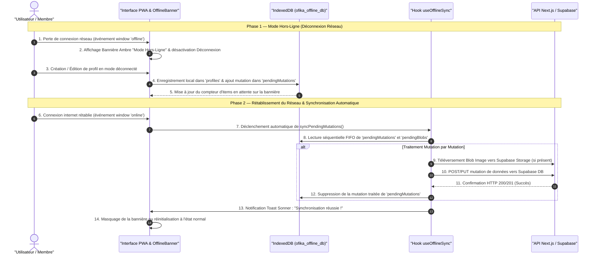

# Procédure de Flux : PWA Offline-First & Synchronisation Automatique (FLOW-OFIKA-PWA-01)

## 1. Synthèse Exécutive

Famille de Flux : `06_PWA_Offline`  
Code du Flux : `FLOW-OFIKA-PWA-01`  
Acteurs Principaux : Membre Ofika, Navigateur PWA, Service Worker (`sw.js`), Magasin IndexedDB (`ofika_offline_db`), API Next.js / Supabase  
Objectif Fonctionnel : Permettre l'accès ininterrompu à l'application Ofika en l'absence de réseau internet (consultation de cartes, édition de profils, enregistrement local des modifications) et déclencher la synchronisation automatique des données vers la base de données centrale dès le rétablissement de la connexion.  
Préréquis : Application Ofika installée ou ouverte sur un navigateur supportant les Service Workers et IndexedDB (iOS Safari, Chrome, Edge, Samsung Internet).  
Livrables & État Final : Profils et modifications enregistrés localement en mode hors-ligne dans la file d'attente FIFO `pendingMutations`, puis synchronisés de façon transparente avec notification de confirmation Toast lors du retour en ligne.

---

## 2. Matrice d'Habilitation RBAC (Rôles & Permissions)

| Rôle Utilisateur | Niveau d'Accès | Écrans Autorisés en Mode Hors-Ligne |
| :--- | :--- | :--- |
| **Visiteur Public** | `visiteur` | Consultation des profils pré-cachés dans le Service Worker et export vCard local. |
| **Client Membre** | `client` | `/dashboard`, consultation de ses profils, édition hors-ligne, création de profil local avec mise en file d'attente FIFO. *(Déconnexion désactivée par sécurité)*. |
| **Agent / Manager** | `agent` | Consultation du cache local des commandes. |
| **Administrateur** | `admin` | N/A (Les actions d'administration nécessitent un accès réseau direct). |
| **Super Admin** | `super_admin` | N/A |

---

## 3. Cartographie du Flux (Diagramme Mermaid)

---

## 4. Déroulé Algorithmique Détaillé en Langage Naturel (Du Début à la Fin)

### Étape 1 — Détection de la Perte de Connexion
1. Le navigateur de l'utilisateur perd le réseau internet (passage en mode avion, zone blanche ou coupure 4G/WiFi).
2. L'événement système `window.addEventListener('offline')` est intercepté par le hook `useOfflineSync`.
3. Le composant `<OfflineBanner />` s'affiche immédiatement en haut de l'écran avec un style ambre distinctif et la mention *"Mode Hors-Ligne"*.
4. Le bouton de déconnexion dans l'interface ([`LogoutButton.tsx`](file:///c:/Users/Toto.ADMINISTRATOR/Desktop/Ofika-c-main/components/core/auth/LogoutButton.tsx)) s'invalide et se grise automatiquement avec un message préventif pour protéger la session et le cache local.

### Étape 2 — Saisie et Stockage Local Hors-Ligne (IndexedDB)
1. L'utilisateur consulte ses profils ou crée/édite un profil Link-in-Bio depuis l'application.
2. Le hook `useProfiles` intercepte l'action et bascule en mode déconnecté.
3. Les données du profil sont sauvegardées instantanément dans le magasin IndexedDB `profiles`.
4. Si l'utilisateur a joint une image d'avatar, l'image binaire est stockée dans le magasin `pendingBlobs`.
5. L'action est encapsulée dans un objet de mutation `{ type, entity, data, blobId, createdAt }` et ajoutée à la file FIFO `pendingMutations`.
6. Le badge du composant `<OfflineBanner />` s'incrémente pour indiquer le nombre exact de modifications en attente.

### Étape 3 — Rétablissement de la Connexion et Synchronisation Automatique
1. Le réseau internet est rétabli. L'événement `window.addEventListener('online')` est immédiatement déclenché.
2. Le hook `useOfflineSync` lance automatiquement l'algorithme `syncPendingMutations()` en arrière-plan (un bouton *"Synchroniser maintenant"* permet également un déclenchement manuel).
3. Le système parcourt la file d'attente FIFO `pendingMutations` ordre par ordre :
   - Si la mutation inclut un `blobId`, l'image binaire est extraite de `pendingBlobs` et téléversée vers le bucket Supabase Storage `avatars`.
   - La mutation de données (insertion/mise à jour du profil ou de l'avis) est soumise à la base de données Supabase.
   - Dès confirmation de la base de données, la mutation est supprimée de la file IndexedDB.
4. Une notification Toast d'information (`sonner`) est affichée à l'utilisateur : *"Synchronisation terminée avec succès !"*.

---

## 5. Synthèse des Contrôles de Sécurité & Résilience

1. **Isolation et Intégrité des Données Locales** : Le stockage IndexedDB `ofika_offline_db` est isolé par origine (`https://ofika.ci`). Aucune donnée sensible de session n'est exposée à des tiers.
2. **Protection Anti-Déconnexion Hors-Ligne** : Le bouton de déconnexion est neutralisé lorsque l'appareil est déconnecté du réseau afin d'éviter la destruction prématurée de la clé de session localement.
3. **Gestion des Erreurs & Résilience Réseau** : En cas de coupure réseau intermittente pendant la synchronisation, les mutations échouées restent conservées dans IndexedDB et seront rétentées automatiquement lors de la reconnexion suivante.
4. **Ordre Séquentiel FIFO** : L'exécution stricte selon l'ordre d'arrivée garantit la cohérence des états chronologiques.

---

## 6. Résumé Général du Fonctionnement

Ce flux garantit aux utilisateurs d'Ofika une continuité de service totale, qu'ils soient connectés ou totalement hors-ligne (dans les transports, en zone blanche ou sans données mobiles). Lorsqu'un membre effectue des modifications ou crée un nouveau profil alors qu'il n'a pas accès à internet, l'application sauvegarde immédiatement son travail sur son appareil dans une base de données locale sécurisée (IndexedDB) et affiche une bannière informative lui confirmant que ses données sont conservées en sécurité. Dès que son téléphone retrouve du réseau, l'application Ofika détecte automatiquement la connexion et envoie en arrière-plan toutes ses modifications vers les serveurs Supabase, sans qu'aucune action complexe ne soit demandée à l'utilisateur. Une discrète notification apparaît pour lui confirmer que son profil est désormais à jour sur le cloud.
