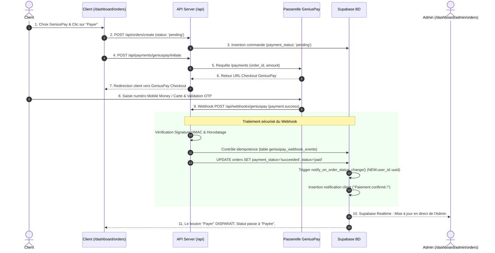
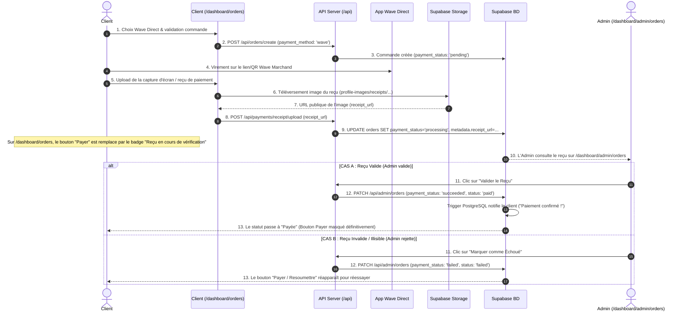

# Documentation Exhaustive des Flux de Paiement Ofika

> **Document de Référence Technique & Fonctionnel**
> Ce document cartographie l'ensemble des parcours de paiement, règles de gestion, cas d'exception, logiques si/sinon et diagrammes Mermaid du système de paiement d'Ofika.

---

## 📌 Table des Matières
1. [Architecture & Niveaux de Prix](#1-architecture--niveaux-de-prix)
2. [Matrice d'Activation des Passerelles (Admin)](#2-matrice-dactivation-des-passerelles-admin)
3. [Flow 1 : GeniusPay (Paiement Automatique Webhook)](#3-flow-1--geniuspay-paiement-automatique-webhook)
4. [Flow 2 : Wave Direct Link (Paiement Manuel & Validation Admin)](#4-flow-2--wave-direct-link-paiement-manuel--validation-admin)
5. [Arbre de Décision & Matrice de Statuts](#5-arbre-de-décision--matrice-de-statuts)
6. [Gestion des Exceptions & Cas Limites](#6-gestion-des-exceptions--cas-limites)

---

## 1. Architecture & Niveaux de Prix

Le système de tarification fonctionne sur un modèle **dynamique à 2 niveaux de priorité** :

| Niveau | Source de Vérité | Emplacement | Description |
| :--- | :--- | :--- | :--- |
| **Niveau 1 (Prioritaire)** | Base de données Supabase | Table `system_config` (clé `pricing_config` ➔ `nfc_card_base_price`) | Déclaré dynamiquement depuis l'admin. Ex: `14 600 FCFA`. |
| **Niveau 2 (Secours)** | Hardcodé dans l'application | `lib/types/payments.ts` | Utilisé si la BD est indisponible. Valeur : `14 600 FCFA`. |

### ⚠️ Règle de Sécurité du Montant Minimum
- **Seuil minimal :** `200 XOF`.
- **Raison :** L'API GeniusPay rejette toute transaction inférieure à `200 XOF` avec une erreur HTTP 422 (`"Le montant minimum pour XOF est 200."`).
- **Implémentation :** Les routes `/api/orders/create` et `/api/payments/geniuspay/initiate` appliquent `Math.max(amount, 200)`.

---

## 2. Matrice d'Activation des Passerelles (Admin)

L'administrateur peut activer ou désactiver chaque passerelle indépendamment dans `/dashboard/admin/payments`. La route `/api/payments/methods` renvoie l'état réel stocké dans `system_config` (clé `payment_gateways`).

```mermaid
flowchart TD
    Start[Vérification de la configuration des passerelles] --> FetchDB[GET /api/payments/methods]
    FetchDB --> CheckState{États dans system_config}

    CheckState -->|GeniusPay=ON & Wave=ON| BothActive[Les 2 choix affichés au client : GeniusPay et Wave Direct]
    CheckState -->|GeniusPay=ON & Wave=OFF| GPOnly[Seul GeniusPay est affiché et auto-sélectionné]
    CheckState -->|GeniusPay=OFF & Wave=ON| WaveOnly[Seul Wave Direct est affiché et auto-sélectionné]
    CheckState -->|GeniusPay=OFF & Wave=OFF| NoneActive[Bouton de paiement désactivé : "Aucun moyen de paiement disponible"]
```

---

## 3. Flow 1 : GeniusPay (Paiement Automatique Webhook)

### 🔄 Diagramme de Séquence Détaillé



---

## 4. Flow 2 : Wave Direct Link (Paiement Manuel & Validation Admin)

### 🔄 Diagramme de Séquence Détaillé



---

## 5. Arbre de Décision & Matrice de Statuts

### 🌲 Arbre de Décision d'Affichage du Bouton "Payer" (Côté Client)

```mermaid
graph TD
    Start[Vérification de la commande sur /dashboard/orders] --> CheckPaid{payment_status == 'succeeded' OR 'paid' OR status == 'paid'}
    
    CheckPaid -->|OUI| HideButton[🚫 Bouton "Payer" MASQUÉ DEFINITIVEMENT<br/>Badge : "Payée"]
    CheckPaid -->|NON| CheckProcessing{payment_status == 'processing'}
    
    CheckProcessing -->|OUI| ProcessingBadge[⏳ Bouton "Payer" MASQUÉ<br/>Badge violet : "Reçu en cours de vérification"]
    CheckProcessing -->|NON| CheckPending{payment_status == 'pending' OR 'failed'}
    
    CheckPending -->|OUI| ShowButton[💳 Bouton "Payer ma commande" AFFICHÉ]
    CheckPending -->|NON| HideDefault[Masqué]
```

### 📋 Matrice des Statuts de Commande

| `payment_status` | `status` (Global) | Signification | Bouton Payer (Client) | Action Admin |
| :--- | :--- | :--- | :--- | :--- |
| `pending` | `pending` | Commande créée, paiement non effectué | 💳 **Affiché** | En attente de paiement |
| `processing` | `pending` | Reçu Wave soumis par le client | ⏳ **Masqué** *(Reçu en vérification)* | Aperçu du reçu + Boutons Valider / Rejeter |
| `succeeded` | `paid` | Paiement validé (GeniusPay ou Admin Wave) | 🚫 **Masqué** *(Payée)* | Passer en Préparation / Expédié / Livré |
| `failed` | `failed` | Paiement échoué ou reçu rejeté par Admin | 💳 **Affiché** *(Réessayer)* | Possibilité d'annuler ou ré-ouvrir |
| `cancelled` | `cancelled` | Commande annulée | 🚫 **Masqué** | Aucune action |

---

## 6. Gestion des Exceptions & Cas Limites

```mermaid
flowchart TD
    ExceptionStart[Détection d'une Exception de Paiement] --> CheckType{Type d'Exception}

    CheckType -->|Montant < 200 XOF| E1[Erreur GeniusPay 422<br/>Correction : Math.max(amount, 200) appliqué par l'API]
    CheckType -->|Erreur PostgreSQL 42804| E2[Trigger UUID vs TEXT<br/>Correction : NEW.user_id::uuid cast dans notify_on_order_status_change]
    CheckType -->|Webhook GeniusPay en double| E3[Doublon Webhook<br/>Correction : Contrôle d'idempotence dans geniuspay_webhook_events]
    CheckType -->|Reçu Wave Invalide| E4[Reçu rejeté par l'Admin<br/>Correction : passage en payment_status='failed', réaffichage du bouton Payer]
    CheckType -->|Client ferme la fenêtre| E5[Abandon Checkout<br/>Correction : Commande reste 'pending', disponible sur le dashboard]
```

---

## 📁 Emplacement du Fichier
- **Chemin :** `schemas-mermaid/processus/flux-paiement-complet.md`
- **Fichiers Mermaid associés :**
  - `schemas-mermaid/processus/geniuspay-webhook-flow.mmd`
  - `schemas-mermaid/processus/wave-direct-flow.mmd`
